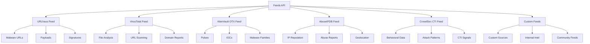

# Feeds API

Complete API reference for TrojanHorse.js threat intelligence feeds, including URLhaus, VirusTotal, AlienVault OTX, AbuseIPDB, and CrowdSec CTI integrations.

## Overview

The Feeds API provides standardized interfaces for integrating with multiple threat intelligence sources, enabling real-time threat detection, correlation, and analysis across diverse data sources.



## Base Feed Interface

### ThreatFeed Abstract Class

All feed implementations extend the base `ThreatFeed` class which provides common functionality.

```javascript
import { ThreatFeed } from 'trojanhorse-js/feeds';

// Base configuration options available to all feeds
const baseFeedConfig = {
  // API configuration
  apiKey: 'your-api-key',           // API key for authentication
  baseUrl: 'https://api.service.com', // Base API URL
  timeout: 10000,                   // Request timeout in milliseconds
  
  // Rate limiting
  rateLimit: {
    enabled: true,                  // Enable rate limiting
    requestsPerMinute: 60,          // Max requests per minute
    requestsPerHour: 1000,          // Max requests per hour
    backoffStrategy: 'exponential'   // 'linear', 'exponential'
  },
  
  // Caching
  cache: {
    enabled: true,                  // Enable response caching
    ttl: 3600,                     // Cache TTL in seconds
    maxSize: '100MB',              // Maximum cache size
    compression: true               // Compress cached data
  },
  
  // Retry configuration
  retry: {
    enabled: true,                  // Enable automatic retries
    maxAttempts: 3,                // Maximum retry attempts
    baseDelay: 1000,               // Base delay in milliseconds
    maxDelay: 30000,               // Maximum delay in milliseconds
    exponentialBackoff: true       // Use exponential backoff
  },
  
  // Error handling
  errorHandling: {
    throwOnError: false,           // Throw errors or return empty results
    logErrors: true,               // Log errors for debugging
    fallbackToCache: true          // Use cached data on errors
  }
};
```

### Common Methods

All feed classes implement these standard methods:

#### fetchThreatData(indicator, options)

Fetches threat intelligence data for a specific indicator.

```javascript
const threatData = await feed.fetchThreatData('malicious-domain.com', {
  includeMetadata: true,           // Include additional metadata
  includeHistory: false,           // Include historical data
  maxAge: 86400,                   // Maximum age of data in seconds
  confidence: 'high',              // Minimum confidence level
  format: 'standard'               // Output format
});

console.log('Threat data:', threatData);
```

#### batchQuery(indicators, options)

Performs batch queries for multiple indicators.

```javascript
const indicators = ['domain1.com', 'domain2.com', '192.168.1.100'];
const batchResults = await feed.batchQuery(indicators, {
  batchSize: 100,                  // Batch size for API calls
  concurrency: 5,                  // Concurrent requests
  waitBetweenBatches: 1000        // Wait time between batches
});

console.log('Batch results:', batchResults);
```

#### getHealthStatus()

Returns the current health status of the feed.

```javascript
const health = await feed.getHealthStatus();
console.log('Feed health:', health);
// Returns:
// {
//   status: 'healthy',
//   lastSuccessfulRequest: '2025-01-15T10:30:00Z',
//   requestCount: 1500,
//   errorRate: 0.02,
//   averageResponseTime: 250
// }
```

## URLhaus Feed

URLhaus provides real-time information about malware URLs and payloads.

### URLhausFeed Class

```javascript
import { URLhausFeed } from 'trojanhorse-js/feeds';

const urlhausFeed = new URLhausFeed({
  ...baseFeedConfig,
  apiKey: process.env.URLHAUS_API_KEY, // Optional for basic usage
  
  // URLhaus-specific options
  options: {
    includeOffline: false,          // Include offline URLs
    maxAge: 30,                     // Max age in days
    malwareFilter: ['trojan', 'ransomware'], // Filter by malware types
    confidenceThreshold: 75         // Minimum confidence score
  }
});
```

#### Methods

##### queryUrl(url, options)

Queries URLhaus for information about a specific URL.

```javascript
const urlInfo = await urlhausFeed.queryUrl('http://malicious-site.com/payload.exe', {
  includePayloads: true,           // Include payload information
  includeScreenshots: false,       // Include screenshots
  includeSubmissions: true         // Include submission history
});

console.log('URL information:', urlInfo);
// Returns:
// {
//   id: "12345",
//   url: "http://malicious-site.com/payload.exe",
//   url_status: "online",
//   host: "malicious-site.com",
//   date_added: "2025-01-15 10:30:00",
//   threat: "trojan",
//   blacklists: ["spamhaus", "surbl"],
//   reporter: "anonymous",
//   confidence: 85,
//   payloads: [...],
//   signatures: [...]
// }
```

##### queryHost(hostname, options)

Queries URLhaus for information about a specific host.

```javascript
const hostInfo = await urlhausFeed.queryHost('malicious-domain.com', {
  includeUrls: true,               // Include URLs hosted on this domain
  includeSubdomains: false,        // Include subdomains
  limit: 100                       // Limit number of results
});
```

##### getRecentUrls(options)

Retrieves recently added malicious URLs.

```javascript
const recentUrls = await urlhausFeed.getRecentUrls({
  limit: 1000,                     // Number of URLs to retrieve
  format: 'json',                  // Response format
  excludeOffline: true             // Exclude offline URLs
});
```

##### downloadPayload(payloadHash, options)

Downloads malware payload samples (requires API key).

```javascript
const payload = await urlhausFeed.downloadPayload('sha256-hash', {
  format: 'binary',                // 'binary', 'base64'
  password: 'infected',            // ZIP password for payload
  saveToFile: './payloads/sample.zip'
});
```

## VirusTotal Feed

VirusTotal provides comprehensive file, URL, domain, and IP analysis.

### VirusTotalFeed Class

```javascript
import { VirusTotalFeed } from 'trojanhorse-js/feeds';

const virusTotalFeed = new VirusTotalFeed({
  ...baseFeedConfig,
  apiKey: process.env.VIRUSTOTAL_API_KEY, // Required
  
  // VirusTotal-specific options
  options: {
    publicApi: false,               // Use public or private API
    engines: ['sophos', 'kaspersky', 'avast'], // Specific engines
    minDetections: 3,               // Minimum detections to consider malicious
    includeMetadata: true,          // Include additional metadata
    followRedirects: false          // Follow URL redirects
  }
});
```

#### Methods

##### scanFile(fileHash, options)

Retrieves analysis results for a file hash.

```javascript
const fileReport = await virusTotalFeed.scanFile('sha256-hash', {
  includeEngineDetails: true,      // Include per-engine results
  includeBehaviorAnalysis: true,   // Include behavioral analysis
  includeNetworkTraffic: false    // Include network traffic analysis
});

console.log('File report:', fileReport);
// Returns:
// {
//   sha256: "hash-value",
//   md5: "md5-hash",
//   sha1: "sha1-hash",
//   scan_date: "2025-01-15 10:30:00",
//   positives: 45,
//   total: 70,
//   permalink: "https://virustotal.com/file/...",
//   scans: {
//     "Sophos": { detected: true, result: "Mal/Generic-S" },
//     "Kaspersky": { detected: true, result: "Trojan.Win32.Agent" }
//   },
//   behavioral_analysis: {...},
//   network_traffic: {...}
// }
```

##### scanUrl(url, options)

Submits a URL for scanning and retrieves results.

```javascript
const urlReport = await virusTotalFeed.scanUrl('http://suspicious-site.com', {
  forceRescan: false,              // Force new scan even if recent results exist
  includeScreenshot: true,         // Include website screenshot
  includeWhoisData: true,          // Include WHOIS information
  followRedirects: true            // Follow URL redirects
});
```

##### getDomainReport(domain, options)

Retrieves domain reputation and analysis data.

```javascript
const domainReport = await virusTotalFeed.getDomainReport('suspicious-domain.com', {
  includeSubdomains: true,         // Include subdomain information
  includePassiveDns: true,         // Include passive DNS data
  includeCommunicatingSamples: false, // Include communicating samples
  includeDetectedReferrerSamples: false // Include detected referrer samples
});
```

##### getIpReport(ipAddress, options)

Retrieves IP address reputation and analysis data.

```javascript
const ipReport = await virusTotalFeed.getIpReport('192.168.1.100', {
  includePassiveDns: true,         // Include passive DNS data
  includeCommunicatingSamples: true, // Include communicating samples
  includeDetectedDownloadedSamples: true, // Include detected samples
  includeGeolocation: true         // Include geolocation data
});
```

##### submitFile(filePath, options)

Submits a file for analysis.

```javascript
const submission = await virusTotalFeed.submitFile('./sample.exe', {
  password: 'infected',            // Password for encrypted files
  notifyUrl: 'https://callback.com/vt', // Callback URL for results
  waitForResults: true,            // Wait for analysis completion
  timeout: 300000                  // Timeout for waiting (5 minutes)
});
```

## AlienVault OTX Feed

AlienVault Open Threat Exchange provides community-driven threat intelligence.

### AlienVaultFeed Class

```javascript
import { AlienVaultFeed } from 'trojanhorse-js/feeds';

const otxFeed = new AlienVaultFeed({
  ...baseFeedConfig,
  apiKey: process.env.ALIENVAULT_API_KEY, // Required
  
  // OTX-specific options
  options: {
    subscribedOnly: false,          // Only subscribed pulses
    modifiedSince: '2025-01-01',    // Only pulses modified since date
    includeInactive: false,         // Include inactive pulses
    tags: ['apt', 'malware'],       // Filter by tags
    authorUsername: null            // Filter by specific author
  }
});
```

#### Methods

##### getIndicatorDetails(indicator, options)

Retrieves detailed information about an indicator.

```javascript
const details = await otxFeed.getIndicatorDetails('malicious-domain.com', {
  section: 'general',              // 'general', 'malware', 'url_list', 'passive_dns'
  includeContext: true,            // Include contextual information
  includePulses: true,             // Include associated pulses
  limit: 50                        // Limit number of results
});

console.log('Indicator details:', details);
```

##### searchPulses(query, options)

Searches for threat intelligence pulses.

```javascript
const pulses = await otxFeed.searchPulses('APT29', {
  sort: 'modified',                // Sort by: 'created', 'modified', 'subscriber_count'
  order: 'desc',                   // Order: 'asc', 'desc'
  limit: 20,                       // Number of results
  tags: ['apt', 'russia'],         // Filter by tags
  adversary: 'APT29'              // Filter by adversary
});
```

##### getPulseDetails(pulseId, options)

Retrieves detailed information about a specific pulse.

```javascript
const pulseDetails = await otxFeed.getPulseDetails('pulse-id-12345', {
  includeIndicators: true,         // Include all indicators
  includeReferences: true,         // Include reference URLs
  includeValidation: false         // Include validation information
});
```

##### getSubscribedPulses(options)

Retrieves pulses the user is subscribed to.

```javascript
const subscribedPulses = await otxFeed.getSubscribedPulses({
  modifiedSince: '2025-01-01',     // Only recent modifications
  limit: 100,                      // Number of pulses
  includeInactive: false           // Exclude inactive pulses
});
```

##### validateIndicator(indicator, options)

Validates an indicator against OTX intelligence.

```javascript
const validation = await otxFeed.validateIndicator('suspicious-ip.com', {
  sections: ['general', 'reputation', 'geo'], // Sections to check
  includeContext: true,            // Include context information
  threshold: 3                     // Minimum pulse count for positive
});
```

## AbuseIPDB Feed

AbuseIPDB provides IP address reputation and abuse reporting data.

### AbuseIPDBFeed Class

```javascript
import { AbuseIPDBFeed } from 'trojanhorse-js/feeds';

const abuseipdbFeed = new AbuseIPDBFeed({
  ...baseFeedConfig,
  apiKey: process.env.ABUSEIPDB_API_KEY, // Required
  
  // AbuseIPDB-specific options
  options: {
    maxAgeInDays: 90,               // Maximum age of reports
    confidenceMinimum: 75,          // Minimum confidence percentage
    includeCountryMatch: true,      // Include country match info
    includeUsageType: true,         // Include usage type (ISP, hosting, etc.)
    verbose: true                   // Include verbose information
  }
});
```

#### Methods

##### checkIp(ipAddress, options)

Checks an IP address for abuse reports.

```javascript
const ipCheck = await abuseipdbFeed.checkIp('192.168.1.100', {
  maxAgeInDays: 90,                // Report age limit
  verbose: true,                   // Include detailed information
  includeReports: false            // Include individual reports
});

console.log('IP check result:', ipCheck);
// Returns:
// {
//   ipAddress: "192.168.1.100",
//   isPublic: true,
//   ipVersion: 4,
//   isWhitelisted: false,
//   abuseConfidencePercentage: 85,
//   countryCode: "US",
//   usageType: "Data Center/Web Hosting/Transit",
//   isp: "Example ISP",
//   domain: "example.com",
//   totalReports: 45,
//   numDistinctUsers: 12,
//   lastReportedAt: "2025-01-15T10:30:00Z"
// }
```

##### reportIp(ipAddress, categories, comment, options)

Reports an abusive IP address.

```javascript
const report = await abuseipdbFeed.reportIp('192.168.1.100', [18, 20], 'Brute force attack on SSH', {
  timestamp: new Date().toISOString(), // When the abuse occurred
  includeEvidence: true             // Include supporting evidence
});

// Category codes:
// 3: Fraud Orders
// 4: DDoS Attack
// 9: Compromised  
// 10: Web Spam
// 11: Email Spam
// 14: Port Scan
// 15: Hacking
// 16: SQL Injection
// 18: Brute Force
// 19: Bad Web Bot
// 20: Exploited Host
// 21: Web App Attack
// 22: SSH
// 23: IoT Targeted
```

##### getBlacklist(options)

Downloads the AbuseIPDB blacklist.

```javascript
const blacklist = await abuseipdbFeed.getBlacklist({
  confidenceMinimum: 90,           // Minimum confidence percentage
  limit: 10000,                    // Maximum number of IPs
  plaintext: false,                // Return as JSON instead of plaintext
  onlyCountries: ['CN', 'RU'],     // Filter by countries
  exceptCountries: ['US', 'CA']    // Exclude specific countries
});
```

##### checkBlock(networkBlock, options)

Checks a network block (subnet) for abuse reports.

```javascript
const blockCheck = await abuseipdbFeed.checkBlock('192.168.1.0/24', {
  maxAgeInDays: 30,                // Report age limit
  includeReports: true             // Include individual IP reports
});
```

##### clearAddress(ipAddress, options)

Clears (whitelists) an IP address from reports.

```javascript
const clearResult = await abuseipdbFeed.clearAddress('192.168.1.100', {
  reason: 'False positive - legitimate server',
  evidence: 'Server logs showing normal behavior'
});
```

## CrowdSec CTI Feed

CrowdSec Community Threat Intelligence provides behavioral analysis and attack patterns.

### CrowdSecFeed Class

```javascript
import { CrowdSecFeed } from 'trojanhorse-js/feeds';

const crowdsecFeed = new CrowdSecFeed({
  ...baseFeedConfig,
  apiKey: process.env.CROWDSEC_API_KEY, // Required
  
  // CrowdSec-specific options
  options: {
    machineId: 'trojanhorse-instance', // Machine identifier
    scenarios: ['ssh-bf', 'http-bf'],  // Specific scenarios to track
    includeMetrics: true,            // Include behavioral metrics
    includeSignatures: true,         // Include attack signatures
    confidenceThreshold: 80          // Minimum confidence level
  }
});
```

#### Methods

##### getIpInfo(ipAddress, options)

Retrieves behavioral information about an IP address.

```javascript
const ipInfo = await crowdsecFeed.getIpInfo('192.168.1.100', {
  includeBehaviors: true,          // Include behavioral analysis
  includeScenarios: true,          // Include triggered scenarios
  includeTargets: true,            // Include target information
  includeGeolocation: true         // Include geo data
});

console.log('IP behavioral info:', ipInfo);
// Returns:
// {
//   ip: "192.168.1.100",
//   ip_range: "192.168.1.0/24",
//   as_name: "Example ISP",
//   as_num: 12345,
//   location: { country: "US", city: "New York" },
//   reputation: "malicious",
//   behaviors: [
//     { name: "ssh:bruteforce", label: "SSH Bruteforce" },
//     { name: "http:scan", label: "HTTP Scanning" }
//   ],
//   history: {
//     first_seen: "2025-01-01T00:00:00Z",
//     last_seen: "2025-01-15T10:30:00Z",
//     full_age: 14,
//     days_age: 14
//   },
//   scores: {
//     overall: { aggressiveness: 4, threat: 4, trust: 1, anomaly: 3 },
//     last_day: { aggressiveness: 3, threat: 3, trust: 1, anomaly: 2 }
//   },
//   target_countries: { "US": 45, "FR": 23, "DE": 15 }
// }
```

##### searchIps(query, options)

Searches for IPs based on various criteria.

```javascript
const searchResults = await crowdsecFeed.searchIps({
  range: '192.168.0.0/16',         // IP range to search
  scenarios: ['ssh-bf', 'http-bf'], // Scenarios to filter by
  behaviors: ['tcp:scan', 'http:exploit'], // Behaviors to filter by
  countries: ['CN', 'RU'],         // Countries to filter by
  as_num: [12345, 67890],          // AS numbers to filter by
  since: '2025-01-01',             // Results since date
  until: '2025-01-15'              // Results until date
}, {
  limit: 1000,                     // Maximum results
  format: 'json'                   // Response format
});
```

##### getScenarios(options)

Retrieves available attack scenarios.

```javascript
const scenarios = await crowdsecFeed.getScenarios({
  type: 'community',               // 'community', 'custom', 'all'
  includeMetrics: true,            // Include usage metrics
  activeOnly: true                 // Only active scenarios
});
```

##### getBehaviors(options)

Retrieves behavioral patterns and attack types.

```javascript
const behaviors = await crowdsecFeed.getBehaviors({
  category: 'attack',              // 'attack', 'scan', 'abuse'
  includeDescriptions: true,       // Include detailed descriptions
  includeExamples: true            // Include example signatures
});
```

##### reportDecision(ipAddress, decision, options)

Reports a decision (block/allow) for an IP address.

```javascript
const report = await crowdsecFeed.reportDecision('192.168.1.100', {
  type: 'ban',                     // 'ban', 'captcha', 'throttle'
  duration: '4h',                  // Decision duration
  scenario: 'manual-ban',          // Scenario that triggered decision
  reason: 'Repeated brute force attempts',
  origin: 'cscli',                 // Origin of decision
  scope: 'Ip',                     // Scope: 'Ip', 'Range', 'AS', 'Country'
  value: '192.168.1.100'          // Value being decided upon
});
```

## Custom Feed Implementation

### Creating Custom Feeds

You can create custom feed implementations by extending the base `ThreatFeed` class.

```javascript
import { ThreatFeed } from 'trojanhorse-js/feeds';

class CustomThreatFeed extends ThreatFeed {
  constructor(config) {
    super(config);
    this.name = 'CustomFeed';
    this.version = '1.0.0';
    this.baseUrl = config.baseUrl;
  }
  
  async fetchThreatData(indicator, options = {}) {
    try {
      // Implement custom API call
      const response = await this.makeRequest('GET', `/api/threat/${indicator}`, {
        params: {
          format: 'json',
          include_metadata: options.includeMetadata || false
        }
      });
      
      // Transform response to standard format
      return this.transformResponse(response.data, indicator);
    } catch (error) {
      return this.handleError(error, indicator);
    }
  }
  
  transformResponse(data, indicator) {
    // Transform API response to standard ThreatFeedResult format
    return {
      indicator: indicator,
      type: this.detectIndicatorType(indicator),
      threat: data.malicious,
      confidence: data.confidence_score,
      sources: [this.name],
      timestamp: new Date(data.scan_date).toISOString(),
      metadata: {
        source: this.name,
        api_version: this.version,
        threat_types: data.threat_categories,
        scan_engines: data.engines_count,
        additional_info: data.extra_data
      },
      // Additional fields for correlation
      correlationScore: data.correlation_score,
      consensusLevel: data.consensus_level
    };
  }
  
  async batchQuery(indicators, options = {}) {
    // Implement batch processing
    const batchSize = options.batchSize || 100;
    const results = [];
    
    for (let i = 0; i < indicators.length; i += batchSize) {
      const batch = indicators.slice(i, i + batchSize);
      const batchResults = await this.processBatch(batch, options);
      results.push(...batchResults);
      
      // Rate limiting delay between batches
      if (i + batchSize < indicators.length) {
        await this.delay(options.waitBetweenBatches || 1000);
      }
    }
    
    return results;
  }
  
  async processBatch(indicators, options) {
    // Process a batch of indicators
    const promises = indicators.map(indicator => 
      this.fetchThreatData(indicator, options)
    );
    
    return await Promise.allSettled(promises).then(results =>
      results.map(result => 
        result.status === 'fulfilled' ? result.value : null
      ).filter(Boolean)
    );
  }
  
  async getHealthStatus() {
    try {
      const response = await this.makeRequest('GET', '/api/health');
      return {
        status: 'healthy',
        lastSuccessfulRequest: new Date().toISOString(),
        apiVersion: response.data.version,
        requestCount: this.requestCount,
        errorRate: this.errorCount / this.requestCount,
        averageResponseTime: this.averageResponseTime
      };
    } catch (error) {
      return {
        status: 'unhealthy',
        error: error.message,
        lastSuccessfulRequest: this.lastSuccessfulRequest,
        requestCount: this.requestCount,
        errorRate: this.errorCount / this.requestCount
      };
    }
  }
}

// Use custom feed
const customFeed = new CustomThreatFeed({
  apiKey: 'your-api-key',
  baseUrl: 'https://api.customfeed.com',
  rateLimit: { requestsPerMinute: 30 }
});

// Register with TrojanHorse
trojan.registerFeed('custom', customFeed);
```

### Feed Registry

```javascript
// Feed registry for managing multiple feeds
import { FeedRegistry } from 'trojanhorse-js/feeds';

const registry = new FeedRegistry();

// Register feeds
registry.register('urlhaus', urlhausFeed);
registry.register('virustotal', virusTotalFeed);
registry.register('otx', otxFeed);
registry.register('abuseipdb', abuseipdbFeed);
registry.register('crowdsec', crowdsecFeed);
registry.register('custom', customFeed);

// Query all feeds
const allResults = await registry.queryAll('malicious-domain.com', {
  includeMetadata: true,
  timeout: 10000,
  failFast: false                  // Don't stop on first error
});

// Query specific feeds
const selectedResults = await registry.queryFeeds(
  ['virustotal', 'otx', 'custom'], 
  'suspicious-ip.com'
);

// Get feed statistics
const stats = registry.getStatistics();
console.log('Feed statistics:', stats);
```

## Error Handling

### Feed Error Types

```javascript
import { 
  FeedError,
  ApiKeyError,
  RateLimitError,
  TimeoutError,
  NetworkError
} from 'trojanhorse-js/feeds';

// Handle different error types
try {
  const result = await feed.fetchThreatData(indicator);
} catch (error) {
  if (error instanceof ApiKeyError) {
    console.error('API key invalid or expired');
  } else if (error instanceof RateLimitError) {
    console.error('Rate limit exceeded, retrying after:', error.retryAfter);
  } else if (error instanceof TimeoutError) {
    console.error('Request timed out');
  } else if (error instanceof NetworkError) {
    console.error('Network connectivity issue');
  } else {
    console.error('Unknown feed error:', error.message);
  }
}
```

---

**Next Steps**:
- Review [Core API](core.md) for main TrojanHorse.js functionality
- Check [Security API](security.md) for encryption and authentication
- Explore [Integrations API](integrations.md) for external system connections