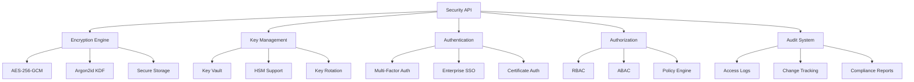

# Security API

Comprehensive API reference for TrojanHorse.js security features, encryption, authentication, and access control systems.

## Overview

The Security API provides enterprise-grade security features including encryption, key management, authentication, authorization, and audit logging for TrojanHorse.js deployments.



## Encryption Engine

### CryptoEngine Class

#### Constructor

```javascript
import { CryptoEngine } from 'trojanhorse-js/security';

const crypto = new CryptoEngine({
  // Encryption algorithm configuration
  encryption: {
    algorithm: 'aes-256-gcm',        // Default: 'aes-256-gcm'
    keySize: 256,                    // Key size in bits
    ivSize: 96,                      // IV size in bits (12 bytes for GCM)
    tagSize: 128                     // Auth tag size in bits (16 bytes)
  },
  
  // Key derivation configuration
  keyDerivation: {
    algorithm: 'argon2id',           // Default: 'argon2id'
    memory: 65536,                   // Memory usage in KiB (64 MB)
    iterations: 3,                   // Number of iterations
    parallelism: 4,                  // Degree of parallelism
    saltSize: 32                     // Salt size in bytes
  },
  
  // Hardware Security Module support
  hsm: {
    enabled: false,                  // Enable HSM support
    provider: 'aws-cloudhsm',        // HSM provider
    keyId: 'master-key-id'           // Master key identifier
  },
  
  // Performance options
  performance: {
    useNativeCrypto: true,           // Use Node.js native crypto when available
    fallbackToCryptoJS: true,        // Fallback to CryptoJS if native fails
    enableCaching: true,             // Cache derived keys
    cacheTimeout: 3600000            // Cache timeout in ms (1 hour)
  }
});
```

#### Methods

##### encrypt(data, options)

Encrypts data using AES-256-GCM with authenticated encryption.

```javascript
const encrypted = await crypto.encrypt('sensitive data', {
  password: 'strong-password',       // Password for key derivation
  associatedData: 'context-info',    // Additional authenticated data
  encoding: 'base64'                 // Output encoding: 'base64', 'hex', 'buffer'
});

console.log('Encrypted:', encrypted);
// Returns: { 
//   data: 'base64-encoded-encrypted-data',
//   iv: 'base64-encoded-iv',
//   tag: 'base64-encoded-auth-tag',
//   salt: 'base64-encoded-salt'
// }
```

##### decrypt(encryptedData, options)

Decrypts AES-256-GCM encrypted data with authentication verification.

```javascript
const decrypted = await crypto.decrypt(encrypted, {
  password: 'strong-password',       // Password for key derivation
  associatedData: 'context-info',    // Must match encryption AAD
  encoding: 'utf8'                   // Output encoding
});

console.log('Decrypted:', decrypted);
```

##### deriveKey(password, options)

Derives a cryptographic key from a password using Argon2id.

```javascript
const derivedKey = await crypto.deriveKey('password', {
  salt: 'optional-salt',             // Custom salt (generates if not provided)
  iterations: 100000,                // Override default iterations
  memory: 65536,                     // Override default memory
  parallelism: 4,                    // Override default parallelism
  keyLength: 32                      // Derived key length in bytes
});

console.log('Derived key:', derivedKey.key);
console.log('Salt used:', derivedKey.salt);
```

##### generateSecureRandom(size)

Generates cryptographically secure random bytes.

```javascript
const randomBytes = await crypto.generateSecureRandom(32);
console.log('Random bytes:', randomBytes);

// Generate secure random string
const randomString = await crypto.generateSecureRandom(16, 'hex');
console.log('Random string:', randomString);
```

##### hash(data, options)

Creates secure hash using SHA-256 or other algorithms.

```javascript
const hash = await crypto.hash('data to hash', {
  algorithm: 'sha256',               // Hash algorithm
  encoding: 'hex',                   // Output encoding
  iterations: 1                      // Number of iterations (for key stretching)
});

console.log('Hash:', hash);
```

## Key Management

### KeyVault Class

#### Constructor

```javascript
import { KeyVault } from 'trojanhorse-js/security';

const vault = new KeyVault({
  // Storage configuration
  storage: {
    type: 'file',                    // 'file', 'memory', 'database', 'cloud'
    path: './secure-vault.enc',      // File path for file storage
    encryption: true,                // Encrypt vault contents
    compression: false               // Compress vault contents
  },
  
  // Security settings
  security: {
    autoLock: true,                  // Auto-lock after timeout
    lockTimeout: 3600,               // Lock timeout in seconds
    maxAttempts: 3,                  // Max failed unlock attempts
    lockoutDuration: 900,            // Lockout duration in seconds
    requireMFA: false,               // Require multi-factor authentication
    auditLogging: true               // Enable audit logging
  },
  
  // Backup configuration
  backup: {
    enabled: true,                   // Enable automatic backups
    frequency: 'daily',              // Backup frequency
    retention: 30,                   // Number of backups to retain
    path: './backups/',              // Backup directory
    encryption: true                 // Encrypt backup files
  }
});
```

#### Methods

##### store(keyName, keyValue, options)

Stores an API key or credential in the encrypted vault.

```javascript
// Store simple API key
await vault.store('urlhaus', 'api-key-value');

// Store structured credential
await vault.store('enterprise_service', {
  apiKey: 'api-key',
  secretKey: 'secret-key',
  endpoint: 'https://api.service.com',
  region: 'us-east-1'
}, {
  validation: {
    enabled: true,                   // Validate key before storing
    testEndpoint: 'https://api.service.com/test',
    timeout: 5000
  },
  metadata: {
    description: 'Enterprise service credentials',
    createdBy: 'admin@company.com',
    expiresAt: '2025-12-31T23:59:59Z'
  }
});

// Store OAuth credentials
await vault.store('oauth_provider', {
  clientId: 'oauth-client-id',
  clientSecret: 'oauth-client-secret',
  refreshToken: 'refresh-token',
  accessToken: 'access-token',
  tokenUrl: 'https://oauth.provider.com/token',
  scopes: ['read', 'write']
});
```

##### retrieve(keyName, options)

Retrieves a stored credential from the vault.

```javascript
// Retrieve simple key
const apiKey = await vault.retrieve('urlhaus');
console.log('API Key:', apiKey);

// Retrieve structured credential
const credentials = await vault.retrieve('enterprise_service', {
  includeMetadata: true,             // Include metadata in response
  validateOnRetrieval: false         // Skip validation on retrieval
});

console.log('Credentials:', credentials.value);
console.log('Metadata:', credentials.metadata);
```

##### delete(keyName, options)

Deletes a credential from the vault.

```javascript
await vault.delete('old_service_key', {
  secureDelete: true,                // Securely overwrite data
  confirmDeletion: true,             // Require confirmation
  auditLog: true                     // Log deletion event
});
```

##### rotateKey(keyName, newKey, options)

Rotates an existing API key with graceful transition.

```javascript
const rotationResult = await vault.rotateKey('virustotal', 'new-api-key', {
  gracePeriod: '24h',                // Keep old key for 24 hours
  testNewKey: true,                  // Test new key before rotation
  notifyUsers: true,                 // Notify users of rotation
  rollbackOnFailure: true            // Rollback if validation fails
});

if (rotationResult.success) {
  console.log('Key rotation successful');
} else {
  console.error('Key rotation failed:', rotationResult.error);
}
```

##### lock()

Locks the vault, requiring password to unlock.

```javascript
await vault.lock();
console.log('Vault locked');
```

##### unlock(password)

Unlocks the vault with the master password.

```javascript
const unlocked = await vault.unlock('master-password');
if (unlocked) {
  console.log('Vault unlocked successfully');
} else {
  console.error('Failed to unlock vault');
}
```

##### export(options)

Exports vault contents for backup or migration.

```javascript
const exportData = await vault.export({
  format: 'encrypted',               // 'encrypted', 'plaintext', 'json'
  includeMetadata: true,             // Include key metadata
  password: 'export-password',       // Password for encrypted export
  excludeKeys: ['temporary_key']     // Keys to exclude from export
});

console.log('Exported vault data');
```

##### import(data, options)

Imports vault contents from backup or migration.

```javascript
await vault.import(exportData, {
  password: 'export-password',       // Password for encrypted import
  mergeStrategy: 'overwrite',        // 'overwrite', 'skip', 'merge'
  validateKeys: true,                // Validate imported keys
  backupBefore: true                 // Backup current vault before import
});
```

## Authentication

### EnterpriseAuth Class

#### Constructor

```javascript
import { EnterpriseAuth } from 'trojanhorse-js/security';

const auth = new EnterpriseAuth({
  // Authentication providers
  providers: {
    local: {
      enabled: true,                 // Enable local authentication
      passwordPolicy: {
        minLength: 12,
        requireUppercase: true,
        requireLowercase: true,
        requireNumbers: true,
        requireSymbols: true,
        maxAge: 90,                  // Password max age in days
        historyCount: 12             // Number of previous passwords to remember
      }
    },
    
    ldap: {
      enabled: true,
      host: 'ldap.company.com',
      port: 636,
      secure: true,
      baseDN: 'dc=company,dc=com',
      bindDN: 'cn=service,dc=company,dc=com',
      bindPassword: 'service-password',
      userFilter: '(uid={{username}})',
      groupFilter: '(member={{dn}})'
    },
    
    oauth2: {
      enabled: true,
      providers: {
        azure: {
          clientId: process.env.AZURE_CLIENT_ID,
          clientSecret: process.env.AZURE_CLIENT_SECRET,
          tenantId: process.env.AZURE_TENANT_ID,
          scope: 'openid profile email'
        },
        google: {
          clientId: process.env.GOOGLE_CLIENT_ID,
          clientSecret: process.env.GOOGLE_CLIENT_SECRET,
          scope: 'openid profile email'
        }
      }
    },
    
    saml: {
      enabled: true,
      entryPoint: 'https://sso.company.com/saml/login',
      issuer: 'trojanhorse-js',
      cert: fs.readFileSync('./saml-cert.pem')
    }
  },
  
  // Multi-factor authentication
  mfa: {
    enabled: true,
    required: true,                  // Require MFA for all users
    methods: {
      totp: {
        enabled: true,
        issuer: 'TrojanHorse.js',
        algorithm: 'SHA256',
        digits: 6,
        period: 30
      },
      webauthn: {
        enabled: true,
        rpName: 'TrojanHorse.js',
        rpId: 'company.com',
        requireResidentKey: false,
        userVerification: 'preferred'
      },
      sms: {
        enabled: false,              // Not recommended for production
        provider: 'twilio'
      }
    },
    backupCodes: {
      enabled: true,
      count: 10,
      length: 8
    }
  },
  
  // Session management
  session: {
    secret: process.env.SESSION_SECRET,
    timeout: 3600,                  // Session timeout in seconds
    rolling: true,                  // Reset timeout on activity
    secure: true,                   // Require HTTPS
    sameSite: 'strict',             // CSRF protection
    maxSessions: 3                  // Max concurrent sessions per user
  },
  
  // JWT configuration
  jwt: {
    secret: process.env.JWT_SECRET,
    algorithm: 'RS256',             // Use asymmetric algorithm
    expiresIn: '15m',               // Short-lived access tokens
    refreshTokenTTL: '7d',          // Refresh token TTL
    issuer: 'trojanhorse.company.com',
    audience: 'trojanhorse-api'
  }
});
```

#### Methods

##### authenticate(credentials, options)

Authenticates user credentials against configured providers.

```javascript
// Local authentication
const result = await auth.authenticate({
  username: 'user@company.com',
  password: 'user-password'
}, {
  provider: 'local',                 // Authentication provider
  rememberMe: false,                 // Create persistent session
  ipAddress: '192.168.1.100',        // Client IP for audit logging
  userAgent: 'Mozilla/5.0...'        // Client user agent
});

if (result.success) {
  console.log('Authentication successful');
  console.log('User:', result.user);
  console.log('Token:', result.token);
  console.log('MFA Required:', result.mfaRequired);
} else {
  console.error('Authentication failed:', result.error);
}

// OAuth2 authentication
const oauthResult = await auth.authenticate({
  provider: 'azure',
  code: 'oauth-authorization-code',
  state: 'csrf-state-token'
});

// SAML authentication
const samlResult = await auth.authenticate({
  provider: 'saml',
  samlResponse: 'base64-encoded-saml-response'
});
```

##### verifyMFA(token, options)

Verifies multi-factor authentication token.

```javascript
// Verify TOTP token
const mfaResult = await auth.verifyMFA({
  userId: 'user-id',
  token: '123456',                   // TOTP token
  method: 'totp'
});

// Verify WebAuthn credential
const webauthnResult = await auth.verifyMFA({
  userId: 'user-id',
  method: 'webauthn',
  credential: {
    id: 'credential-id',
    rawId: 'raw-credential-id',
    response: {
      authenticatorData: '...',
      clientDataJSON: '...',
      signature: '...'
    }
  }
});

// Verify backup code
const backupResult = await auth.verifyMFA({
  userId: 'user-id',
  token: 'backup-code-123',
  method: 'backup'
});
```

##### generateTokens(user, options)

Generates JWT access and refresh tokens.

```javascript
const tokens = await auth.generateTokens(user, {
  audience: 'trojanhorse-api',       // Token audience
  expiresIn: '15m',                  // Access token expiry
  refreshExpiresIn: '7d',            // Refresh token expiry
  scopes: ['read', 'write'],         // Token scopes
  sessionId: 'session-id'            // Associated session ID
});

console.log('Access Token:', tokens.accessToken);
console.log('Refresh Token:', tokens.refreshToken);
console.log('Expires In:', tokens.expiresIn);
```

##### verifyToken(token, options)

Verifies and decodes JWT tokens.

```javascript
const verification = await auth.verifyToken(accessToken, {
  audience: 'trojanhorse-api',       // Expected audience
  issuer: 'trojanhorse.company.com', // Expected issuer
  clockTolerance: 60,                // Clock skew tolerance in seconds
  ignoreExpiration: false            // Ignore expiration for testing
});

if (verification.valid) {
  console.log('Token valid');
  console.log('User:', verification.user);
  console.log('Scopes:', verification.scopes);
  console.log('Expires:', verification.exp);
} else {
  console.error('Token invalid:', verification.error);
}
```

##### refreshToken(refreshToken)

Refreshes an expired access token using a refresh token.

```javascript
const refreshResult = await auth.refreshToken(refreshToken);

if (refreshResult.success) {
  console.log('New Access Token:', refreshResult.accessToken);
  console.log('New Refresh Token:', refreshResult.refreshToken);
} else {
  console.error('Token refresh failed:', refreshResult.error);
}
```

##### revokeToken(token, options)

Revokes access or refresh tokens.

```javascript
await auth.revokeToken(accessToken, {
  type: 'access',                    // 'access' or 'refresh'
  revokeRefresh: true,               // Also revoke associated refresh token
  userId: 'user-id'                  // User ID for audit logging
});
```

## Authorization

### AuthorizationEngine Class

#### Constructor

```javascript
import { AuthorizationEngine } from 'trojanhorse-js/security';

const authz = new AuthorizationEngine({
  // Role-Based Access Control (RBAC)
  rbac: {
    enabled: true,
    roles: {
      admin: {
        permissions: ['*'],          // All permissions
        inherits: []                 // No role inheritance
      },
      analyst: {
        permissions: [
          'threats:read',
          'intelligence:read',
          'reports:read',
          'reports:create'
        ],
        inherits: ['viewer']
      },
      viewer: {
        permissions: [
          'dashboard:read',
          'threats:read'
        ],
        inherits: []
      },
      service: {
        permissions: [
          'api:read',
          'api:write'
        ],
        inherits: []
      }
    }
  },
  
  // Attribute-Based Access Control (ABAC)
  abac: {
    enabled: true,
    policies: [
      {
        name: 'time_based_access',
        effect: 'ALLOW',
        condition: 'user.department === "security" && time.hour >= 9 && time.hour <= 17'
      },
      {
        name: 'location_based_access',
        effect: 'DENY',
        condition: 'request.ip.country !== "US" && resource.classification === "confidential"'
      },
      {
        name: 'mfa_required_for_admin',
        effect: 'DENY',
        condition: 'user.role === "admin" && !user.mfaVerified'
      }
    ]
  },
  
  // Resource permissions
  resources: {
    threats: {
      actions: ['read', 'write', 'delete'],
      attributes: ['confidence', 'source', 'type']
    },
    vault: {
      actions: ['read', 'write', 'delete', 'rotate'],
      attributes: ['keyType', 'service', 'environment']
    },
    reports: {
      actions: ['read', 'write', 'delete', 'export'],
      attributes: ['classification', 'department']
    }
  }
});
```

#### Methods

##### authorize(subject, action, resource, context)

Authorizes an action based on RBAC and ABAC policies.

```javascript
// Basic authorization check
const authorized = await authz.authorize(
  {
    id: 'user-123',
    roles: ['analyst'],
    department: 'security',
    mfaVerified: true
  },
  'read',
  {
    type: 'threats',
    id: 'threat-456',
    attributes: {
      confidence: 85,
      source: 'urlhaus',
      classification: 'internal'
    }
  },
  {
    ip: '192.168.1.100',
    time: new Date(),
    userAgent: 'Mozilla/5.0...'
  }
);

if (authorized.allowed) {
  console.log('Access granted');
} else {
  console.log('Access denied:', authorized.reason);
}

// Batch authorization
const resources = [
  { type: 'threats', id: 'threat-1' },
  { type: 'threats', id: 'threat-2' },
  { type: 'vault', id: 'key-urlhaus' }
];

const batchResult = await authz.authorizeBatch(user, 'read', resources, context);
console.log('Authorized resources:', batchResult.allowed);
console.log('Denied resources:', batchResult.denied);
```

##### checkPermission(user, permission)

Checks if a user has a specific permission.

```javascript
const hasPermission = await authz.checkPermission(user, 'threats:read');
console.log('Has permission:', hasPermission);

// Check multiple permissions
const permissions = await authz.checkPermissions(user, [
  'threats:read',
  'threats:write',
  'vault:read'
]);
console.log('Permissions:', permissions);
```

##### addRole(roleName, roleDefinition)

Adds a new role to the RBAC system.

```javascript
await authz.addRole('security_lead', {
  permissions: [
    'threats:*',
    'intelligence:*',
    'reports:*',
    'vault:read',
    'users:read'
  ],
  inherits: ['analyst'],
  metadata: {
    description: 'Security team lead role',
    department: 'security'
  }
});
```

##### assignRole(userId, roleName, options)

Assigns a role to a user.

```javascript
await authz.assignRole('user-123', 'analyst', {
  temporaryUntil: '2025-12-31T23:59:59Z', // Temporary role assignment
  approvedBy: 'admin-456',                // Approval tracking
  reason: 'Promoted to analyst position'
});
```

##### revokeRole(userId, roleName, options)

Revokes a role from a user.

```javascript
await authz.revokeRole('user-123', 'analyst', {
  revokedBy: 'admin-456',
  reason: 'Role change due to department transfer',
  auditLog: true
});
```

## Audit System

### AuditLogger Class

#### Constructor

```javascript
import { AuditLogger } from 'trojanhorse-js/security';

const audit = new AuditLogger({
  // Storage configuration
  storage: {
    type: 'database',                // 'file', 'database', 'siem', 'cloud'
    connection: {
      host: 'audit-db.company.com',
      database: 'audit_logs',
      table: 'security_events'
    },
    retention: '7y',                 // Audit log retention period
    archiving: {
      enabled: true,
      after: '1y',                   // Archive after 1 year
      compression: true
    }
  },
  
  // Event configuration
  events: {
    authentication: true,            // Log authentication events
    authorization: true,             // Log authorization decisions
    dataAccess: true,               // Log data access events
    configuration: true,             // Log configuration changes
    errors: true,                   // Log security errors
    admin: true                     // Log administrative actions
  },
  
  // Data to include in logs
  includeData: {
    userId: true,
    sessionId: true,
    ipAddress: true,
    userAgent: true,
    timestamp: true,
    action: true,
    resource: true,
    outcome: true,
    details: true
  },
  
  // Compliance settings
  compliance: {
    standard: 'SOC2',               // Compliance standard
    encryption: true,                // Encrypt audit logs
    integrity: true,                 // Ensure log integrity
    immutable: true                  // Make logs immutable
  }
});
```

#### Methods

##### logEvent(event, options)

Logs a security event to the audit trail.

```javascript
// Log authentication event
await audit.logEvent({
  type: 'authentication',
  action: 'login',
  outcome: 'success',
  userId: 'user-123',
  sessionId: 'session-456',
  ipAddress: '192.168.1.100',
  userAgent: 'Mozilla/5.0...',
  details: {
    provider: 'ldap',
    mfaUsed: true,
    loginDuration: 1500
  }
});

// Log authorization event
await audit.logEvent({
  type: 'authorization',
  action: 'access_denied',
  outcome: 'failure',
  userId: 'user-123',
  resource: {
    type: 'vault',
    id: 'sensitive-keys'
  },
  reason: 'insufficient_permissions',
  details: {
    requiredRole: 'admin',
    userRoles: ['analyst']
  }
});

// Log data access event
await audit.logEvent({
  type: 'data_access',
  action: 'read',
  outcome: 'success',
  userId: 'user-123',
  resource: {
    type: 'threats',
    id: 'threat-789',
    classification: 'confidential'
  },
  details: {
    query: 'threats where confidence > 90',
    recordsReturned: 15
  }
});
```

##### search(criteria, options)

Searches audit logs based on criteria.

```javascript
// Search by user
const userEvents = await audit.search({
  userId: 'user-123',
  timeRange: {
    start: '2025-01-01T00:00:00Z',
    end: '2025-01-31T23:59:59Z'
  },
  eventTypes: ['authentication', 'authorization']
});

// Search by action
const failedLogins = await audit.search({
  type: 'authentication',
  action: 'login',
  outcome: 'failure',
  timeRange: { start: '-24h', end: 'now' }
}, {
  limit: 100,
  orderBy: 'timestamp',
  orderDirection: 'desc'
});

// Advanced search with filters
const suspiciousActivity = await audit.search({
  $or: [
    { 
      type: 'authentication',
      outcome: 'failure',
      'details.failureCount': { $gte: 5 }
    },
    {
      type: 'authorization',
      outcome: 'failure',
      ipAddress: { $not: { $in: ['192.168.1.0/24'] } }
    }
  ]
});
```

##### generateReport(criteria, options)

Generates compliance and security reports.

```javascript
// Generate SOC2 compliance report
const soc2Report = await audit.generateReport({
  standard: 'SOC2',
  period: {
    start: '2025-01-01',
    end: '2025-01-31'
  },
  controls: [
    'CC6.1',  // Logical Access Controls
    'CC6.2',  // Authentication
    'CC6.3',  // Authorization
    'CC6.6',  // Logging and Monitoring
    'CC6.7'   // System Monitoring
  ]
}, {
  format: 'pdf',
  includeEvidence: true,
  groupBy: 'control',
  summary: true
});

// Generate security summary report
const securityReport = await audit.generateReport({
  type: 'security_summary',
  period: { start: '-30d', end: 'now' },
  sections: [
    'authentication_summary',
    'authorization_failures',
    'data_access_patterns',
    'anomaly_detection',
    'top_users',
    'top_resources'
  ]
}, {
  format: 'json',
  charts: true,
  metrics: true
});

console.log('Report generated:', soc2Report.path);
```

##### verifyIntegrity(options)

Verifies the integrity of audit logs.

```javascript
const integrityCheck = await audit.verifyIntegrity({
  timeRange: { start: '-7d', end: 'now' },
  checkHashes: true,
  checkSequence: true,
  checkSignatures: true
});

if (integrityCheck.valid) {
  console.log('Audit log integrity verified');
} else {
  console.error('Integrity issues found:', integrityCheck.issues);
}
```

## Error Handling

### SecurityError Classes

```javascript
import { 
  SecurityError,
  AuthenticationError,
  AuthorizationError,
  EncryptionError,
  KeyManagementError
} from 'trojanhorse-js/security';

// Handle authentication errors
try {
  await auth.authenticate(credentials);
} catch (error) {
  if (error instanceof AuthenticationError) {
    switch (error.code) {
      case 'INVALID_CREDENTIALS':
        console.log('Invalid username or password');
        break;
      case 'ACCOUNT_LOCKED':
        console.log('Account is locked due to failed attempts');
        break;
      case 'MFA_REQUIRED':
        console.log('Multi-factor authentication required');
        break;
      case 'PASSWORD_EXPIRED':
        console.log('Password has expired');
        break;
    }
  }
}

// Handle authorization errors
try {
  await authz.authorize(user, action, resource);
} catch (error) {
  if (error instanceof AuthorizationError) {
    console.log('Access denied:', error.message);
    console.log('Required permissions:', error.requiredPermissions);
    console.log('User permissions:', error.userPermissions);
  }
}

// Handle encryption errors
try {
  await crypto.encrypt(data, options);
} catch (error) {
  if (error instanceof EncryptionError) {
    console.error('Encryption failed:', error.message);
    console.error('Algorithm:', error.algorithm);
    console.error('Key size:', error.keySize);
  }
}

// Handle key management errors
try {
  await vault.rotateKey(keyName, newKey);
} catch (error) {
  if (error instanceof KeyManagementError) {
    console.error('Key rotation failed:', error.message);
    console.error('Key name:', error.keyName);
    console.error('Reason:', error.reason);
  }
}
```

## Best Practices

### Security Implementation Guidelines

1. **Encryption**:
   - Always use AES-256-GCM for symmetric encryption
   - Use Argon2id for password hashing and key derivation
   - Implement proper key rotation policies
   - Use HSMs for critical key storage

2. **Authentication**:
   - Require strong passwords with complexity requirements
   - Implement multi-factor authentication
   - Use short-lived access tokens (15 minutes or less)
   - Implement proper session management

3. **Authorization**:
   - Follow principle of least privilege
   - Use both RBAC and ABAC for comprehensive access control
   - Regularly audit user permissions
   - Implement time-based and location-based restrictions

4. **Audit Logging**:
   - Log all security-relevant events
   - Ensure logs are tamper-proof and immutable
   - Implement real-time monitoring and alerting
   - Maintain logs for compliance requirements

5. **Error Handling**:
   - Don't expose sensitive information in error messages
   - Implement proper rate limiting
   - Log security events for investigation
   - Provide clear guidance for resolution

---

**Next Steps**:
- Review [Core API](core.md) for main TrojanHorse.js functionality
- Check [Integrations API](integrations.md) for external system connections
- Explore [Analytics API](analytics.md) for monitoring and metrics