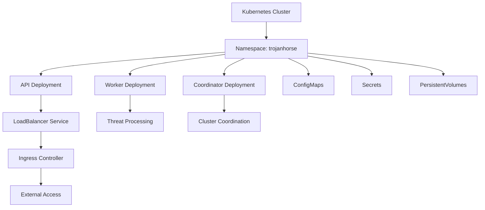

# Kubernetes Deployment

Complete guide for deploying TrojanHorse.js on Kubernetes clusters for production-scale threat intelligence operations.

## Overview

TrojanHorse.js Enterprise provides comprehensive Kubernetes deployment manifests with support for horizontal scaling, high availability, and cloud-native integrations.



## Prerequisites

### Cluster Requirements

- **Kubernetes**: v1.24+ 
- **Resources**: Minimum 8 CPU cores, 16GB RAM
- **Storage**: 100GB+ for persistent volumes
- **Networking**: CNI plugin (Calico, Flannel, etc.)

### Required Permissions

```yaml
# rbac.yaml
apiVersion: v1
kind: ServiceAccount
metadata:
  name: trojanhorse
  namespace: trojanhorse
---
apiVersion: rbac.authorization.k8s.io/v1
kind: ClusterRole
metadata:
  name: trojanhorse
rules:
- apiGroups: [""]
  resources: ["pods", "services", "endpoints"]
  verbs: ["get", "list", "watch"]
- apiGroups: ["apps"]
  resources: ["deployments", "replicasets"]
  verbs: ["get", "list", "watch"]
- apiGroups: ["networking.k8s.io"]
  resources: ["networkpolicies"]
  verbs: ["get", "list", "watch"]
---
apiVersion: rbac.authorization.k8s.io/v1
kind: ClusterRoleBinding
metadata:
  name: trojanhorse
roleRef:
  apiGroup: rbac.authorization.k8s.io
  kind: ClusterRole
  name: trojanhorse
subjects:
- kind: ServiceAccount
  name: trojanhorse
  namespace: trojanhorse
```

## Core Deployments

### API Deployment

```yaml
# api-deployment.yaml
apiVersion: apps/v1
kind: Deployment
metadata:
  name: trojanhorse-api
  namespace: trojanhorse
  labels:
    app: trojanhorse
    component: api
spec:
  replicas: 3
  strategy:
    type: RollingUpdate
    rollingUpdate:
      maxSurge: 1
      maxUnavailable: 0
  selector:
    matchLabels:
      app: trojanhorse
      component: api
  template:
    metadata:
      labels:
        app: trojanhorse
        component: api
      annotations:
        prometheus.io/scrape: "true"
        prometheus.io/port: "9090"
        prometheus.io/path: "/metrics"
    spec:
      serviceAccountName: trojanhorse
      securityContext:
        runAsNonRoot: true
        runAsUser: 1001
        fsGroup: 1001
      containers:
      - name: trojanhorse-api
        image: trojanhorse/enterprise:latest
        imagePullPolicy: Always
        ports:
        - containerPort: 3000
          name: http
        - containerPort: 9090
          name: metrics
        env:
        - name: CLUSTER_ROLE
          value: "api"
        - name: NODE_ENV
          value: "production"
        - name: TROJANHORSE_MODE
          value: "cluster"
        resources:
          requests:
            cpu: "500m"
            memory: "1Gi"
          limits:
            cpu: "2"
            memory: "4Gi"
        livenessProbe:
          httpGet:
            path: /health
            port: 3000
          initialDelaySeconds: 30
          periodSeconds: 10
          timeoutSeconds: 5
          failureThreshold: 3
        readinessProbe:
          httpGet:
            path: /ready
            port: 3000
          initialDelaySeconds: 10
          periodSeconds: 5
          timeoutSeconds: 3
          failureThreshold: 3
```

### Worker Deployment

```yaml
# worker-deployment.yaml
apiVersion: apps/v1
kind: Deployment
metadata:
  name: trojanhorse-worker
  namespace: trojanhorse
  labels:
    app: trojanhorse
    component: worker
spec:
  replicas: 5
  strategy:
    type: RollingUpdate
    rollingUpdate:
      maxSurge: 2
      maxUnavailable: 1
  selector:
    matchLabels:
      app: trojanhorse
      component: worker
  template:
    metadata:
      labels:
        app: trojanhorse
        component: worker
    spec:
      serviceAccountName: trojanhorse
      securityContext:
        runAsNonRoot: true
        runAsUser: 1001
        fsGroup: 1001
      containers:
      - name: trojanhorse-worker
        image: trojanhorse/enterprise:latest
        imagePullPolicy: Always
        env:
        - name: CLUSTER_ROLE
          value: "worker"
        - name: NODE_ENV
          value: "production"
        resources:
          requests:
            cpu: "1"
            memory: "2Gi"
          limits:
            cpu: "4"
            memory: "8Gi"
        livenessProbe:
          exec:
            command:
            - node
            - scripts/worker-health.js
          initialDelaySeconds: 60
          periodSeconds: 30
          failureThreshold: 3
```

### Services and Ingress

```yaml
# services.yaml
apiVersion: v1
kind: Service
metadata:
  name: trojanhorse-api-service
  namespace: trojanhorse
  labels:
    app: trojanhorse
    component: api
spec:
  type: ClusterIP
  ports:
  - port: 80
    targetPort: 3000
    protocol: TCP
    name: http
  - port: 9090
    targetPort: 9090
    protocol: TCP
    name: metrics
  selector:
    app: trojanhorse
    component: api
---
# ingress.yaml
apiVersion: networking.k8s.io/v1
kind: Ingress
metadata:
  name: trojanhorse-ingress
  namespace: trojanhorse
  annotations:
    kubernetes.io/ingress.class: nginx
    cert-manager.io/cluster-issuer: letsencrypt-prod
    nginx.ingress.kubernetes.io/ssl-redirect: "true"
    nginx.ingress.kubernetes.io/rate-limit: "100"
spec:
  tls:
  - hosts:
    - trojanhorse.company.com
    secretName: trojanhorse-tls
  rules:
  - host: trojanhorse.company.com
    http:
      paths:
      - path: /
        pathType: Prefix
        backend:
          service:
            name: trojanhorse-api-service
            port:
              number: 80
```

### Horizontal Pod Autoscaler

```yaml
# hpa.yaml
apiVersion: autoscaling/v2
kind: HorizontalPodAutoscaler
metadata:
  name: trojanhorse-api-hpa
  namespace: trojanhorse
spec:
  scaleTargetRef:
    apiVersion: apps/v1
    kind: Deployment
    name: trojanhorse-api
  minReplicas: 3
  maxReplicas: 20
  metrics:
  - type: Resource
    resource:
      name: cpu
      target:
        type: Utilization
        averageUtilization: 70
  - type: Resource
    resource:
      name: memory
      target:
        type: Utilization
        averageUtilization: 80
  behavior:
    scaleDown:
      stabilizationWindowSeconds: 300
      policies:
      - type: Percent
        value: 10
        periodSeconds: 60
    scaleUp:
      stabilizationWindowSeconds: 60
      policies:
      - type: Percent
        value: 50
        periodSeconds: 60
```

## Security Configuration

### Network Policies

```yaml
# network-policy.yaml
apiVersion: networking.k8s.io/v1
kind: NetworkPolicy
metadata:
  name: trojanhorse-network-policy
  namespace: trojanhorse
spec:
  podSelector:
    matchLabels:
      app: trojanhorse
  policyTypes:
  - Ingress
  - Egress
  ingress:
  - from:
    - namespaceSelector:
        matchLabels:
          name: ingress-nginx
    - podSelector:
        matchLabels:
          app: prometheus
    ports:
    - protocol: TCP
      port: 3000
    - protocol: TCP
      port: 9090
  egress:
  - to: []
    ports:
    - protocol: TCP
      port: 443
    - protocol: TCP
      port: 80
```

### Secrets Management

```yaml
# secrets.yaml
apiVersion: v1
kind: Secret
metadata:
  name: trojanhorse-secrets
  namespace: trojanhorse
type: Opaque
stringData:
  JWT_SECRET: "your-jwt-secret-here"
  API_ENCRYPTION_KEY: "your-encryption-key-here"
  URLHAUS_API_KEY: "your-urlhaus-api-key"
  VIRUSTOTAL_API_KEY: "your-virustotal-api-key"
  ALIENVAULT_API_KEY: "your-alienvault-api-key"
```

## Deployment Script

```bash
#!/bin/bash
# deploy.sh

set -e

NAMESPACE="trojanhorse"
echo "Deploying TrojanHorse.js to Kubernetes..."

# Create namespace
kubectl create namespace $NAMESPACE --dry-run=client -o yaml | kubectl apply -f -

# Apply RBAC
kubectl apply -f k8s/rbac.yaml

# Create secrets
kubectl apply -f k8s/secrets.yaml

# Deploy applications
kubectl apply -f k8s/api-deployment.yaml
kubectl apply -f k8s/worker-deployment.yaml

# Create services
kubectl apply -f k8s/services.yaml

# Setup networking
kubectl apply -f k8s/ingress.yaml
kubectl apply -f k8s/network-policy.yaml

# Configure autoscaling
kubectl apply -f k8s/hpa.yaml

echo "Deployment completed!"
kubectl get pods -n $NAMESPACE
```

---

**Next Steps**: Check [Docker Deployment](docker.md) for containerization or [Production Deployment](production.md) for additional strategies.