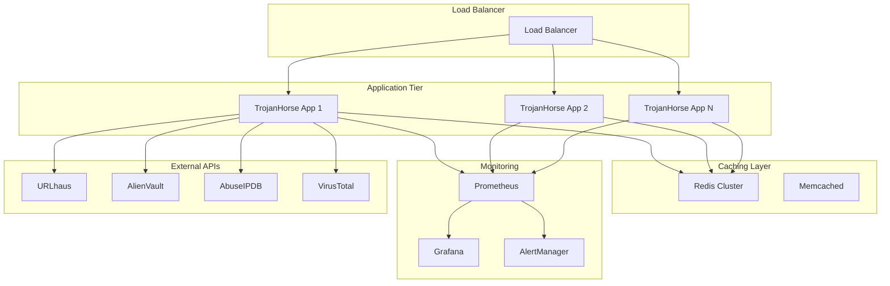

# Production Deployment Guide

Complete guide for deploying TrojanHorse.js in production environments with security, scalability, and reliability best practices.

## Production Readiness Checklist

### ✅ Security
- [ ] API keys stored in encrypted vault or secure environment variables
- [ ] HTTPS enforced for all communications
- [ ] SSL certificate validation enabled
- [ ] Audit logging configured
- [ ] Access controls implemented
- [ ] Rate limiting configured
- [ ] Input validation enabled

### ✅ Performance
- [ ] Caching strategy implemented
- [ ] Circuit breakers configured
- [ ] Connection pooling optimized
- [ ] Memory limits set
- [ ] Garbage collection tuned
- [ ] Monitoring and alerting setup

### ✅ Reliability
- [ ] Health checks implemented
- [ ] Graceful shutdown handling
- [ ] Error recovery mechanisms
- [ ] Backup and recovery procedures
- [ ] Load balancing configured
- [ ] Auto-scaling setup

### ✅ Operational
- [ ] Logging and monitoring
- [ ] Metrics collection
- [ ] Deployment automation
- [ ] Configuration management
- [ ] Documentation updated
- [ ] Incident response procedures

## Architecture Overview



## Docker Deployment

### Production Dockerfile

```dockerfile
# Multi-stage build for optimized production image
FROM node:18-alpine AS builder

WORKDIR /app

# Copy package files
COPY package*.json ./
COPY tsconfig.json ./

# Install dependencies
RUN npm ci --only=production && npm cache clean --force

# Copy source code
COPY src/ ./src/

# Build application
RUN npm run build

# Production stage
FROM node:18-alpine AS production

# Security: Create non-root user
RUN addgroup -g 1001 -S trojanhorse && \
    adduser -S trojanhorse -u 1001

# Install security updates
RUN apk --no-cache upgrade && \
    apk --no-cache add dumb-init

# Set working directory
WORKDIR /app

# Copy built application
COPY --from=builder --chown=trojanhorse:trojanhorse /app/dist ./dist
COPY --from=builder --chown=trojanhorse:trojanhorse /app/node_modules ./node_modules
COPY --chown=trojanhorse:trojanhorse package*.json ./

# Security: Remove package manager
RUN apk del npm

# Set security headers
ENV NODE_ENV=production
ENV NODE_OPTIONS="--max-old-space-size=512"

# Health check
HEALTHCHECK --interval=30s --timeout=10s --start-period=5s --retries=3 \
    CMD node -e "
        const http = require('http');
        const options = { host: 'localhost', port: 3000, path: '/health', timeout: 2000 };
        const req = http.request(options, (res) => {
            if (res.statusCode === 200) process.exit(0);
            else process.exit(1);
        });
        req.on('error', () => process.exit(1));
        req.end();
    "

# Switch to non-root user
USER trojanhorse

# Expose port
EXPOSE 3000

# Use dumb-init for proper signal handling
ENTRYPOINT ["dumb-init", "--"]
CMD ["node", "dist/server.js"]
```

### Docker Compose for Production

```yaml
# docker-compose.prod.yml
version: '3.8'

services:
  trojanhorse-app:
    build:
      context: .
      dockerfile: Dockerfile
      target: production
    deploy:
      replicas: 3
      restart_policy:
        condition: on-failure
        delay: 5s
        max_attempts: 3
      resources:
        limits:
          cpus: '1.0'
          memory: 512M
        reservations:
          cpus: '0.25'
          memory: 256M
    environment:
      - NODE_ENV=production
      - REDIS_URL=redis://redis:6379
      - ALIENVAULT_API_KEY=${ALIENVAULT_API_KEY}
      - ABUSEIPDB_API_KEY=${ABUSEIPDB_API_KEY}
      - VIRUSTOTAL_API_KEY=${VIRUSTOTAL_API_KEY}
    depends_on:
      - redis
      - prometheus
    networks:
      - app-network
    labels:
      - "traefik.enable=true"
      - "traefik.http.routers.trojanhorse.rule=Host(`trojanhorse.company.com`)"
      - "traefik.http.routers.trojanhorse.tls=true"

  redis:
    image: redis:7-alpine
    deploy:
      resources:
        limits:
          cpus: '0.5'
          memory: 256M
    command: redis-server --appendonly yes --maxmemory 200mb --maxmemory-policy allkeys-lru
    volumes:
      - redis-data:/data
    networks:
      - app-network
    healthcheck:
      test: ["CMD", "redis-cli", "ping"]
      interval: 30s
      timeout: 10s
      retries: 3

  traefik:
    image: traefik:v2.10
    command:
      - "--api.dashboard=true"
      - "--providers.docker=true"
      - "--entrypoints.web.address=:80"
      - "--entrypoints.websecure.address=:443"
      - "--certificatesresolvers.letsencrypt.acme.email=admin@company.com"
      - "--certificatesresolvers.letsencrypt.acme.storage=/acme.json"
      - "--certificatesresolvers.letsencrypt.acme.httpchallenge.entrypoint=web"
    ports:
      - "80:80"
      - "443:443"
    volumes:
      - /var/run/docker.sock:/var/run/docker.sock:ro
      - traefik-data:/acme.json
    networks:
      - app-network

  prometheus:
    image: prom/prometheus:latest
    ports:
      - "9090:9090"
    volumes:
      - ./monitoring/prometheus.yml:/etc/prometheus/prometheus.yml
      - prometheus-data:/prometheus
    networks:
      - app-network

  grafana:
    image: grafana/grafana:latest
    ports:
      - "3001:3000"
    environment:
      - GF_SECURITY_ADMIN_PASSWORD=${GRAFANA_PASSWORD}
    volumes:
      - grafana-data:/var/lib/grafana
      - ./monitoring/grafana:/etc/grafana/provisioning
    networks:
      - app-network

volumes:
  redis-data:
  traefik-data:
  prometheus-data:
  grafana-data:

networks:
  app-network:
    driver: overlay
    attachable: true
```

## Kubernetes Deployment

### Namespace and ConfigMap

```yaml
# k8s/namespace.yaml
apiVersion: v1
kind: Namespace
metadata:
  name: trojanhorse
  labels:
    name: trojanhorse
---
# k8s/configmap.yaml
apiVersion: v1
kind: ConfigMap
metadata:
  name: trojanhorse-config
  namespace: trojanhorse
data:
  NODE_ENV: "production"
  REDIS_URL: "redis://redis-service:6379"
  LOG_LEVEL: "info"
  MAX_CONCURRENCY: "10"
  CACHE_TTL: "3600000"
```

### Secrets Management

```yaml
# k8s/secrets.yaml
apiVersion: v1
kind: Secret
metadata:
  name: trojanhorse-secrets
  namespace: trojanhorse
type: Opaque
data:
  # Base64 encoded API keys
  ALIENVAULT_API_KEY: <base64-encoded-key>
  ABUSEIPDB_API_KEY: <base64-encoded-key>
  VIRUSTOTAL_API_KEY: <base64-encoded-key>
```

### Deployment

```yaml
# k8s/deployment.yaml
apiVersion: apps/v1
kind: Deployment
metadata:
  name: trojanhorse-app
  namespace: trojanhorse
  labels:
    app: trojanhorse
spec:
  replicas: 3
  strategy:
    type: RollingUpdate
    rollingUpdate:
      maxSurge: 1
      maxUnavailable: 0
  selector:
    matchLabels:
      app: trojanhorse
  template:
    metadata:
      labels:
        app: trojanhorse
    spec:
      securityContext:
        runAsNonRoot: true
        runAsUser: 1001
        fsGroup: 1001
      containers:
      - name: trojanhorse
        image: trojanhorse/trojanhorse-js:1.0.0
        imagePullPolicy: Always
        ports:
        - containerPort: 3000
          name: http
        env:
        - name: NODE_ENV
          valueFrom:
            configMapKeyRef:
              name: trojanhorse-config
              key: NODE_ENV
        - name: REDIS_URL
          valueFrom:
            configMapKeyRef:
              name: trojanhorse-config
              key: REDIS_URL
        - name: ALIENVAULT_API_KEY
          valueFrom:
            secretKeyRef:
              name: trojanhorse-secrets
              key: ALIENVAULT_API_KEY
        - name: ABUSEIPDB_API_KEY
          valueFrom:
            secretKeyRef:
              name: trojanhorse-secrets
              key: ABUSEIPDB_API_KEY
        - name: VIRUSTOTAL_API_KEY
          valueFrom:
            secretKeyRef:
              name: trojanhorse-secrets
              key: VIRUSTOTAL_API_KEY
        resources:
          requests:
            memory: "256Mi"
            cpu: "250m"
          limits:
            memory: "512Mi"
            cpu: "500m"
        livenessProbe:
          httpGet:
            path: /health
            port: 3000
          initialDelaySeconds: 30
          periodSeconds: 30
          timeoutSeconds: 10
          failureThreshold: 3
        readinessProbe:
          httpGet:
            path: /ready
            port: 3000
          initialDelaySeconds: 5
          periodSeconds: 10
          timeoutSeconds: 5
          failureThreshold: 3
        securityContext:
          allowPrivilegeEscalation: false
          readOnlyRootFilesystem: true
          capabilities:
            drop:
            - ALL
        volumeMounts:
        - name: tmp-volume
          mountPath: /tmp
        - name: logs-volume
          mountPath: /app/logs
      volumes:
      - name: tmp-volume
        emptyDir: {}
      - name: logs-volume
        emptyDir: {}
      serviceAccountName: trojanhorse-service-account
      automountServiceAccountToken: false
```

### Service and Ingress

```yaml
# k8s/service.yaml
apiVersion: v1
kind: Service
metadata:
  name: trojanhorse-service
  namespace: trojanhorse
  labels:
    app: trojanhorse
spec:
  type: ClusterIP
  ports:
  - port: 80
    targetPort: 3000
    protocol: TCP
    name: http
  selector:
    app: trojanhorse
---
# k8s/ingress.yaml
apiVersion: networking.k8s.io/v1
kind: Ingress
metadata:
  name: trojanhorse-ingress
  namespace: trojanhorse
  annotations:
    kubernetes.io/ingress.class: nginx
    cert-manager.io/cluster-issuer: letsencrypt-prod
    nginx.ingress.kubernetes.io/rate-limit: "100"
    nginx.ingress.kubernetes.io/rate-limit-window: "1m"
spec:
  tls:
  - hosts:
    - trojanhorse.company.com
    secretName: trojanhorse-tls
  rules:
  - host: trojanhorse.company.com
    http:
      paths:
      - path: /
        pathType: Prefix
        backend:
          service:
            name: trojanhorse-service
            port:
              number: 80
```

### Horizontal Pod Autoscaler

```yaml
# k8s/hpa.yaml
apiVersion: autoscaling/v2
kind: HorizontalPodAutoscaler
metadata:
  name: trojanhorse-hpa
  namespace: trojanhorse
spec:
  scaleTargetRef:
    apiVersion: apps/v1
    kind: Deployment
    name: trojanhorse-app
  minReplicas: 3
  maxReplicas: 10
  metrics:
  - type: Resource
    resource:
      name: cpu
      target:
        type: Utilization
        averageUtilization: 70
  - type: Resource
    resource:
      name: memory
      target:
        type: Utilization
        averageUtilization: 80
  behavior:
    scaleUp:
      stabilizationWindowSeconds: 300
      policies:
      - type: Percent
        value: 100
        periodSeconds: 15
    scaleDown:
      stabilizationWindowSeconds: 300
      policies:
      - type: Percent
        value: 10
        periodSeconds: 60
```

## Monitoring and Observability

### Prometheus Configuration

```yaml
# monitoring/prometheus.yml
global:
  scrape_interval: 15s
  evaluation_interval: 15s

rule_files:
  - "trojanhorse_rules.yml"

scrape_configs:
  - job_name: 'trojanhorse'
    static_configs:
      - targets: ['trojanhorse-app:3000']
    metrics_path: '/metrics'
    scrape_interval: 30s

  - job_name: 'redis'
    static_configs:
      - targets: ['redis:6379']

alerting:
  alertmanagers:
    - static_configs:
        - targets:
          - alertmanager:9093
```

### Alerting Rules

```yaml
# monitoring/trojanhorse_rules.yml
groups:
- name: trojanhorse
  rules:
  - alert: HighErrorRate
    expr: rate(trojanhorse_requests_total{status=~"5.."}[5m]) > 0.1
    for: 5m
    labels:
      severity: warning
    annotations:
      summary: "High error rate detected"
      description: "Error rate is {{ $value }} for the last 5 minutes"

  - alert: HighLatency
    expr: histogram_quantile(0.95, rate(trojanhorse_request_duration_seconds_bucket[5m])) > 1
    for: 5m
    labels:
      severity: warning
    annotations:
      summary: "High latency detected"
      description: "95th percentile latency is {{ $value }}s"

  - alert: FeedDown
    expr: trojanhorse_feed_up == 0
    for: 2m
    labels:
      severity: critical
    annotations:
      summary: "Threat feed is down"
      description: "Feed {{ $labels.feed }} has been down for more than 2 minutes"

  - alert: VaultLocked
    expr: trojanhorse_vault_locked == 1
    for: 10m
    labels:
      severity: warning
    annotations:
      summary: "Vault has been locked"
      description: "API key vault has been locked for more than 10 minutes"
```

### Application Metrics

```javascript
// server/metrics.js
import promClient from 'prom-client';

// Create metrics registry
const register = new promClient.Registry();

// Default metrics
promClient.collectDefaultMetrics({ register });

// Custom metrics
const requestDuration = new promClient.Histogram({
  name: 'trojanhorse_request_duration_seconds',
  help: 'Duration of HTTP requests in seconds',
  labelNames: ['method', 'route', 'status'],
  buckets: [0.1, 0.5, 1, 2, 5]
});

const requestsTotal = new promClient.Counter({
  name: 'trojanhorse_requests_total',
  help: 'Total number of HTTP requests',
  labelNames: ['method', 'route', 'status']
});

const feedStatus = new promClient.Gauge({
  name: 'trojanhorse_feed_up',
  help: 'Status of threat feeds (1=up, 0=down)',
  labelNames: ['feed']
});

const threatsDetected = new promClient.Counter({
  name: 'trojanhorse_threats_detected_total',
  help: 'Total number of threats detected',
  labelNames: ['feed', 'severity']
});

const vaultStatus = new promClient.Gauge({
  name: 'trojanhorse_vault_locked',
  help: 'Vault lock status (1=locked, 0=unlocked)'
});

const cacheHitRate = new promClient.Gauge({
  name: 'trojanhorse_cache_hit_rate',
  help: 'Cache hit rate percentage'
});

// Register metrics
register.registerMetric(requestDuration);
register.registerMetric(requestsTotal);
register.registerMetric(feedStatus);
register.registerMetric(threatsDetected);
register.registerMetric(vaultStatus);
register.registerMetric(cacheHitRate);

export {
  register,
  requestDuration,
  requestsTotal,
  feedStatus,
  threatsDetected,
  vaultStatus,
  cacheHitRate
};
```

### Health Check Implementation

```javascript
// server/health.js
import { TrojanHorse } from '../src/index.js';

class HealthChecker {
  constructor(trojan) {
    this.trojan = trojan;
    this.healthCache = null;
    this.lastCheck = 0;
    this.cacheTimeout = 30000; // 30 seconds
  }

  async getHealth() {
    const now = Date.now();
    
    // Return cached result if recent
    if (this.healthCache && (now - this.lastCheck) < this.cacheTimeout) {
      return this.healthCache;
    }

    const health = {
      status: 'healthy',
      timestamp: new Date().toISOString(),
      uptime: process.uptime(),
      version: process.env.npm_package_version,
      checks: {}
    };

    try {
      // Check TrojanHorse instance
      const trojanHealth = await this.trojan.getHealth();
      health.checks.trojanhorse = {
        status: trojanHealth.overall,
        feeds: trojanHealth.feeds
      };

      // Check memory usage
      const memUsage = process.memoryUsage();
      health.checks.memory = {
        status: memUsage.heapUsed < 400 * 1024 * 1024 ? 'healthy' : 'warning', // 400MB threshold
        heapUsed: Math.round(memUsage.heapUsed / 1024 / 1024),
        heapTotal: Math.round(memUsage.heapTotal / 1024 / 1024),
        rss: Math.round(memUsage.rss / 1024 / 1024)
      };

      // Check event loop lag
      const start = process.hrtime();
      setImmediate(() => {
        const lag = process.hrtime(start);
        const lagMs = lag[0] * 1000 + lag[1] * 1e-6;
        health.checks.eventLoop = {
          status: lagMs < 100 ? 'healthy' : 'warning', // 100ms threshold
          lag: Math.round(lagMs)
        };
      });

      // Overall status
      const statuses = Object.values(health.checks).map(check => check.status);
      if (statuses.includes('unhealthy')) {
        health.status = 'unhealthy';
      } else if (statuses.includes('warning')) {
        health.status = 'warning';
      }

    } catch (error) {
      health.status = 'unhealthy';
      health.error = error.message;
    }

    // Cache result
    this.healthCache = health;
    this.lastCheck = now;

    return health;
  }

  async getReadiness() {
    try {
      // Simple readiness check
      const health = await this.trojan.getHealth();
      return {
        status: health.overall === 'unhealthy' ? 'not_ready' : 'ready',
        timestamp: new Date().toISOString()
      };
    } catch (error) {
      return {
        status: 'not_ready',
        error: error.message,
        timestamp: new Date().toISOString()
      };
    }
  }
}

export default HealthChecker;
```

## Configuration Management

### Environment-Based Configuration

```javascript
// config/production.js
export default {
  server: {
    port: process.env.PORT || 3000,
    host: process.env.HOST || '0.0.0.0'
  },
  
  trojanhorse: {
    sources: ['urlhaus', 'alienvault', 'abuseipdb', 'virustotal'],
    strategy: process.env.THREAT_STRATEGY || 'balanced',
    
    apiKeys: {
      alienVault: process.env.ALIENVAULT_API_KEY,
      abuseipdb: process.env.ABUSEIPDB_API_KEY,
      virustotal: process.env.VIRUSTOTAL_API_KEY
    },
    
    security: {
      enforceHttps: true,
      autoLock: true,
      lockTimeout: parseInt(process.env.VAULT_LOCK_TIMEOUT) || 600000
    },
    
    performance: {
      maxConcurrency: parseInt(process.env.MAX_CONCURRENCY) || 15,
      requestTimeout: parseInt(process.env.REQUEST_TIMEOUT) || 45000,
      retryAttempts: 3,
      circuitBreaker: {
        enabled: true,
        failureThreshold: 5,
        resetTimeout: 60000
      }
    },
    
    caching: {
      enabled: true,
      type: 'redis',
      redis: {
        url: process.env.REDIS_URL || 'redis://localhost:6379'
      },
      ttl: parseInt(process.env.CACHE_TTL) || 3600000
    },
    
    logging: {
      level: process.env.LOG_LEVEL || 'info',
      transports: [
        {
          type: 'file',
          filename: './logs/app.log',
          maxSize: '10MB',
          maxFiles: 5
        },
        {
          type: 'console',
          colorize: false
        }
      ]
    }
  }
};
```

### Secrets Management with HashiCorp Vault

```javascript
// config/vault.js
import vault from 'node-vault';

class SecretsManager {
  constructor(options) {
    this.client = vault({
      apiVersion: 'v1',
      endpoint: options.endpoint,
      token: options.token
    });
    this.secretPath = options.secretPath;
  }

  async getSecrets() {
    try {
      const result = await this.client.read(this.secretPath);
      return result.data.data; // Vault v2 KV engine
    } catch (error) {
      console.error('Failed to retrieve secrets:', error.message);
      throw error;
    }
  }

  async rotateSecret(key, newValue) {
    try {
      const secrets = await this.getSecrets();
      secrets[key] = newValue;
      
      await this.client.write(this.secretPath, { data: secrets });
      console.log(`Secret ${key} rotated successfully`);
    } catch (error) {
      console.error(`Failed to rotate secret ${key}:`, error.message);
      throw error;
    }
  }
}

export default SecretsManager;
```

## Security Hardening

### Security Headers Middleware

```javascript
// middleware/security.js
import helmet from 'helmet';
import rateLimit from 'express-rate-limit';

// Security headers
export const securityHeaders = helmet({
  contentSecurityPolicy: {
    directives: {
      defaultSrc: ["'self'"],
      styleSrc: ["'self'", "'unsafe-inline'"],
      scriptSrc: ["'self'"],
      imgSrc: ["'self'", "data:", "https:"],
      connectSrc: ["'self'"],
      fontSrc: ["'self'"],
      objectSrc: ["'none'"],
      mediaSrc: ["'self'"],
      frameSrc: ["'none'"],
      baseUri: ["'self'"],
      formAction: ["'self'"]
    }
  },
  hsts: {
    maxAge: 31536000,
    includeSubDomains: true,
    preload: true
  }
});

// Rate limiting
export const rateLimiter = rateLimit({
  windowMs: 15 * 60 * 1000, // 15 minutes
  max: 1000, // Limit each IP to 1000 requests per windowMs
  message: {
    error: 'Too many requests from this IP, please try again later.'
  },
  standardHeaders: true,
  legacyHeaders: false,
  skip: (req) => {
    // Skip rate limiting for health checks
    return req.path === '/health' || req.path === '/ready';
  }
});

// API-specific rate limiting
export const apiRateLimiter = rateLimit({
  windowMs: 5 * 60 * 1000, // 5 minutes
  max: 100, // Limit API calls
  message: {
    error: 'API rate limit exceeded, please try again later.'
  },
  keyGenerator: (req) => {
    // Use API key or IP for rate limiting
    return req.headers['x-api-key'] || req.ip;
  }
});
```

### Input Validation

```javascript
// middleware/validation.js
import Joi from 'joi';

const threatCheckSchema = Joi.object({
  target: Joi.string()
    .required()
    .max(255)
    .pattern(/^[a-zA-Z0-9.-]+$/)
    .messages({
      'string.pattern.base': 'Invalid target format'
    }),
  type: Joi.string()
    .valid('auto', 'domain', 'url', 'ip', 'hash')
    .default('auto')
});

const batchCheckSchema = Joi.object({
  targets: Joi.array()
    .items(Joi.string().max(255))
    .min(1)
    .max(100)
    .required()
});

export const validateThreatCheck = (req, res, next) => {
  const { error, value } = threatCheckSchema.validate(req.body);
  
  if (error) {
    return res.status(400).json({
      error: 'Validation failed',
      details: error.details.map(d => d.message)
    });
  }
  
  req.body = value;
  next();
};

export const validateBatchCheck = (req, res, next) => {
  const { error, value } = batchCheckSchema.validate(req.body);
  
  if (error) {
    return res.status(400).json({
      error: 'Validation failed',
      details: error.details.map(d => d.message)
    });
  }
  
  req.body = value;
  next();
};
```

## Performance Optimization

### Connection Pooling

```javascript
// utils/connectionPool.js
import Agent from 'agentkeepalive';
import https from 'https';

// HTTP Keep-Alive agent
export const httpAgent = new Agent({
  keepAlive: true,
  maxSockets: 100,
  maxFreeSockets: 10,
  timeout: 60000,
  freeSocketTimeout: 30000
});

export const httpsAgent = new Agent.HttpsAgent({
  keepAlive: true,
  maxSockets: 100,
  maxFreeSockets: 10,
  timeout: 60000,
  freeSocketTimeout: 30000,
  rejectUnauthorized: true
});

// Global agent configuration
https.globalAgent = httpsAgent;
```

### Memory Management

```javascript
// utils/memoryManager.js
class MemoryManager {
  constructor() {
    this.gcThreshold = 400 * 1024 * 1024; // 400MB
    this.checkInterval = 30000; // 30 seconds
    this.startMonitoring();
  }

  startMonitoring() {
    setInterval(() => {
      this.checkMemoryUsage();
    }, this.checkInterval);
  }

  checkMemoryUsage() {
    const usage = process.memoryUsage();
    
    if (usage.heapUsed > this.gcThreshold) {
      console.log('Memory threshold exceeded, forcing garbage collection');
      
      if (global.gc) {
        global.gc();
      }
      
      // Log memory usage after GC
      const afterGC = process.memoryUsage();
      console.log(`Memory usage: ${Math.round(afterGC.heapUsed / 1024 / 1024)}MB`);
    }
  }

  getMemoryStats() {
    const usage = process.memoryUsage();
    return {
      heapUsed: Math.round(usage.heapUsed / 1024 / 1024),
      heapTotal: Math.round(usage.heapTotal / 1024 / 1024),
      rss: Math.round(usage.rss / 1024 / 1024),
      external: Math.round(usage.external / 1024 / 1024)
    };
  }
}

export default MemoryManager;
```

## Disaster Recovery

### Backup Strategy

```bash
#!/bin/bash
# scripts/backup.sh

# Backup configuration and logs
BACKUP_DIR="/backups/trojanhorse/$(date +%Y%m%d_%H%M%S)"
mkdir -p "$BACKUP_DIR"

# Backup configuration
cp -r ./config "$BACKUP_DIR/"
cp ./package*.json "$BACKUP_DIR/"

# Backup logs (last 7 days)
find ./logs -name "*.log" -mtime -7 -exec cp {} "$BACKUP_DIR/" \;

# Backup Redis data (if using Redis for caching)
if command -v redis-cli &> /dev/null; then
    redis-cli BGSAVE
    sleep 5
    cp /var/lib/redis/dump.rdb "$BACKUP_DIR/"
fi

# Compress backup
tar -czf "$BACKUP_DIR.tar.gz" -C "$BACKUP_DIR" .
rm -rf "$BACKUP_DIR"

# Upload to S3 (optional)
if [ -n "$AWS_S3_BUCKET" ]; then
    aws s3 cp "$BACKUP_DIR.tar.gz" "s3://$AWS_S3_BUCKET/backups/"
fi

# Cleanup old backups (keep last 30 days)
find /backups/trojanhorse -name "*.tar.gz" -mtime +30 -delete

echo "Backup completed: $BACKUP_DIR.tar.gz"
```

### Recovery Procedures

```bash
#!/bin/bash
# scripts/restore.sh

if [ -z "$1" ]; then
    echo "Usage: $0 <backup_file>"
    exit 1
fi

BACKUP_FILE="$1"
RESTORE_DIR="/tmp/trojanhorse_restore"

# Extract backup
mkdir -p "$RESTORE_DIR"
tar -xzf "$BACKUP_FILE" -C "$RESTORE_DIR"

# Stop services
docker-compose down

# Restore configuration
cp -r "$RESTORE_DIR/config" ./

# Restore Redis data
if [ -f "$RESTORE_DIR/dump.rdb" ]; then
    cp "$RESTORE_DIR/dump.rdb" /var/lib/redis/
fi

# Start services
docker-compose up -d

# Cleanup
rm -rf "$RESTORE_DIR"

echo "Restore completed from: $BACKUP_FILE"
```

## Troubleshooting

### Common Production Issues

#### High Memory Usage

```javascript
// Debugging memory leaks
const v8 = require('v8');
const fs = require('fs');

function takeHeapSnapshot() {
  const filename = `heap-${Date.now()}.heapsnapshot`;
  const heapSnapshot = v8.getHeapSnapshot();
  const fileStream = fs.createWriteStream(filename);
  heapSnapshot.pipe(fileStream);
  console.log(`Heap snapshot saved to ${filename}`);
}

// Take snapshots on high memory usage
process.on('SIGTERM', takeHeapSnapshot);
```

#### Feed Connectivity Issues

```javascript
// Network troubleshooting
import { TrojanHorse } from 'trojanhorse-js';

const trojan = new TrojanHorse({
  events: {
    feedError: (error, feedName) => {
      console.error(`Feed ${feedName} error:`, {
        message: error.message,
        code: error.code,
        statusCode: error.statusCode,
        timeout: error.timeout,
        timestamp: new Date().toISOString()
      });
      
      // Implement exponential backoff
      const backoffTime = Math.min(1000 * Math.pow(2, error.retryCount || 0), 60000);
      setTimeout(() => {
        console.log(`Retrying ${feedName} in ${backoffTime}ms`);
      }, backoffTime);
    }
  }
});
```

#### Performance Degradation

```javascript
// Performance monitoring
class PerformanceMonitor {
  constructor() {
    this.metrics = {
      requestTimes: [],
      errorCounts: new Map(),
      memoryUsage: []
    };
  }

  recordRequest(duration, error = null) {
    this.metrics.requestTimes.push({
      duration,
      timestamp: Date.now()
    });

    if (error) {
      const count = this.metrics.errorCounts.get(error.type) || 0;
      this.metrics.errorCounts.set(error.type, count + 1);
    }

    // Keep only last hour of data
    const oneHourAgo = Date.now() - 60 * 60 * 1000;
    this.metrics.requestTimes = this.metrics.requestTimes.filter(
      r => r.timestamp > oneHourAgo
    );
  }

  getStats() {
    const times = this.metrics.requestTimes.map(r => r.duration);
    const avg = times.reduce((a, b) => a + b, 0) / times.length;
    const p95 = times.sort((a, b) => a - b)[Math.floor(times.length * 0.95)];

    return {
      averageResponseTime: Math.round(avg),
      p95ResponseTime: Math.round(p95 || 0),
      requestCount: times.length,
      errorCounts: Object.fromEntries(this.metrics.errorCounts)
    };
  }
}
```

## Maintenance

### Scheduled Maintenance Tasks

```bash
#!/bin/bash
# scripts/maintenance.sh

echo "Starting maintenance tasks..."

# Clear old logs (keep last 30 days)
find ./logs -name "*.log" -mtime +30 -delete

# Compact Redis memory (if using Redis)
if command -v redis-cli &> /dev/null; then
    redis-cli MEMORY PURGE
fi

# Update threat feed data
curl -s http://localhost:3000/api/admin/refresh-feeds

# Check disk usage
df -h

# Check memory usage
free -h

# Rotate logs
logrotate /etc/logrotate.d/trojanhorse

echo "Maintenance tasks completed"
```

### Health Check Script

```bash
#!/bin/bash
# scripts/health-check.sh

API_URL="http://localhost:3000"
EXPECTED_STATUS="healthy"

# Check health endpoint
HEALTH_RESPONSE=$(curl -s "$API_URL/health")
STATUS=$(echo "$HEALTH_RESPONSE" | jq -r '.status')

if [ "$STATUS" != "$EXPECTED_STATUS" ]; then
    echo "Health check failed: $STATUS"
    echo "Response: $HEALTH_RESPONSE"
    exit 1
fi

# Check readiness
READY_RESPONSE=$(curl -s "$API_URL/ready")
READY_STATUS=$(echo "$READY_RESPONSE" | jq -r '.status')

if [ "$READY_STATUS" != "ready" ]; then
    echo "Readiness check failed: $READY_STATUS"
    exit 1
fi

echo "All health checks passed"
exit 0
```

## Next Steps

- **[Browser Deployment](browser.md)** - Static site integration
- **[Docker Guide](docker.md)** - Containerization details
- **[Kubernetes Guide](kubernetes.md)** - Orchestration setup
- **[Monitoring Guide](../enterprise/monitoring.md)** - Advanced monitoring

---

**Production deployment questions?** Check our [troubleshooting guide](#troubleshooting) or join the [community discussions](https://github.com/sc4rfurry/TrojanHorse.js/discussions).