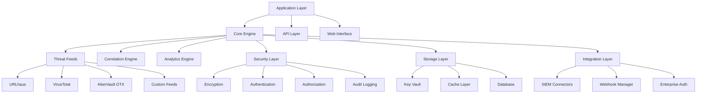
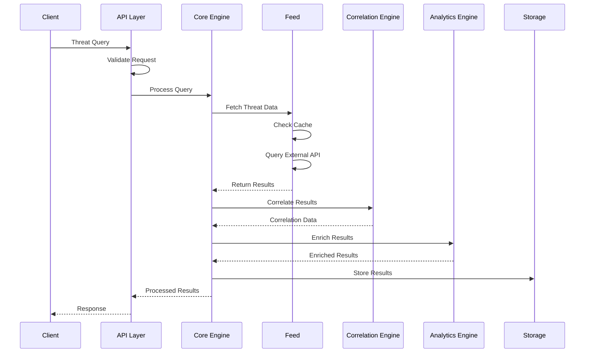
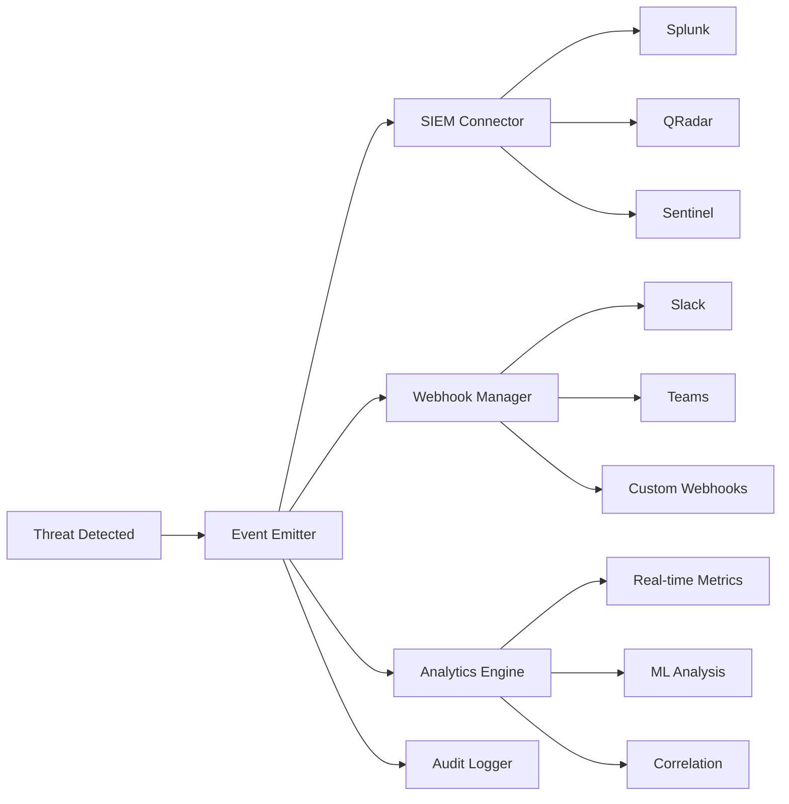

# Architecture

Comprehensive overview of TrojanHorse.js architecture, design patterns, and system components for developers and contributors.

## Overview

TrojanHorse.js is built with a modular, extensible architecture that supports multiple deployment patterns, from simple single-node implementations to large-scale distributed enterprise deployments.



## Core Architecture Principles

### 1. Modularity and Extensibility

The system is designed around loosely coupled modules that can be independently developed, tested, and deployed.

```javascript
// Core module structure
src/
├── core/                 // Core engine components
│   ├── TrojanHorse.ts   // Main orchestrator
│   ├── CircuitBreaker.ts
│   ├── EventEmitter.ts
│   └── CorrelationEngine.ts
├── feeds/               // Threat intelligence feeds
│   ├── base/
│   │   └── ThreatFeed.ts
│   ├── URLhausFeed.ts
│   ├── VirusTotalFeed.ts
│   └── CustomFeed.ts
├── security/            // Security components
│   ├── CryptoEngine.ts
│   ├── KeyVault.ts
│   └── AuthManager.ts
├── analytics/           // Analytics and correlation
│   ├── RealTimeAnalytics.ts
│   ├── MLEngine.ts
│   └── ReportGenerator.ts
├── integrations/        // External integrations
│   ├── SIEMConnector.ts
│   ├── WebhookManager.ts
│   └── EnterpriseAuth.ts
└── utils/               // Utility functions
    ├── validators.ts
    ├── formatters.ts
    └── helpers.ts
```

### 2. Event-Driven Architecture

The system uses an event-driven pattern for loose coupling and scalability.

```javascript
// Event flow architecture
class TrojanHorse extends EventEmitter {
  async scout(indicator: string): Promise<ThreatFeedResult[]> {
    // Emit pre-processing event
    this.emit('beforeScout', { indicator });
    
    try {
      // Process through feeds
      const results = await this.processFeeds(indicator);
      
      // Emit threat detection events
      results.forEach(result => {
        if (result.threat) {
          this.emit('threatDetected', result);
        }
      });
      
      // Emit post-processing event
      this.emit('afterScout', { indicator, results });
      
      return results;
    } catch (error) {
      this.emit('error', error);
      throw error;
    }
  }
}
```

### 3. Plugin-Based Feed System

Threat intelligence feeds are implemented as plugins with a common interface.

```javascript
// Feed plugin interface
abstract class ThreatFeed {
  abstract name: string;
  abstract version: string;
  
  abstract async fetchThreatData(
    indicator: string, 
    options?: FeedOptions
  ): Promise<ThreatFeedResult>;
  
  abstract async batchQuery(
    indicators: string[], 
    options?: BatchOptions
  ): Promise<ThreatFeedResult[]>;
  
  abstract async getHealthStatus(): Promise<FeedHealthStatus>;
}

// Feed registration system
class FeedRegistry {
  private feeds = new Map<string, ThreatFeed>();
  
  register(name: string, feed: ThreatFeed): void {
    this.feeds.set(name, feed);
  }
  
  async queryAll(indicator: string): Promise<ThreatFeedResult[]> {
    const promises = Array.from(this.feeds.values()).map(
      feed => feed.fetchThreatData(indicator)
    );
    
    return Promise.allSettled(promises).then(results =>
      results.filter(r => r.status === 'fulfilled')
              .map(r => (r as PromiseFulfilledResult<ThreatFeedResult>).value)
    );
  }
}
```

## Component Architecture

### Core Engine

The core engine orchestrates all system operations and maintains state.

```typescript
interface CoreEngineConfig {
  feeds: FeedConfig[];
  performance: PerformanceConfig;
  security: SecurityConfig;
  analytics: AnalyticsConfig;
}

class CoreEngine {
  private feedRegistry: FeedRegistry;
  private correlationEngine: CorrelationEngine;
  private analyticsEngine: AnalyticsEngine;
  private securityManager: SecurityManager;
  private circuitBreaker: CircuitBreaker;
  
  constructor(config: CoreEngineConfig) {
    this.initialize(config);
  }
  
  private async initialize(config: CoreEngineConfig): Promise<void> {
    // Initialize components in dependency order
    this.securityManager = new SecurityManager(config.security);
    this.feedRegistry = new FeedRegistry();
    this.correlationEngine = new CorrelationEngine(config.analytics);
    this.analyticsEngine = new AnalyticsEngine(config.analytics);
    this.circuitBreaker = new CircuitBreaker(config.performance);
    
    // Register feeds
    for (const feedConfig of config.feeds) {
      const feed = this.createFeed(feedConfig);
      this.feedRegistry.register(feedConfig.name, feed);
    }
  }
  
  async processThreatQuery(
    indicator: string, 
    options: QueryOptions
  ): Promise<ProcessedThreatResult> {
    // Pre-processing
    const sanitizedIndicator = this.sanitizeIndicator(indicator);
    await this.validateAccess(options.userId, 'threat:read');
    
    // Circuit breaker protection
    const results = await this.circuitBreaker.execute(async () => {
      return this.feedRegistry.queryFeeds(sanitizedIndicator, options.sources);
    });
    
    // Correlation and enrichment
    const correlatedResults = await this.correlationEngine.correlate(results);
    const enrichedResults = await this.analyticsEngine.enrich(correlatedResults);
    
    // Post-processing
    await this.auditLogger.log('threat_query', {
      user: options.userId,
      indicator: sanitizedIndicator,
      results: enrichedResults.length
    });
    
    return {
      indicator: sanitizedIndicator,
      results: enrichedResults,
      correlation: correlatedResults.metadata,
      timestamp: new Date().toISOString()
    };
  }
}
```

### Feed Architecture

Each threat intelligence feed implements the standard `ThreatFeed` interface.

```typescript
// Feed implementation pattern
class URLhausFeed extends ThreatFeed {
  name = 'URLhaus';
  version = '1.0.0';
  
  private client: HTTPClient;
  private cache: CacheManager;
  private rateLimiter: RateLimiter;
  
  constructor(config: URLhausFeedConfig) {
    super(config);
    this.client = new HTTPClient(config.http);
    this.cache = new CacheManager(config.cache);
    this.rateLimiter = new RateLimiter(config.rateLimit);
  }
  
  async fetchThreatData(
    indicator: string, 
    options: FeedOptions = {}
  ): Promise<ThreatFeedResult> {
    // Rate limiting
    await this.rateLimiter.acquire();
    
    try {
      // Check cache first
      const cached = await this.cache.get(indicator);
      if (cached && !options.ignoreCache) {
        return cached;
      }
      
      // Fetch from API
      const response = await this.client.get(`/api/url/${indicator}`);
      const result = this.transformResponse(response.data, indicator);
      
      // Cache result
      await this.cache.set(indicator, result, options.cacheTTL);
      
      return result;
    } catch (error) {
      this.handleError(error, indicator);
      throw error;
    } finally {
      this.rateLimiter.release();
    }
  }
  
  private transformResponse(apiData: any, indicator: string): ThreatFeedResult {
    return {
      indicator,
      type: this.detectIndicatorType(indicator),
      threat: Boolean(apiData.threat),
      confidence: this.normalizeConfidence(apiData.confidence),
      sources: [this.name],
      timestamp: new Date().toISOString(),
      metadata: {
        source: this.name,
        version: this.version,
        raw_data: apiData
      }
    };
  }
}
```

### Security Architecture

Security is implemented as a layered system with multiple controls.

```typescript
class SecurityManager {
  private cryptoEngine: CryptoEngine;
  private keyVault: KeyVault;
  private authManager: AuthManager;
  private auditLogger: AuditLogger;
  
  constructor(config: SecurityConfig) {
    this.cryptoEngine = new CryptoEngine(config.crypto);
    this.keyVault = new KeyVault(config.vault);
    this.authManager = new AuthManager(config.auth);
    this.auditLogger = new AuditLogger(config.audit);
  }
  
  async validateAccess(
    userId: string, 
    permission: string, 
    resource?: string
  ): Promise<boolean> {
    // Authentication check
    const user = await this.authManager.validateUser(userId);
    if (!user) {
      throw new AuthenticationError('Invalid user');
    }
    
    // Authorization check
    const authorized = await this.authManager.checkPermission(
      user, permission, resource
    );
    if (!authorized) {
      throw new AuthorizationError('Insufficient permissions');
    }
    
    // Audit logging
    await this.auditLogger.log('access_check', {
      userId,
      permission,
      resource,
      result: 'granted'
    });
    
    return true;
  }
  
  async encryptSensitiveData(data: any): Promise<EncryptedData> {
    const key = await this.keyVault.getEncryptionKey();
    return this.cryptoEngine.encrypt(JSON.stringify(data), key);
  }
  
  async decryptSensitiveData(encryptedData: EncryptedData): Promise<any> {
    const key = await this.keyVault.getEncryptionKey();
    const decrypted = await this.cryptoEngine.decrypt(encryptedData, key);
    return JSON.parse(decrypted);
  }
}
```

## Data Flow Architecture

### Request Processing Flow



### Event Flow Architecture



## Scalability Architecture

### Horizontal Scaling

The system supports horizontal scaling through multiple patterns:

```typescript
// Worker pool for parallel processing
class WorkerPool {
  private workers: Worker[] = [];
  private taskQueue: Queue<Task> = new Queue();
  
  constructor(private poolSize: number) {
    this.initializeWorkers();
  }
  
  private initializeWorkers(): void {
    for (let i = 0; i < this.poolSize; i++) {
      const worker = new Worker('./threat-worker.js');
      worker.on('message', this.handleWorkerMessage.bind(this));
      this.workers.push(worker);
    }
  }
  
  async processBatch(indicators: string[]): Promise<ThreatFeedResult[]> {
    const chunks = this.chunkArray(indicators, this.poolSize);
    const promises = chunks.map(chunk => this.processChunk(chunk));
    
    const results = await Promise.all(promises);
    return results.flat();
  }
  
  private async processChunk(chunk: string[]): Promise<ThreatFeedResult[]> {
    const availableWorker = await this.getAvailableWorker();
    
    return new Promise((resolve, reject) => {
      const timeout = setTimeout(() => {
        reject(new Error('Worker timeout'));
      }, 30000);
      
      availableWorker.once('message', (result) => {
        clearTimeout(timeout);
        resolve(result);
      });
      
      availableWorker.postMessage({ type: 'process_batch', data: chunk });
    });
  }
}
```

### Caching Architecture

Multi-layer caching for performance optimization:

```typescript
class CacheManager {
  private l1Cache: LRUCache;  // In-memory cache
  private l2Cache: RedisClient;  // Distributed cache
  private l3Cache: DatabaseCache;  // Persistent cache
  
  constructor(config: CacheConfig) {
    this.l1Cache = new LRUCache({ max: config.l1.maxSize });
    this.l2Cache = new RedisClient(config.l2);
    this.l3Cache = new DatabaseCache(config.l3);
  }
  
  async get(key: string): Promise<any> {
    // L1 cache check
    let value = this.l1Cache.get(key);
    if (value) {
      return value;
    }
    
    // L2 cache check
    value = await this.l2Cache.get(key);
    if (value) {
      this.l1Cache.set(key, value);
      return value;
    }
    
    // L3 cache check
    value = await this.l3Cache.get(key);
    if (value) {
      this.l1Cache.set(key, value);
      await this.l2Cache.set(key, value, 3600); // 1 hour TTL
      return value;
    }
    
    return null;
  }
  
  async set(key: string, value: any, ttl?: number): Promise<void> {
    // Set in all cache layers
    this.l1Cache.set(key, value);
    await this.l2Cache.set(key, value, ttl || 3600);
    await this.l3Cache.set(key, value, ttl || 86400);
  }
}
```

## Deployment Architectures

### Single Node Deployment

Simple deployment for development and small-scale use:

```typescript
// Single node configuration
const trojan = new TrojanHorse({
  deployment: 'single-node',
  
  feeds: [
    { name: 'urlhaus', enabled: true },
    { name: 'virustotal', enabled: true }
  ],
  
  cache: {
    type: 'memory',
    maxSize: '100MB'
  },
  
  storage: {
    type: 'sqlite',
    path: './data/threats.db'
  },
  
  performance: {
    workers: 4,
    batchSize: 50,
    timeout: 10000
  }
});
```

### Distributed Deployment

Enterprise-scale distributed deployment:

```typescript
// Distributed cluster configuration
const cluster = new TrojanHorseCluster({
  deployment: 'distributed',
  
  coordinator: {
    enabled: true,
    port: 8080,
    endpoints: ['node1:8080', 'node2:8080', 'node3:8080']
  },
  
  worker_nodes: {
    count: 10,
    resources: {
      cpu: '2',
      memory: '4Gi',
      storage: '10Gi'
    }
  },
  
  load_balancer: {
    type: 'nginx',
    algorithm: 'round_robin',
    health_checks: true
  },
  
  cache: {
    type: 'redis-cluster',
    nodes: ['redis1:6379', 'redis2:6379', 'redis3:6379']
  },
  
  storage: {
    type: 'postgresql-cluster',
    nodes: ['db1:5432', 'db2:5432', 'db3:5432'],
    replication: 'streaming'
  }
});
```

### Microservices Architecture

Service-oriented deployment pattern:

```typescript
// Microservices configuration
const services = {
  api_gateway: {
    port: 8080,
    routes: {
      '/threats': 'threat-service:8081',
      '/analytics': 'analytics-service:8082',
      '/auth': 'auth-service:8083'
    }
  },
  
  threat_service: {
    port: 8081,
    feeds: ['urlhaus', 'virustotal', 'alienvault'],
    replicas: 3
  },
  
  analytics_service: {
    port: 8082,
    engines: ['correlation', 'ml', 'reporting'],
    replicas: 2
  },
  
  auth_service: {
    port: 8083,
    providers: ['ldap', 'oauth2', 'saml'],
    replicas: 2
  },
  
  storage_service: {
    port: 8084,
    database: 'postgresql',
    cache: 'redis',
    replicas: 3
  }
};
```

## Error Handling Architecture

### Hierarchical Error Handling

```typescript
// Error hierarchy
abstract class TrojanHorseError extends Error {
  abstract code: string;
  abstract httpStatus: number;
  
  constructor(message: string, public details?: any) {
    super(message);
    this.name = this.constructor.name;
  }
}

class FeedError extends TrojanHorseError {
  code = 'FEED_ERROR';
  httpStatus = 502;
}

class AuthenticationError extends TrojanHorseError {
  code = 'AUTH_ERROR';
  httpStatus = 401;
}

class RateLimitError extends TrojanHorseError {
  code = 'RATE_LIMIT';
  httpStatus = 429;
  
  constructor(message: string, public retryAfter: number) {
    super(message);
  }
}

// Global error handler
class ErrorHandler {
  static handle(error: Error, context: string): void {
    if (error instanceof TrojanHorseError) {
      this.handleKnownError(error, context);
    } else {
      this.handleUnknownError(error, context);
    }
  }
  
  private static handleKnownError(error: TrojanHorseError, context: string): void {
    console.error(`[${context}] ${error.code}: ${error.message}`, error.details);
    
    // Send to monitoring system
    this.sendToMonitoring(error, context);
    
    // Handle specific error types
    switch (error.constructor.name) {
      case 'RateLimitError':
        this.handleRateLimit(error as RateLimitError);
        break;
      case 'FeedError':
        this.handleFeedError(error as FeedError);
        break;
    }
  }
}
```

## Monitoring and Observability

### Metrics Architecture

```typescript
class MetricsCollector {
  private prometheus: PrometheusRegistry;
  private counters: Map<string, Counter> = new Map();
  private gauges: Map<string, Gauge> = new Map();
  private histograms: Map<string, Histogram> = new Map();
  
  constructor() {
    this.prometheus = new PrometheusRegistry();
    this.initializeMetrics();
  }
  
  private initializeMetrics(): void {
    // Threat detection metrics
    this.counters.set('threats_detected', new Counter({
      name: 'trojanhorse_threats_detected_total',
      help: 'Total number of threats detected',
      labelNames: ['source', 'type', 'confidence_level']
    }));
    
    // Performance metrics
    this.histograms.set('request_duration', new Histogram({
      name: 'trojanhorse_request_duration_seconds',
      help: 'Request duration in seconds',
      labelNames: ['method', 'endpoint'],
      buckets: [0.1, 0.5, 1, 2, 5, 10]
    }));
    
    // System metrics
    this.gauges.set('active_connections', new Gauge({
      name: 'trojanhorse_active_connections',
      help: 'Number of active connections'
    }));
  }
  
  recordThreatDetection(source: string, type: string, confidence: number): void {
    const confidenceLevel = confidence >= 90 ? 'high' : 
                           confidence >= 70 ? 'medium' : 'low';
    
    this.counters.get('threats_detected')?.inc({
      source,
      type,
      confidence_level: confidenceLevel
    });
  }
  
  recordRequestDuration(method: string, endpoint: string, duration: number): void {
    this.histograms.get('request_duration')?.observe({ method, endpoint }, duration);
  }
}
```

### Distributed Tracing

```typescript
import { trace, context, SpanStatusCode } from '@opentelemetry/api';

class TracingManager {
  private tracer = trace.getTracer('trojanhorse-js');
  
  async traceOperation<T>(
    operationName: string,
    operation: () => Promise<T>,
    attributes?: Record<string, string>
  ): Promise<T> {
    const span = this.tracer.startSpan(operationName, { attributes });
    
    try {
      const result = await context.with(trace.setSpan(context.active(), span), operation);
      span.setStatus({ code: SpanStatusCode.OK });
      return result;
    } catch (error) {
      span.setStatus({
        code: SpanStatusCode.ERROR,
        message: error instanceof Error ? error.message : 'Unknown error'
      });
      throw error;
    } finally {
      span.end();
    }
  }
  
  addSpanEvent(name: string, attributes?: Record<string, string>): void {
    const activeSpan = trace.getActiveSpan();
    if (activeSpan) {
      activeSpan.addEvent(name, attributes);
    }
  }
}

// Usage in core operations
class CoreEngine {
  private tracing = new TracingManager();
  
  async processThreatQuery(indicator: string): Promise<ThreatFeedResult[]> {
    return this.tracing.traceOperation(
      'process_threat_query',
      async () => {
        this.tracing.addSpanEvent('query_started', { indicator });
        
        const results = await this.feedRegistry.queryFeeds(indicator);
        
        this.tracing.addSpanEvent('feeds_queried', { 
          indicator, 
          result_count: results.length.toString() 
        });
        
        return results;
      },
      { indicator, operation: 'threat_query' }
    );
  }
}
```

## Security Architecture

### Zero-Trust Implementation

```typescript
class ZeroTrustManager {
  private policyEngine: PolicyEngine;
  private identityVerifier: IdentityVerifier;
  private deviceVerifier: DeviceVerifier;
  
  async verifyAccess(request: AccessRequest): Promise<AccessDecision> {
    // Never trust, always verify
    const verifications = await Promise.all([
      this.identityVerifier.verify(request.user),
      this.deviceVerifier.verify(request.device),
      this.policyEngine.evaluate(request.context)
    ]);
    
    const decision = this.makeAccessDecision(verifications);
    
    // Continuous monitoring
    if (decision.allowed) {
      this.setupContinuousMonitoring(request.session);
    }
    
    return decision;
  }
  
  private makeAccessDecision(verifications: VerificationResult[]): AccessDecision {
    const allPassed = verifications.every(v => v.passed);
    const trustScore = verifications.reduce((sum, v) => sum + v.score, 0) / verifications.length;
    
    return {
      allowed: allPassed && trustScore >= 0.8,
      trustScore,
      conditions: this.calculateConditions(verifications),
      monitoring: this.calculateMonitoringLevel(trustScore)
    };
  }
}
```

---

**Next Steps**:
- Review [Testing Guide](testing.md) for testing strategies
- Check [Building Guide](building.md) for build processes
- Explore [Contributing Guide](contributing.md) for development guidelines