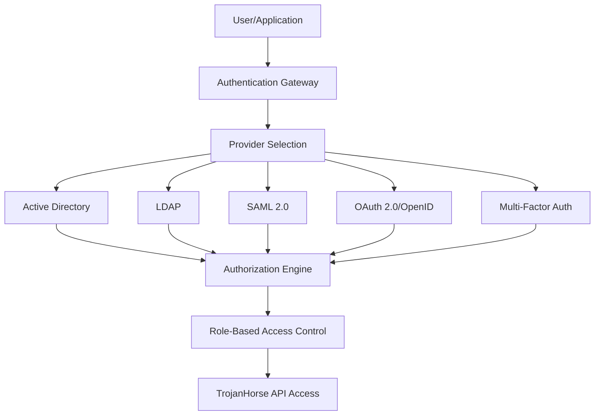

# Enterprise Authentication

TrojanHorse.js Enterprise provides comprehensive authentication and authorization capabilities for enterprise environments.

## Overview

The Enterprise Authentication module supports multiple authentication providers, SSO integration, and fine-grained authorization controls suitable for large organizations.



## Supported Authentication Methods

### 1. Active Directory Integration

Integrate with Microsoft Active Directory for Windows environments:

```javascript
import { EnterpriseAuth } from 'trojanhorse-js/enterprise';

const auth = new EnterpriseAuth({
  provider: 'activedirectory',
  config: {
    url: 'ldap://domain-controller.company.com',
    baseDN: 'dc=company,dc=com',
    username: 'service-account@company.com',
    password: process.env.AD_PASSWORD,
    attributes: {
      user: ['sAMAccountName', 'mail', 'memberOf'],
      group: ['cn', 'description']
    }
  }
});

// Authenticate user
const user = await auth.authenticate('john.doe', 'password123');
console.log(user);
// {
//   id: 'john.doe',
//   email: 'john.doe@company.com',
//   groups: ['Security-Team', 'Analysts'],
//   permissions: ['threat.read', 'alert.create']
// }
```

### 2. LDAP Authentication

Generic LDAP authentication for various directory services:

```javascript
const ldapAuth = new EnterpriseAuth({
  provider: 'ldap',
  config: {
    url: 'ldaps://ldap.company.com:636',
    bindDN: 'cn=admin,dc=company,dc=com',
    bindCredentials: process.env.LDAP_PASSWORD,
    searchBase: 'ou=users,dc=company,dc=com',
    searchFilter: '(uid={{username}})',
    tlsOptions: {
      rejectUnauthorized: true,
      ca: fs.readFileSync('./certs/ca.pem')
    }
  }
});
```

### 3. SAML 2.0 SSO

Enterprise SSO integration with SAML 2.0:

```javascript
const samlAuth = new EnterpriseAuth({
  provider: 'saml',
  config: {
    issuer: 'trojanhorse-js',
    identityProviderUrl: 'https://sso.company.com/saml/sso',
    cert: fs.readFileSync('./certs/idp-cert.pem', 'utf8'),
    privateCert: fs.readFileSync('./certs/sp-private.pem', 'utf8'),
    callbackUrl: 'https://trojanhorse.company.com/auth/saml/callback',
    attributes: {
      email: 'http://schemas.xmlsoap.org/ws/2005/05/identity/claims/emailaddress',
      name: 'http://schemas.xmlsoap.org/ws/2005/05/identity/claims/name',
      groups: 'http://schemas.xmlsoap.org/ws/2005/05/identity/claims/groups'
    }
  }
});

// Handle SAML callback
app.post('/auth/saml/callback', async (req, res) => {
  try {
    const user = await samlAuth.validateResponse(req.body.SAMLResponse);
    req.session.user = user;
    res.redirect('/dashboard');
  } catch (error) {
    res.status(401).send('Authentication failed');
  }
});
```

### 4. OAuth 2.0 / OpenID Connect

Modern OAuth 2.0 and OpenID Connect integration:

```javascript
const oauthAuth = new EnterpriseAuth({
  provider: 'oauth2',
  config: {
    clientId: process.env.OAUTH_CLIENT_ID,
    clientSecret: process.env.OAUTH_CLIENT_SECRET,
    authorizationURL: 'https://auth.company.com/oauth/authorize',
    tokenURL: 'https://auth.company.com/oauth/token',
    userInfoURL: 'https://auth.company.com/oauth/userinfo',
    scope: ['openid', 'profile', 'email', 'groups'],
    callbackURL: 'https://trojanhorse.company.com/auth/oauth/callback'
  }
});

// OAuth flow
const authUrl = await oauthAuth.getAuthorizationUrl({
  state: generateRandomState(),
  nonce: generateRandomNonce()
});

// Handle OAuth callback
const tokens = await oauthAuth.exchangeCodeForTokens(authCode, state);
const user = await oauthAuth.getUserInfo(tokens.access_token);
```

## Multi-Factor Authentication (MFA)

### TOTP (Time-based One-Time Password)

```javascript
import { MFAProvider } from 'trojanhorse-js/enterprise';

const mfa = new MFAProvider({
  type: 'totp',
  issuer: 'TrojanHorse.js',
  serviceName: 'Threat Intelligence Platform'
});

// Setup MFA for user
const secret = await mfa.generateSecret('john.doe');
const qrCode = await mfa.generateQRCode(secret);

// Verify TOTP token
const isValid = await mfa.verifyToken(secret, userEnteredToken);
```

### SMS/Email MFA

```javascript
const smsMFA = new MFAProvider({
  type: 'sms',
  provider: 'twilio',
  config: {
    accountSid: process.env.TWILIO_SID,
    authToken: process.env.TWILIO_TOKEN,
    fromNumber: '+1234567890'
  }
});

// Send verification code
await smsMFA.sendCode('+1987654321', 'Your verification code: {{code}}');

// Verify code
const isValid = await smsMFA.verifyCode('+1987654321', userEnteredCode);
```

### Hardware Security Keys (WebAuthn)

```javascript
const webauthnMFA = new MFAProvider({
  type: 'webauthn',
  config: {
    rpId: 'trojanhorse.company.com',
    rpName: 'TrojanHorse.js Enterprise',
    origin: 'https://trojanhorse.company.com'
  }
});

// Registration challenge
const registrationOptions = await webauthnMFA.generateRegistrationOptions({
  userId: user.id,
  userName: user.email,
  userDisplayName: user.name
});

// Verification challenge
const authenticationOptions = await webauthnMFA.generateAuthenticationOptions();
```

## Role-Based Access Control (RBAC)

### Role Definitions

```javascript
const roles = {
  'security-analyst': {
    name: 'Security Analyst',
    permissions: [
      'threat.read',
      'threat.scan',
      'alert.create',
      'dashboard.view'
    ]
  },
  'security-admin': {
    name: 'Security Administrator',
    permissions: [
      'threat.*',
      'alert.*',
      'user.read',
      'config.read',
      'dashboard.*'
    ]
  },
  'super-admin': {
    name: 'Super Administrator',
    permissions: ['*']
  }
};

// Apply roles to authentication
const auth = new EnterpriseAuth({
  provider: 'saml',
  config: { /* SAML config */ },
  authorization: {
    enabled: true,
    roleMapping: {
      'Security-Team': 'security-analyst',
      'Security-Admins': 'security-admin',
      'IT-Admins': 'super-admin'
    },
    roles: roles
  }
});
```

### Permission Checking

```javascript
// Middleware for permission checking
const requirePermission = (permission) => {
  return (req, res, next) => {
    if (!req.user) {
      return res.status(401).json({ error: 'Authentication required' });
    }
    
    if (!auth.hasPermission(req.user, permission)) {
      return res.status(403).json({ error: 'Insufficient permissions' });
    }
    
    next();
  };
};

// Apply to routes
app.get('/api/threats', requirePermission('threat.read'), async (req, res) => {
  const threats = await trojan.getThreats();
  res.json(threats);
});

app.post('/api/threats/scan', requirePermission('threat.scan'), async (req, res) => {
  const result = await trojan.scout(req.body.indicator);
  res.json(result);
});
```

## Session Management

### Enterprise Session Store

```javascript
import { EnterpriseSessionStore } from 'trojanhorse-js/enterprise';

const sessionStore = new EnterpriseSessionStore({
  type: 'redis',
  config: {
    host: 'redis-cluster.company.com',
    port: 6379,
    password: process.env.REDIS_PASSWORD,
    db: 0
  },
  options: {
    ttl: 8 * 60 * 60, // 8 hours
    prefix: 'trojanhorse:session:',
    encryption: {
      enabled: true,
      algorithm: 'aes-256-gcm',
      key: process.env.SESSION_ENCRYPTION_KEY
    }
  }
});

// Session configuration
app.use(session({
  store: sessionStore,
  secret: process.env.SESSION_SECRET,
  resave: false,
  saveUninitialized: false,
  cookie: {
    secure: true, // HTTPS only
    httpOnly: true,
    maxAge: 8 * 60 * 60 * 1000, // 8 hours
    sameSite: 'strict'
  }
}));
```

### Session Security

```javascript
// Session security middleware
const sessionSecurity = {
  // IP address validation
  validateIP: (req, res, next) => {
    if (req.session.ipAddress && req.session.ipAddress !== req.ip) {
      req.session.destroy();
      return res.status(401).json({ error: 'Session IP mismatch' });
    }
    req.session.ipAddress = req.ip;
    next();
  },
  
  // Session rotation
  rotateSession: (req, res, next) => {
    if (Date.now() - req.session.createdAt > 2 * 60 * 60 * 1000) { // 2 hours
      const userData = req.session.user;
      req.session.regenerate((err) => {
        if (err) return next(err);
        req.session.user = userData;
        req.session.createdAt = Date.now();
        next();
      });
    } else {
      next();
    }
  }
};
```

## API Key Management

### Enterprise API Keys

```javascript
import { APIKeyManager } from 'trojanhorse-js/enterprise';

const apiKeyManager = new APIKeyManager({
  storage: {
    type: 'database',
    config: {
      connectionString: process.env.DATABASE_URL
    }
  },
  encryption: {
    algorithm: 'aes-256-gcm',
    key: process.env.API_KEY_ENCRYPTION_KEY
  }
});

// Create API key with specific permissions
const apiKey = await apiKeyManager.create({
  name: 'Integration API Key',
  userId: user.id,
  permissions: ['threat.read', 'threat.scan'],
  expiresAt: new Date(Date.now() + 365 * 24 * 60 * 60 * 1000), // 1 year
  ipWhitelist: ['192.168.1.0/24', '10.0.0.0/8'],
  rateLimit: {
    requests: 1000,
    window: '1h'
  }
});

// API key authentication middleware
const authenticateAPIKey = async (req, res, next) => {
  const apiKey = req.headers['x-api-key'];
  if (!apiKey) {
    return res.status(401).json({ error: 'API key required' });
  }
  
  try {
    const keyInfo = await apiKeyManager.validate(apiKey);
    req.user = keyInfo.user;
    req.apiKey = keyInfo;
    next();
  } catch (error) {
    res.status(401).json({ error: 'Invalid API key' });
  }
};
```

## Audit Logging

### Authentication Audit Trail

```javascript
import { AuditLogger } from 'trojanhorse-js/enterprise';

const auditLogger = new AuditLogger({
  storage: {
    type: 'elasticsearch',
    config: {
      node: 'https://elasticsearch.company.com:9200',
      index: 'trojanhorse-audit'
    }
  }
});

// Log authentication events
auth.on('login', async (event) => {
  await auditLogger.log({
    event: 'authentication.login',
    userId: event.user.id,
    userEmail: event.user.email,
    ipAddress: event.ipAddress,
    userAgent: event.userAgent,
    provider: event.provider,
    success: true,
    timestamp: new Date()
  });
});

auth.on('loginFailed', async (event) => {
  await auditLogger.log({
    event: 'authentication.login_failed',
    userId: event.userId,
    ipAddress: event.ipAddress,
    reason: event.reason,
    timestamp: new Date()
  });
});
```

## Configuration Examples

### Complete Enterprise Auth Setup

```javascript
import { TrojanHorse } from 'trojanhorse-js';
import { EnterpriseAuth, MFAProvider, SessionStore } from 'trojanhorse-js/enterprise';

const auth = new EnterpriseAuth({
  providers: [
    {
      name: 'corporate-ad',
      type: 'activedirectory',
      config: {
        url: process.env.AD_URL,
        baseDN: process.env.AD_BASE_DN,
        username: process.env.AD_USERNAME,
        password: process.env.AD_PASSWORD
      },
      priority: 1
    },
    {
      name: 'external-saml',
      type: 'saml',
      config: {
        issuer: 'trojanhorse-enterprise',
        identityProviderUrl: process.env.SAML_IDP_URL,
        cert: process.env.SAML_CERT
      },
      priority: 2
    }
  ],
  
  mfa: {
    enabled: true,
    providers: ['totp', 'sms'],
    requirement: 'conditional', // 'always', 'conditional', 'never'
    conditions: {
      adminRoles: ['super-admin', 'security-admin'],
      externalAccess: true
    }
  },
  
  session: {
    store: 'redis',
    security: {
      ipValidation: true,
      rotation: true,
      encryption: true
    }
  },
  
  audit: {
    enabled: true,
    events: ['login', 'logout', 'permission_denied', 'api_access']
  }
});

// Initialize TrojanHorse with enterprise authentication
const trojan = new TrojanHorse({
  authentication: auth,
  authorization: {
    enabled: true,
    defaultRole: 'security-analyst'
  }
});
```

## Security Best Practices

### 1. Password Policies
- Enforce strong password requirements
- Implement password rotation policies
- Use secure password storage (bcrypt, scrypt)

### 2. Session Security
- Use secure session cookies
- Implement session timeout
- Rotate session IDs regularly

### 3. Multi-Factor Authentication
- Require MFA for privileged accounts
- Support multiple MFA methods
- Implement backup codes

### 4. Network Security
- Restrict access by IP address
- Use TLS for all authentication traffic
- Implement rate limiting

### 5. Monitoring and Alerting
- Monitor failed login attempts
- Alert on suspicious activity
- Log all authentication events

---

**Next Steps**: Explore [SIEM Integration](siem.md) for connecting with enterprise security systems or check [Monitoring](monitoring.md) for comprehensive security monitoring.