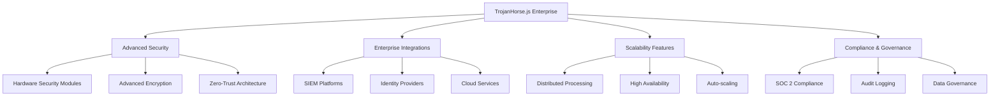

# Enterprise Features

Comprehensive overview of TrojanHorse.js Enterprise edition capabilities for large-scale threat intelligence operations.

## Overview

TrojanHorse.js Enterprise provides advanced features designed for enterprise-scale deployments, including enhanced security, scalability, compliance features, and professional support.



## Core Enterprise Features

### Advanced Security

#### Hardware Security Module (HSM) Support
```javascript
import { HardwareSecurityModule } from 'trojanhorse-js/enterprise';

const hsm = new HardwareSecurityModule({
  provider: 'aws-cloudhsm', // or 'azure-hsm', 'thales'
  cluster: 'cluster-abcdef123',
  
  keyManagement: {
    masterKey: 'enterprise-master-key',
    rotationInterval: '90d',
    backup: true
  }
});

// Use HSM for critical operations
const encryptedData = await hsm.encrypt(sensitiveData, {
  algorithm: 'AES-256-GCM',
  keyId: 'threat-intel-key'
});
```

#### Zero-Trust Network Architecture
```javascript
const zeroTrust = new ZeroTrustSecurity({
  verification: {
    userIdentity: true,
    deviceIdentity: true,
    networkLocation: false // Don't trust network location
  },
  
  policies: {
    alwaysVerify: true,
    leastPrivilege: true,
    assumeBreach: true
  },
  
  microsegmentation: {
    enabled: true,
    granularity: 'api-endpoint'
  }
});
```

#### Advanced Threat Protection
```javascript
const atp = new AdvancedThreatProtection({
  machineLearning: {
    behavioralAnalysis: true,
    anomalyDetection: true,
    predictiveModeling: true
  },
  
  sandboxing: {
    enabled: true,
    provider: 'falcon-sandbox',
    automaticDetonation: true
  },
  
  threatHunting: {
    proactiveHunting: true,
    customRules: true,
    iotlAnalysis: true
  }
});
```

### Enterprise Integrations

#### Enterprise Identity Providers
```javascript
// Multiple SSO provider support
const enterpriseAuth = new EnterpriseAuth({
  providers: [
    {
      type: 'azure-ad',
      tenantId: process.env.AZURE_TENANT_ID,
      applicationId: process.env.AZURE_APP_ID
    },
    {
      type: 'okta',
      domain: 'company.okta.com',
      clientId: process.env.OKTA_CLIENT_ID
    },
    {
      type: 'ping-identity',
      baseUrl: 'https://auth.company.com',
      clientId: process.env.PING_CLIENT_ID
    }
  ],
  
  fallback: {
    enabled: true,
    provider: 'local-ldap'
  }
});
```

#### Enterprise Service Bus Integration
```javascript
const esbIntegration = new EnterpriseServiceBus({
  type: 'mulesoft', // or 'tibco', 'websphere'
  
  endpoints: {
    threatIntel: '/services/threat-intelligence',
    incidents: '/services/incident-management',
    compliance: '/services/compliance-reporting'
  },
  
  messageFormat: 'soap', // or 'rest', 'messaging'
  transformation: {
    enabled: true,
    schema: 'threat-intel-v2.xsd'
  }
});
```

#### API Gateway Integration
```javascript
const apiGateway = new EnterpriseAPIGateway({
  provider: 'apigee', // or 'aws-api-gateway', 'azure-apim'
  
  policies: {
    rateLimiting: true,
    oauth2Validation: true,
    schemaValidation: true,
    transformations: true
  },
  
  analytics: {
    enabled: true,
    metrics: ['latency', 'throughput', 'errors'],
    alerts: true
  }
});
```

### Scalability and Performance

#### Distributed Architecture
```javascript
const distributedCluster = new DistributedCluster({
  nodes: {
    coordinator: 1,
    workers: 10,
    storage: 3
  },
  
  loadBalancing: {
    algorithm: 'consistent-hashing',
    healthChecks: true,
    failover: 'automatic'
  },
  
  clustering: {
    consensus: 'raft',
    partitionTolerance: true,
    consistency: 'eventual'
  }
});
```

#### High Availability Configuration
```javascript
const haConfig = new HighAvailabilityConfig({
  replication: {
    factor: 3,
    synchronous: true,
    crossRegion: true
  },
  
  backup: {
    frequency: 'continuous',
    retention: '1y',
    encryption: true,
    offsite: true
  },
  
  disaster_recovery: {
    rto: '4h', // Recovery Time Objective
    rpo: '15m', // Recovery Point Objective
    automated: true
  }
});
```

#### Auto-scaling
```javascript
const autoScaler = new AutoScaler({
  metrics: [
    { name: 'cpu_utilization', threshold: 70 },
    { name: 'memory_utilization', threshold: 80 },
    { name: 'queue_depth', threshold: 100 },
    { name: 'response_time', threshold: 5000 }
  ],
  
  scaling: {
    minInstances: 2,
    maxInstances: 50,
    scaleUpCooldown: '5m',
    scaleDownCooldown: '10m'
  },
  
  predictive: {
    enabled: true,
    model: 'lstm',
    horizon: '1h'
  }
});
```

## Compliance and Governance

### SOC 2 Type II Compliance
```javascript
const complianceFramework = new ComplianceFramework({
  framework: 'SOC2',
  type: 'TypeII',
  
  controls: {
    'CC1.1': { // Control Environment
      implemented: true,
      evidence: ['policies', 'procedures', 'training'],
      testing: 'automated'
    },
    'CC6.1': { // Logical Access Controls
      implemented: true,
      evidence: ['rbac', 'mfa', 'audit-logs'],
      testing: 'continuous'
    }
  },
  
  reporting: {
    automated: true,
    frequency: 'quarterly',
    auditor: 'deloitte'
  }
});
```

### Data Loss Prevention (DLP)
```javascript
const dlp = new DataLossPrevention({
  classification: {
    levels: ['public', 'internal', 'confidential', 'restricted'],
    automaticClassification: true,
    machineLearning: true
  },
  
  policies: [
    {
      name: 'Threat Intelligence Protection',
      scope: 'all-threat-data',
      actions: ['encrypt', 'audit', 'block-external']
    },
    {
      name: 'API Key Protection',
      scope: 'credentials',
      actions: ['redact', 'alert', 'block']
    }
  ],
  
  monitoring: {
    realtime: true,
    alerts: true,
    reporting: true
  }
});
```

### Audit and Compliance Reporting
```javascript
const auditReporting = new AuditReporting({
  standards: ['SOC2', 'ISO27001', 'GDPR', 'HIPAA'],
  
  automated_reports: [
    {
      name: 'Access Control Review',
      frequency: 'monthly',
      scope: 'all-user-access',
      format: 'pdf'
    },
    {
      name: 'Data Processing Activities',
      frequency: 'quarterly',
      scope: 'gdpr-compliance',
      format: 'json'
    }
  ],
  
  real_time_monitoring: {
    enabled: true,
    violations: 'immediate-alert',
    dashboard: true
  }
});
```

## Advanced Analytics

### Machine Learning Platform
```javascript
const mlPlatform = new MachineLearningPlatform({
  infrastructure: {
    gpu_clusters: true,
    distributed_training: true,
    model_serving: 'kubernetes'
  },
  
  models: [
    {
      name: 'threat-classification',
      type: 'transformer',
      accuracy: 0.97,
      latency: '50ms'
    },
    {
      name: 'campaign-detection',
      type: 'graph-neural-network',
      accuracy: 0.94,
      latency: '100ms'
    }
  ],
  
  features: {
    auto_ml: true,
    feature_store: true,
    model_versioning: true,
    a_b_testing: true
  }
});
```

### Threat Intelligence Platform
```javascript
const tip = new ThreatIntelligencePlatform({
  data_sources: {
    commercial: ['recorded-future', 'crowdstrike', 'fireeye'],
    open_source: ['misp', 'opencti', 'yara-rules'],
    internal: ['siem-logs', 'honeypots', 'sandbox']
  },
  
  enrichment: {
    automated: true,
    contextualization: true,
    attribution: true,
    confidence_scoring: true
  },
  
  dissemination: {
    formats: ['stix', 'taxii', 'json', 'csv'],
    apis: ['rest', 'graphql', 'grpc'],
    real_time: true
  }
});
```

## Professional Services

### Enterprise Support
- **24/7/365 Support**: Round-the-clock technical support
- **Dedicated TAM**: Technical Account Manager
- **SLA Guarantees**: 99.9% uptime guarantee
- **Priority Bug Fixes**: Critical issues resolved within 4 hours

### Professional Services
- **Implementation Consulting**: Expert deployment assistance
- **Custom Development**: Bespoke feature development
- **Training Programs**: Comprehensive user training
- **Health Checks**: Regular system optimization

### Managed Services
- **Fully Managed**: Complete infrastructure management
- **Monitoring**: 24/7 system monitoring
- **Maintenance**: Regular updates and patches
- **Backup Management**: Automated backup and recovery

## Licensing and Pricing

### Enterprise License Features
```javascript
const enterpriseLicense = {
  features: {
    unlimited_api_calls: true,
    unlimited_users: true,
    advanced_analytics: true,
    premium_integrations: true,
    priority_support: true,
    sla_guarantee: true
  },
  
  deployment: {
    on_premises: true,
    private_cloud: true,
    hybrid: true,
    air_gapped: true
  },
  
  compliance: {
    soc2: true,
    iso27001: true,
    fedramp: 'in-progress',
    gdpr: true,
    hipaa: true
  }
};
```

### Pricing Model
- **Enterprise Starter**: $50,000/year (up to 1M API calls/month)
- **Enterprise Professional**: $150,000/year (up to 10M API calls/month)
- **Enterprise Unlimited**: Custom pricing (unlimited usage)

*All prices include:*
- Enterprise features
- Professional support
- Regular security updates
- Compliance certifications

## Getting Started

### Enterprise Evaluation
1. **Contact Sales**: Schedule a demo with our enterprise team
2. **Proof of Concept**: 30-day trial with full enterprise features
3. **Architecture Review**: Expert review of your requirements
4. **Custom Proposal**: Tailored solution and pricing

### Implementation Process
1. **Planning Phase**: Requirements gathering and architecture design
2. **Deployment Phase**: Professional installation and configuration
3. **Integration Phase**: Connect with existing enterprise systems
4. **Training Phase**: Comprehensive user and administrator training
5. **Go-Live**: Production deployment with support

### Contact Information
- **Sales**: enterprise@trojanhorse-js.com
- **Support**: support@trojanhorse-js.com
- **Phone**: +1-555-TROJAN-1 (Enterprise Hotline)

---

**Ready to enhance your enterprise threat intelligence capabilities?** Contact our enterprise team for a personalized demonstration and custom pricing proposal.