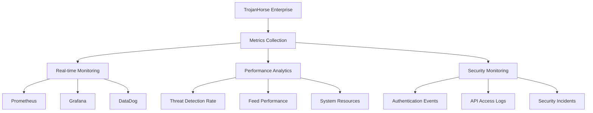

# Enterprise Monitoring

Comprehensive monitoring and observability for TrojanHorse.js Enterprise deployments.

## Overview

Enterprise monitoring provides deep insights into threat intelligence operations, performance metrics, and security events across your entire infrastructure.



## Metrics Collection

### Prometheus Integration

```javascript
import { PrometheusMonitoring } from 'trojanhorse-js/enterprise';

const prometheus = new PrometheusMonitoring({
  port: 9090,
  endpoint: '/metrics',
  
  // Custom metrics configuration
  metrics: {
    threats_detected: {
      type: 'counter',
      help: 'Total number of threats detected',
      labelNames: ['source', 'type', 'severity']
    },
    
    feed_response_time: {
      type: 'histogram',
      help: 'Feed API response times',
      labelNames: ['feed', 'status'],
      buckets: [0.1, 0.5, 1, 2, 5, 10]
    },
    
    api_requests: {
      type: 'counter',
      help: 'Total API requests',
      labelNames: ['method', 'endpoint', 'status']
    },
    
    threat_confidence: {
      type: 'gauge',
      help: 'Average threat confidence score',
      labelNames: ['timeframe']
    }
  }
});

// Instrument TrojanHorse with monitoring
const trojan = new TrojanHorse({
  monitoring: prometheus,
  metrics: {
    enabled: true,
    collectInterval: 15000, // 15 seconds
    detailedMetrics: true
  }
});

// Custom metric recording
trojan.on('threatDetected', (threat) => {
  prometheus.metrics.threats_detected.inc({
    source: threat.source,
    type: threat.type,
    severity: threat.severity
  });
  
  prometheus.metrics.threat_confidence.set(
    { timeframe: '1h' },
    threat.confidence
  );
});
```

### Performance Monitoring

```javascript
import { PerformanceMonitor } from 'trojanhorse-js/enterprise';

const perfMonitor = new PerformanceMonitor({
  collection: {
    interval: 30000, // 30 seconds
    retention: '7d'
  },
  
  thresholds: {
    responseTime: 5000, // 5 seconds
    memoryUsage: 0.8,   // 80% of available memory
    cpuUsage: 0.9,      // 90% CPU
    errorRate: 0.05     // 5% error rate
  },
  
  alerts: {
    enabled: true,
    channels: ['slack', 'email', 'webhook']
  }
});

// Monitor feed performance
perfMonitor.trackFeedMetrics({
  feeds: ['urlhaus', 'alienvault', 'abuseipdb'],
  metrics: [
    'response_time',
    'success_rate',
    'data_quality',
    'threat_yield'
  ]
});

// System resource monitoring
perfMonitor.trackSystemMetrics({
  cpu: true,
  memory: true,
  disk: true,
  network: true,
  processes: ['node', 'trojanhorse']
});
```

## Real-time Dashboards

### Grafana Integration

```javascript
import { GrafanaIntegration } from 'trojanhorse-js/enterprise';

const grafana = new GrafanaIntegration({
  url: 'https://grafana.company.com',
  auth: {
    type: 'token',
    token: process.env.GRAFANA_TOKEN
  },
  
  organization: 'security-team',
  
  dashboards: {
    main: 'TrojanHorse Overview',
    feeds: 'Threat Feed Performance',
    security: 'Security Monitoring'
  }
});

// Create comprehensive dashboard
await grafana.createDashboard({
  title: 'TrojanHorse Enterprise Monitoring',
  tags: ['security', 'threat-intelligence'],
  
  panels: [
    {
      title: 'Threats Detected (Last 24h)',
      type: 'stat',
      query: 'sum(threats_detected_total)',
      visualization: {
        colorMode: 'value',
        thresholds: [
          { value: 100, color: 'green' },
          { value: 500, color: 'yellow' },
          { value: 1000, color: 'red' }
        ]
      }
    },
    
    {
      title: 'Feed Response Times',
      type: 'graph',
      query: 'feed_response_time_bucket',
      visualization: {
        legend: true,
        tooltip: 'shared',
        yAxis: { unit: 'seconds' }
      }
    },
    
    {
      title: 'Threat Distribution by Type',
      type: 'piechart',
      query: 'sum by (type) (threats_detected_total)',
      visualization: {
        displayLabels: true,
        legendValues: true
      }
    },
    
    {
      title: 'System Resource Usage',
      type: 'graph',
      queries: [
        'cpu_usage_percent',
        'memory_usage_percent',
        'disk_usage_percent'
      ],
      visualization: {
        yAxis: { unit: 'percent', max: 100 }
      }
    }
  ],
  
  timeRange: '24h',
  refreshInterval: '30s'
});
```

### Real-time Alerts

```javascript
const alertManager = {
  // Performance alerts
  setupPerformanceAlerts: async () => {
    await grafana.createAlert({
      name: 'High Feed Response Time',
      condition: 'feed_response_time > 10',
      frequency: '1m',
      notifications: ['slack-security', 'email-oncall']
    });
    
    await grafana.createAlert({
      name: 'Low Threat Detection Rate',
      condition: 'rate(threats_detected_total[5m]) < 0.1',
      frequency: '5m',
      notifications: ['email-security-team']
    });
  },
  
  // Security alerts
  setupSecurityAlerts: async () => {
    await grafana.createAlert({
      name: 'Authentication Failures',
      condition: 'rate(auth_failures_total[5m]) > 0.5',
      frequency: '1m',
      notifications: ['slack-security', 'pagerduty']
    });
    
    await grafana.createAlert({
      name: 'Unusual API Activity',
      condition: 'rate(api_requests_total[5m]) > 100',
      frequency: '2m',
      notifications: ['email-security-team']
    });
  }
};
```

## Security Event Monitoring

### Authentication Monitoring

```javascript
import { SecurityEventMonitor } from 'trojanhorse-js/enterprise';

const securityMonitor = new SecurityEventMonitor({
  events: [
    'authentication.login',
    'authentication.failure',
    'authorization.denied',
    'api.access',
    'configuration.change'
  ],
  
  storage: {
    type: 'elasticsearch',
    config: {
      node: 'https://elasticsearch.company.com:9200',
      index: 'trojanhorse-security-events'
    }
  },
  
  realtime: {
    enabled: true,
    stream: 'security-events',
    processors: ['anomaly-detection', 'threat-correlation']
  }
});

// Monitor authentication patterns
securityMonitor.trackAuthenticationPatterns({
  patterns: [
    'multiple_failures',
    'unusual_locations',
    'off_hours_access',
    'privilege_escalation'
  ],
  
  thresholds: {
    failed_attempts: 5,
    time_window: '5m',
    geo_variance: 1000 // km
  },
  
  actions: [
    'log_event',
    'send_alert',
    'temporary_lockout'
  ]
});
```

### API Access Monitoring

```javascript
const apiMonitor = {
  // Monitor API usage patterns
  trackAPIUsage: async () => {
    securityMonitor.on('api.request', (event) => {
      // Track rate limiting
      if (event.rateLimit && event.rateLimit.remaining < 10) {
        securityMonitor.logEvent({
          type: 'api.rate_limit_warning',
          userId: event.userId,
          endpoint: event.endpoint,
          remaining: event.rateLimit.remaining
        });
      }
      
      // Detect unusual access patterns
      if (this.isUnusualAccess(event)) {
        securityMonitor.createAlert({
          type: 'unusual_api_access',
          details: event,
          severity: 'medium'
        });
      }
    });
  },
  
  isUnusualAccess: (event) => {
    return (
      event.hour < 6 || event.hour > 22 || // Off hours
      event.requestSize > 10000 ||         // Large requests
      event.endpoint.includes('admin')     // Admin endpoints
    );
  }
};
```

## Advanced Analytics

### Threat Intelligence Analytics

```javascript
import { ThreatAnalytics } from 'trojanhorse-js/enterprise';

const analytics = new ThreatAnalytics({
  ml: {
    enabled: true,
    models: ['anomaly_detection', 'trend_analysis', 'campaign_detection']
  },
  
  correlation: {
    timeWindows: ['5m', '1h', '24h'],
    confidenceThreshold: 0.8
  },
  
  reporting: {
    automated: true,
    schedule: 'daily',
    recipients: ['security-team@company.com']
  }
});

// Campaign detection analytics
const campaignAnalysis = await analytics.detectCampaigns({
  timeRange: '7d',
  clustering: {
    algorithm: 'dbscan',
    similarity: 0.85
  },
  
  features: [
    'infrastructure_overlap',
    'timing_patterns',
    'ttp_similarity',
    'target_patterns'
  ]
});

console.log(campaignAnalysis);
// {
//   campaigns: [
//     {
//       id: 'campaign_001',
//       confidence: 0.92,
//       indicators: 47,
//       timespan: '2025-01-20 to 2025-01-27',
//       attribution: 'APT29 (likely)'
//     }
//   ]
// }
```

### Performance Analytics

```javascript
const performanceAnalytics = {
  // Analyze feed performance trends
  analyzeFeedPerformance: async () => {
    const analysis = await analytics.analyzeFeedTrends({
      feeds: ['urlhaus', 'alienvault', 'abuseipdb'],
      timeRange: '30d',
      metrics: ['response_time', 'success_rate', 'threat_quality']
    });
    
    return {
      trends: analysis.trends,
      predictions: analysis.predictions,
      recommendations: analysis.recommendations
    };
  },
  
  // Resource optimization analytics
  optimizeResources: async () => {
    const optimization = await analytics.analyzeResourceUsage({
      components: ['feeds', 'correlation', 'storage', 'api'],
      timeRange: '7d'
    });
    
    return {
      bottlenecks: optimization.bottlenecks,
      recommendations: optimization.recommendations,
      projectedSavings: optimization.savings
    };
  }
};
```

## Compliance and Audit Monitoring

### Compliance Monitoring

```javascript
import { ComplianceMonitor } from 'trojanhorse-js/enterprise';

const compliance = new ComplianceMonitor({
  frameworks: ['SOC2', 'ISO27001', 'NIST'],
  
  controls: {
    'SOC2-CC6.1': {
      description: 'Logical access controls',
      monitors: ['authentication.events', 'authorization.events']
    },
    'ISO27001-A.12.6.1': {
      description: 'Management of technical vulnerabilities',
      monitors: ['threat.detection', 'vulnerability.scanning']
    }
  },
  
  reporting: {
    automated: true,
    schedule: 'monthly',
    format: 'pdf'
  }
});

// Generate compliance reports
const complianceReport = await compliance.generateReport({
  framework: 'SOC2',
  period: '2025-Q1',
  controls: ['CC6.1', 'CC6.2', 'CC6.3'],
  
  evidence: {
    includeMetrics: true,
    includeLogs: true,
    includeIncidents: true
  }
});
```

### Audit Trail Monitoring

```javascript
const auditMonitor = {
  // Track all system changes
  trackSystemChanges: () => {
    const auditEvents = [
      'config.change',
      'user.created',
      'user.modified',
      'permission.granted',
      'permission.revoked',
      'key.created',
      'key.rotated'
    ];
    
    auditEvents.forEach(event => {
      securityMonitor.on(event, (data) => {
        this.logAuditEvent({
          event: event,
          timestamp: new Date(),
          user: data.user,
          details: data,
          source: 'trojanhorse-enterprise'
        });
      });
    });
  },
  
  logAuditEvent: async (event) => {
    await elasticsearch.index({
      index: 'audit-trail',
      body: {
        ...event,
        '@timestamp': event.timestamp,
        hash: this.calculateHash(event)
      }
    });
  }
};
```

## Configuration Examples

### Complete Monitoring Setup

```javascript
import { TrojanHorse } from 'trojanhorse-js';
import { 
  EnterpriseMonitoring,
  PrometheusIntegration,
  GrafanaIntegration,
  SecurityEventMonitor
} from 'trojanhorse-js/enterprise';

const monitoring = new EnterpriseMonitoring({
  metrics: {
    prometheus: {
      enabled: true,
      port: 9090,
      interval: 15000
    },
    
    grafana: {
      enabled: true,
      url: 'https://grafana.company.com',
      auth: { token: process.env.GRAFANA_TOKEN }
    }
  },
  
  security: {
    eventMonitoring: true,
    auditTrail: true,
    anomalyDetection: true
  },
  
  performance: {
    resourceMonitoring: true,
    feedAnalytics: true,
    predictiveAnalytics: true
  },
  
  alerts: {
    channels: ['slack', 'email', 'webhook'],
    thresholds: {
      responseTime: 5000,
      errorRate: 0.05,
      threatDetectionRate: 0.1
    }
  }
});

const trojan = new TrojanHorse({
  monitoring: monitoring,
  observability: {
    tracing: true,
    logging: 'debug',
    metrics: 'detailed'
  }
});
```

## Custom Monitoring Solutions

### DataDog Integration

```javascript
import { DataDogMonitoring } from 'trojanhorse-js/enterprise';

const datadog = new DataDogMonitoring({
  apiKey: process.env.DATADOG_API_KEY,
  appKey: process.env.DATADOG_APP_KEY,
  
  metrics: {
    namespace: 'trojanhorse',
    tags: ['env:production', 'team:security']
  },
  
  logs: {
    source: 'trojanhorse-enterprise',
    service: 'threat-intelligence'
  }
});

// Custom metric tracking
datadog.gauge('threat.confidence.avg', avgConfidence, {
  tags: ['source:urlhaus', 'type:domain']
});

datadog.increment('threat.detected', 1, {
  tags: ['severity:high', 'source:virustotal']
});
```

### Custom Monitoring Webhooks

```javascript
const customMonitoring = {
  setupWebhooks: () => {
    // Teams integration
    const teamsWebhook = new WebhookNotifier({
      url: process.env.TEAMS_WEBHOOK_URL,
      format: 'teams'
    });
    
    // Slack integration
    const slackWebhook = new WebhookNotifier({
      url: process.env.SLACK_WEBHOOK_URL,
      format: 'slack'
    });
    
    // PagerDuty integration
    const pagerDuty = new WebhookNotifier({
      url: 'https://events.pagerduty.com/v2/enqueue',
      format: 'pagerduty',
      routingKey: process.env.PAGERDUTY_ROUTING_KEY
    });
    
    return { teamsWebhook, slackWebhook, pagerDuty };
  }
};
```

---

**Next Steps**: Explore [Analytics](../api/analytics.md) for detailed analytics APIs or check [SIEM Integration](siem.md) for connecting monitoring with SIEM platforms.