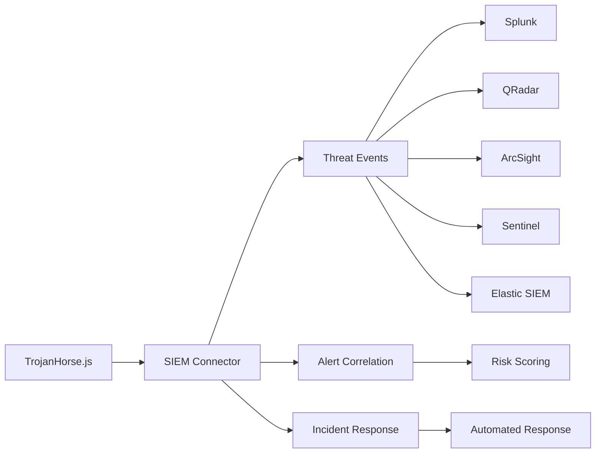

# SIEM Integration

Comprehensive Security Information and Event Management (SIEM) integration for enterprise threat intelligence workflows.

## Overview

TrojanHorse.js Enterprise provides native connectors for major SIEM platforms, enabling seamless integration of threat intelligence into existing security operations centers (SOCs).



## Supported SIEM Platforms

### Splunk Enterprise

#### Configuration
```javascript
import { SplunkConnector } from 'trojanhorse-js/enterprise';

const splunk = new SplunkConnector({
  host: 'splunk-enterprise.company.com',
  port: 8089,
  protocol: 'https',
  authentication: {
    username: 'trojanhorse-service',
    password: process.env.SPLUNK_PASSWORD
  },
  
  // HTTP Event Collector configuration
  hec: {
    token: process.env.SPLUNK_HEC_TOKEN,
    index: 'threat_intelligence',
    sourcetype: 'trojanhorse:threat'
  },
  
  // Search configuration
  search: {
    app: 'search',
    owner: 'admin',
    timeout: 30000
  }
});
```

#### Sending Threat Intelligence
```javascript
// Send threat data to Splunk
await splunk.sendThreatEvent({
  indicator: 'malicious-domain.com',
  indicator_type: 'domain',
  threat_type: 'malware',
  confidence: 85,
  severity: 'high',
  sources: ['urlhaus', 'virustotal'],
  first_seen: '2025-01-29T10:00:00Z',
  tags: ['apt', 'banking-trojan'],
  context: {
    campaign: 'Operation StealthBanking',
    attribution: 'APT29'
  }
});

// Batch sending for high volume
const threats = await trojan.scout(['domain1.com', 'domain2.com', 'domain3.com']);
await splunk.sendBatch(threats.map(threat => ({
  indicator: threat.indicator,
  confidence: threat.confidence,
  sources: threat.sources,
  timestamp: new Date().toISOString()
})));
```

#### Creating Splunk Searches
```javascript
// Create saved search for threat hunting
await splunk.createSavedSearch({
  name: 'TrojanHorse Threat Hunt',
  search: `
    index=threat_intelligence sourcetype="trojanhorse:threat"
    | eval risk_score = if(confidence > 80 AND severity="high", 100, confidence)
    | where risk_score > 70
    | stats count by indicator, threat_type, sources
    | sort -count
  `,
  schedule: {
    cron: '0 */4 * * *', // Every 4 hours
    enabled: true
  },
  alert: {
    condition: 'count > 10',
    action: 'webhook',
    webhook_url: 'https://trojanhorse.company.com/webhooks/splunk-alert'
  }
});
```

### IBM QRadar

#### Configuration
```javascript
import { QRadarConnector } from 'trojanhorse-js/enterprise';

const qradar = new QRadarConnector({
  host: 'qradar.company.com',
  port: 443,
  version: '15.0',
  authentication: {
    type: 'token',
    token: process.env.QRADAR_SEC_TOKEN
  },
  
  // Reference data configuration
  referenceData: {
    threatIntel: 'TrojanHorse_Threats',
    indicators: 'TrojanHorse_IOCs',
    campaigns: 'TrojanHorse_Campaigns'
  }
});
```

#### Creating Reference Sets
```javascript
// Create reference sets for threat intelligence
await qradar.createReferenceSet({
  name: 'TrojanHorse_Threats',
  elementType: 'ALN', // Alphanumeric
  timeoutType: 'LAST_SEEN',
  timeout: 30 * 24 * 60 * 60 * 1000 // 30 days
});

// Add threats to reference set
const threats = await trojan.scout('suspicious-domain.com');
for (const threat of threats) {
  await qradar.addToReferenceSet('TrojanHorse_Threats', {
    value: threat.indicator,
    source: `TrojanHorse (${threat.sources.join(', ')})`,
    confidence: threat.confidence
  });
}
```

#### Custom Rules
```javascript
// Create QRadar rules for threat detection
await qradar.createRule({
  name: 'TrojanHorse High Confidence Threat Detection',
  type: 'EVENT',
  enabled: true,
  
  tests: [
    {
      text: `
        SELECT * FROM events 
        WHERE "destinationip" IN (
          SELECT value FROM REFERENCE.TrojanHorse_Threats 
          WHERE confidence > 80
        )
      `,
      identifier: 'high_confidence_ip_match'
    }
  ],
  
  actions: [
    {
      type: 'OFFENSE',
      parameters: {
        offense_name: 'High Confidence Threat Communication',
        magnitude: 8,
        credibility: 9
      }
    }
  ]
});
```

### Microsoft Sentinel

#### Configuration
```javascript
import { SentinelConnector } from 'trojanhorse-js/enterprise';

const sentinel = new SentinelConnector({
  tenantId: process.env.AZURE_TENANT_ID,
  subscriptionId: process.env.AZURE_SUBSCRIPTION_ID,
  resourceGroup: 'security-rg',
  workspaceName: 'sentinel-workspace',
  
  authentication: {
    clientId: process.env.AZURE_CLIENT_ID,
    clientSecret: process.env.AZURE_CLIENT_SECRET
  }
});
```

#### Creating Threat Intelligence Indicators
```javascript
// Create threat intelligence indicators in Sentinel
const threats = await trojan.scout(['malicious-ip.com', '192.0.2.1']);

for (const threat of threats) {
  await sentinel.createThreatIndicator({
    displayName: `TrojanHorse: ${threat.indicator}`,
    pattern: `[${threat.type}:value = '${threat.indicator}']`,
    threatTypes: ['malicious-activity'],
    confidence: threat.confidence,
    labels: threat.sources,
    
    killChainPhases: [{
      killChainName: 'mitre-attack',
      phaseName: 'command-and-control'
    }],
    
    source: 'TrojanHorse.js',
    validFrom: new Date().toISOString(),
    validUntil: new Date(Date.now() + 30 * 24 * 60 * 60 * 1000).toISOString()
  });
}
```

#### Analytics Rules
```javascript
// Create analytics rules for threat detection
await sentinel.createAnalyticsRule({
  displayName: 'TrojanHorse Threat Communication',
  description: 'Detects communication with threats identified by TrojanHorse.js',
  severity: 'High',
  
  query: `
    CommonSecurityLog
    | where TimeGenerated > ago(1h)
    | where DestinationIP in (
        ThreatIntelligenceIndicator
        | where SourceSystem == "TrojanHorse.js"
        | where ConfidenceScore > 80
        | project NetworkDestinationIP
    )
    | summarize count() by DestinationIP, SourceIP
  `,
  
  tactics: ['CommandAndControl'],
  techniques: ['T1071'],
  
  entityMappings: [{
    entityType: 'IP',
    fieldMappings: [{
      identifier: 'Address',
      columnName: 'DestinationIP'
    }]
  }]
});
```

### Elastic SIEM

#### Configuration
```javascript
import { ElasticSIEMConnector } from 'trojanhorse-js/enterprise';

const elasticSiem = new ElasticSIEMConnector({
  node: 'https://elasticsearch.company.com:9200',
  auth: {
    username: 'trojanhorse-user',
    password: process.env.ELASTIC_PASSWORD
  },
  
  indices: {
    threats: 'threat-intelligence-*',
    detections: 'detection-alerts-*',
    timeline: 'timeline-events-*'
  },
  
  kibana: {
    host: 'https://kibana.company.com:5601',
    spaceId: 'security'
  }
});
```

#### Indexing Threat Data
```javascript
// Index threat intelligence in Elasticsearch
const threats = await trojan.scout('suspicious-domain.com');

await elasticSiem.indexThreats(threats.map(threat => ({
  '@timestamp': new Date().toISOString(),
  threat: {
    indicator: {
      type: threat.type,
      value: threat.indicator
    },
    confidence: threat.confidence,
    source: threat.sources,
    classification: threat.classification
  },
  event: {
    category: 'threat',
    type: 'indicator',
    dataset: 'trojanhorse'
  }
})));
```

#### Detection Rules
```javascript
// Create detection rules in Elastic SIEM
await elasticSiem.createDetectionRule({
  name: 'TrojanHorse High Confidence Threat',
  description: 'Detects network connections to high-confidence threats',
  type: 'query',
  
  query: {
    bool: {
      must: [
        { range: { '@timestamp': { gte: 'now-1h' } } },
        { term: { 'event.category': 'network' } },
        { range: { 'threat.confidence': { gte: 80 } } }
      ]
    }
  },
  
  severity: 'high',
  risk_score: 90,
  
  actions: [{
    id: 'webhook-action',
    action_type_id: '.webhook',
    params: {
      method: 'POST',
      url: 'https://trojanhorse.company.com/webhooks/elastic-alert',
      body: JSON.stringify({
        rule: '{{context.rule.name}}',
        alerts: '{{context.alerts}}'
      })
    }
  }]
});
```

## Advanced SIEM Integration Features

### Cross-Platform Correlation

Correlate threats across multiple SIEM platforms:

```javascript
import { SIEMOrchestrator } from 'trojanhorse-js/enterprise';

const orchestrator = new SIEMOrchestrator({
  platforms: [splunk, qradar, sentinel, elasticSiem],
  correlation: {
    enabled: true,
    timeWindow: '1h',
    confidenceThreshold: 70
  }
});

// Distribute threat intelligence across all platforms
const threats = await trojan.scout(['malicious-domain.com']);
await orchestrator.distributeThreats(threats);

// Cross-platform correlation
const correlations = await orchestrator.correlateThreatActivity({
  indicator: 'malicious-domain.com',
  timeRange: '24h'
});

console.log(correlations);
// {
//   platforms: ['splunk', 'qradar'],
//   commonEvents: 47,
//   confidence: 0.89,
//   timeline: [...]
// }
```

### Automated Incident Response

Integrate with incident response platforms:

```javascript
const incidentResponse = {
  // Create incidents automatically
  createIncident: async (threat) => {
    if (threat.confidence > 90 && threat.severity === 'critical') {
      return await sentinel.createIncident({
        title: `Critical Threat: ${threat.indicator}`,
        description: `High confidence threat detected by TrojanHorse.js`,
        severity: 'High',
        status: 'New',
        
        labels: [
          { name: 'source', value: 'trojanhorse' },
          { name: 'confidence', value: threat.confidence.toString() }
        ],
        
        assignee: 'security-team@company.com'
      });
    }
  },
  
  // Update existing incidents
  updateIncident: async (incidentId, newEvidence) => {
    await sentinel.addCommentToIncident(incidentId, {
      message: `New evidence from TrojanHorse.js: ${newEvidence.description}`,
      author: 'TrojanHorse Automation'
    });
  }
};
```

### Real-time Threat Streaming

Stream threats in real-time to SIEM platforms:

```javascript
import { ThreatStreamer } from 'trojanhorse-js/enterprise';

const streamer = new ThreatStreamer({
  sources: ['urlhaus', 'alienvault', 'abuseipdb'],
  filters: {
    confidence: { min: 70 },
    types: ['domain', 'ip', 'url']
  },
  
  destinations: [
    { platform: 'splunk', realtime: true },
    { platform: 'qradar', batch: { size: 100, interval: '5m' } }
  ]
});

// Start real-time streaming
await streamer.start();

streamer.on('threat', async (threat) => {
  console.log(`Streaming threat: ${threat.indicator}`);
  
  // Custom processing before sending to SIEM
  const enriched = await enrichThreat(threat);
  await streamer.send(enriched);
});
```

## Custom SIEM Connectors

Create connectors for proprietary or unsupported SIEM platforms:

```javascript
class CustomSIEMConnector {
  constructor(config) {
    this.config = config;
    this.client = new CustomSIEMClient(config);
  }
  
  async sendThreatEvent(threat) {
    // Convert TrojanHorse threat format to custom SIEM format
    const siemEvent = {
      timestamp: new Date().toISOString(),
      event_type: 'threat_intelligence',
      indicator: threat.indicator,
      indicator_type: threat.type,
      confidence: threat.confidence,
      sources: threat.sources.join(','),
      raw_data: JSON.stringify(threat)
    };
    
    return await this.client.ingestEvent(siemEvent);
  }
  
  async createAlert(threat) {
    if (threat.confidence > this.config.alertThreshold) {
      return await this.client.createAlert({
        title: `Threat Detected: ${threat.indicator}`,
        severity: this.mapSeverity(threat.confidence),
        description: `TrojanHorse.js detected ${threat.indicator} with ${threat.confidence}% confidence`
      });
    }
  }
  
  mapSeverity(confidence) {
    if (confidence >= 90) return 'CRITICAL';
    if (confidence >= 80) return 'HIGH';
    if (confidence >= 70) return 'MEDIUM';
    return 'LOW';
  }
}

// Register custom connector
const customSiem = new CustomSIEMConnector({
  endpoint: 'https://siem.company.com/api',
  apiKey: process.env.CUSTOM_SIEM_KEY,
  alertThreshold: 80
});

// Use with TrojanHorse
trojan.addSIEMConnector('custom', customSiem);
```

## Configuration Examples

### Multi-SIEM Environment

```javascript
const siemConfig = {
  primary: {
    type: 'splunk',
    config: {
      host: 'splunk.company.com',
      hec_token: process.env.SPLUNK_HEC_TOKEN
    }
  },
  
  secondary: {
    type: 'qradar',
    config: {
      host: 'qradar.company.com',
      token: process.env.QRADAR_TOKEN
    }
  },
  
  cloud: {
    type: 'sentinel',
    config: {
      workspace: 'sentinel-workspace',
      tenant_id: process.env.AZURE_TENANT_ID
    }
  }
};

// Initialize all SIEM connections
const siemManager = new SIEMManager(siemConfig);
await siemManager.initializeAll();

// Configure threat distribution
await siemManager.configure({
  distribution: {
    all: ['medium', 'high', 'critical'],
    primary: ['all'],
    secondary: ['high', 'critical'],
    cloud: ['critical']
  },
  
  correlation: {
    enabled: true,
    crossValidation: true
  }
});
```

## Monitoring and Maintenance

### SIEM Connector Health Monitoring

```javascript
const healthMonitor = {
  async checkConnectorHealth() {
    const results = {};
    
    for (const [name, connector] of Object.entries(siemConnectors)) {
      try {
        const startTime = Date.now();
        await connector.ping();
        results[name] = {
          status: 'healthy',
          responseTime: Date.now() - startTime
        };
      } catch (error) {
        results[name] = {
          status: 'unhealthy',
          error: error.message
        };
      }
    }
    
    return results;
  },
  
  async getMetrics() {
    return {
      eventsProcessed: await redis.get('siem:events:count'),
      lastSuccessfulSync: await redis.get('siem:last:sync'),
      errorRate: await this.calculateErrorRate()
    };
  }
};

// Periodic health checks
setInterval(async () => {
  const health = await healthMonitor.checkConnectorHealth();
  
  for (const [platform, status] of Object.entries(health)) {
    if (status.status === 'unhealthy') {
      await alertManager.sendAlert({
        type: 'siem_connector_failure',
        platform: platform,
        error: status.error
      });
    }
  }
}, 5 * 60 * 1000); // Every 5 minutes
```

---

**Next Steps**: Check out [Monitoring](monitoring.md) for comprehensive SIEM monitoring or explore [Authentication](authentication.md) for securing SIEM integrations.