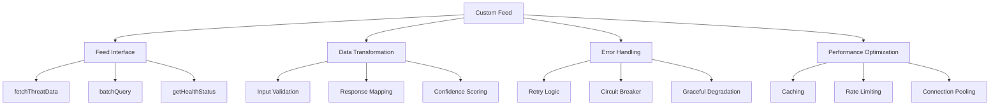

# Custom Feed Implementation

Learn how to create custom threat intelligence feeds for TrojanHorse.js, integrating with proprietary sources, internal systems, and community feeds.

## Overview

TrojanHorse.js supports custom feed implementations, allowing you to integrate with any threat intelligence source, internal security tools, or proprietary databases. This guide shows you how to build robust, production-ready custom feeds.



## Basic Custom Feed

### Simple Implementation

```javascript
import { ThreatFeed } from 'trojanhorse-js/feeds';
import axios from 'axios';

class SimpleThreatFeed extends ThreatFeed {
  constructor(config) {
    super(config);
    this.name = 'SimpleThreatFeed';
    this.version = '1.0.0';
    this.baseUrl = config.baseUrl;
    this.apiKey = config.apiKey;
    
    // Configure HTTP client
    this.client = axios.create({
      baseURL: this.baseUrl,
      timeout: config.timeout || 10000,
      headers: {
        'Authorization': `Bearer ${this.apiKey}`,
        'User-Agent': `TrojanHorse.js/${this.version}`,
        'Content-Type': 'application/json'
      }
    });
  }
  
  // Required: Implement fetchThreatData method
  async fetchThreatData(indicator, options = {}) {
    try {
      this.validateIndicator(indicator);
      
      const response = await this.client.get(`/threat/${encodeURIComponent(indicator)}`, {
        params: {
          format: 'json',
          include_details: options.includeMetadata || false,
          max_age: options.maxAge || 86400
        }
      });
      
      return this.transformToStandardFormat(response.data, indicator);
    } catch (error) {
      return this.handleApiError(error, indicator);
    }
  }
  
  // Transform API response to TrojanHorse standard format
  transformToStandardFormat(apiResponse, indicator) {
    return {
      indicator: indicator,
      type: this.detectIndicatorType(indicator),
      threat: apiResponse.is_malicious || false,
      confidence: this.normalizeConfidence(apiResponse.score),
      sources: [this.name],
      timestamp: new Date(apiResponse.scan_date || Date.now()).toISOString(),
      
      // Core metadata
      metadata: {
        source: this.name,
        version: this.version,
        scan_id: apiResponse.scan_id,
        threat_types: apiResponse.categories || [],
        raw_score: apiResponse.score,
        last_updated: apiResponse.updated_at
      },
      
      // Additional correlation fields
      correlationScore: this.calculateCorrelationScore(apiResponse),
      consensusLevel: this.determineConsensusLevel(apiResponse),
      sources: [this.name]
    };
  }
  
  // Normalize confidence score to 0-100 range
  normalizeConfidence(score) {
    if (typeof score !== 'number') return 0;
    
    // Assuming API returns 0-1 range, convert to 0-100
    if (score >= 0 && score <= 1) {
      return Math.round(score * 100);
    }
    
    // If already 0-100 range
    if (score >= 0 && score <= 100) {
      return Math.round(score);
    }
    
    // Default fallback
    return 0;
  }
  
  // Calculate correlation score for threat correlation
  calculateCorrelationScore(apiResponse) {
    let score = 0;
    
    // Factor in threat categories
    if (apiResponse.categories && apiResponse.categories.length > 0) {
      score += apiResponse.categories.length * 10;
    }
    
    // Factor in confidence
    score += this.normalizeConfidence(apiResponse.score);
    
    // Factor in recency
    const daysSinceScan = (Date.now() - new Date(apiResponse.scan_date)) / (1000 * 60 * 60 * 24);
    score += Math.max(0, 30 - daysSinceScan); // More recent = higher score
    
    return Math.min(100, score);
  }
  
  // Determine consensus level
  determineConsensusLevel(apiResponse) {
    const confidence = this.normalizeConfidence(apiResponse.score);
    
    if (confidence >= 90) return 'consensus';
    if (confidence >= 70) return 'strong';
    if (confidence >= 50) return 'moderate';
    return 'weak';
  }
  
  // Validate indicator format
  validateIndicator(indicator) {
    if (!indicator || typeof indicator !== 'string') {
      throw new Error('Invalid indicator: must be a non-empty string');
    }
    
    if (indicator.length > 2048) {
      throw new Error('Invalid indicator: too long');
    }
    
    // Basic validation - extend as needed
    const validPatterns = [
      /^[a-zA-Z0-9.-]+\.[a-zA-Z]{2,}$/, // Domain
      /^\d{1,3}\.\d{1,3}\.\d{1,3}\.\d{1,3}$/, // IPv4
      /^https?:\/\/.+/, // URL
      /^[a-fA-F0-9]{32,128}$/ // Hash
    ];
    
    const isValid = validPatterns.some(pattern => pattern.test(indicator));
    if (!isValid) {
      throw new Error(`Invalid indicator format: ${indicator}`);
    }
  }
  
  // Handle API errors gracefully
  handleApiError(error, indicator) {
    console.error(`${this.name} API error for ${indicator}:`, error.message);
    
    // Return empty result instead of throwing
    return {
      indicator: indicator,
      type: this.detectIndicatorType(indicator),
      threat: false,
      confidence: 0,
      sources: [this.name],
      timestamp: new Date().toISOString(),
      metadata: {
        source: this.name,
        error: error.message,
        status: 'error'
      },
      correlationScore: 0,
      consensusLevel: 'weak',
      sources: [this.name]
    };
  }
}

// Usage
const customFeed = new SimpleThreatFeed({
  baseUrl: 'https://api.mythreatfeed.com',
  apiKey: process.env.CUSTOM_FEED_API_KEY,
  timeout: 5000
});

// Test the feed
const result = await customFeed.fetchThreatData('malicious-domain.com');
console.log('Threat result:', result);
```

## Advanced Custom Feed

### Enterprise-Grade Implementation

```javascript
import { ThreatFeed, FeedError, RateLimitError } from 'trojanhorse-js/feeds';
import { CircuitBreaker } from 'trojanhorse-js/core';
import Redis from 'ioredis';

class EnterpriseThreatFeed extends ThreatFeed {
  constructor(config) {
    super(config);
    this.name = config.name || 'EnterpriseFeed';
    this.version = config.version || '1.0.0';
    this.baseUrl = config.baseUrl;
    this.apiKey = config.apiKey;
    
    // Initialize components
    this.setupHttpClient(config);
    this.setupCaching(config);
    this.setupCircuitBreaker(config);
    this.setupMetrics();
  }
  
  setupHttpClient(config) {
    this.client = axios.create({
      baseURL: this.baseUrl,
      timeout: config.timeout || 10000,
      maxRedirects: 3,
      headers: {
        'Authorization': `Bearer ${this.apiKey}`,
        'User-Agent': `TrojanHorse.js/${this.version}`,
        'Accept': 'application/json',
        'Content-Type': 'application/json'
      }
    });
    
    // Request interceptor for rate limiting
    this.client.interceptors.request.use(async (request) => {
      await this.checkRateLimit();
      return request;
    });
    
    // Response interceptor for error handling
    this.client.interceptors.response.use(
      (response) => response,
      (error) => this.handleHttpError(error)
    );
  }
  
  setupCaching(config) {
    if (config.cache && config.cache.enabled) {
      this.cache = new Redis({
        host: config.cache.host || 'localhost',
        port: config.cache.port || 6379,
        password: config.cache.password,
        db: config.cache.db || 0,
        retryDelayOnFailover: 100,
        maxRetriesPerRequest: 3
      });
      
      this.cacheTTL = config.cache.ttl || 3600; // 1 hour default
    }
  }
  
  setupCircuitBreaker(config) {
    this.circuitBreaker = new CircuitBreaker({
      threshold: config.circuitBreaker?.threshold || 5,
      timeout: config.circuitBreaker?.timeout || 60000,
      resetTimeout: config.circuitBreaker?.resetTimeout || 30000,
      
      onOpen: () => {
        console.warn(`${this.name}: Circuit breaker opened`);
        this.metrics.circuitBreakerOpens++;
      },
      
      onClose: () => {
        console.info(`${this.name}: Circuit breaker closed`);
        this.metrics.circuitBreakerCloses++;
      }
    });
  }
  
  setupMetrics() {
    this.metrics = {
      requestCount: 0,
      errorCount: 0,
      cacheHits: 0,
      cacheMisses: 0,
      circuitBreakerOpens: 0,
      circuitBreakerCloses: 0,
      averageResponseTime: 0,
      lastSuccessfulRequest: null,
      responseTimeHistory: []
    };
    
    // Clear old response time history every hour
    setInterval(() => {
      this.metrics.responseTimeHistory = this.metrics.responseTimeHistory.slice(-100);
    }, 3600000);
  }
  
  async fetchThreatData(indicator, options = {}) {
    const startTime = Date.now();
    this.metrics.requestCount++;
    
    try {
      this.validateIndicator(indicator);
      
      // Check cache first
      if (this.cache && !options.ignoreCache) {
        const cached = await this.getCachedResult(indicator);
        if (cached) {
          this.metrics.cacheHits++;
          return cached;
        }
        this.metrics.cacheMisses++;
      }
      
      // Use circuit breaker for API call
      const result = await this.circuitBreaker.execute(async () => {
        const response = await this.client.get(`/api/v2/threat/${encodeURIComponent(indicator)}`, {
          params: this.buildRequestParams(options),
          timeout: options.timeout || 10000
        });
        
        return this.transformToStandardFormat(response.data, indicator);
      });
      
      // Cache successful result
      if (this.cache && result && result.confidence > 0) {
        await this.cacheResult(indicator, result);
      }
      
      // Update metrics
      this.updateMetrics(startTime, true);
      
      return result;
    } catch (error) {
      this.updateMetrics(startTime, false);
      return this.handleError(error, indicator);
    }
  }
  
  async batchQuery(indicators, options = {}) {
    const batchSize = options.batchSize || 100;
    const concurrency = options.concurrency || 5;
    const results = [];
    
    // Process in batches
    for (let i = 0; i < indicators.length; i += batchSize) {
      const batch = indicators.slice(i, i + batchSize);
      
      // Process batch with concurrency control
      const batchPromises = [];
      for (let j = 0; j < batch.length; j += concurrency) {
        const concurrentBatch = batch.slice(j, j + concurrency);
        const concurrentPromises = concurrentBatch.map(indicator =>
          this.fetchThreatData(indicator, options).catch(error => ({
            indicator,
            error: error.message,
            threat: false,
            confidence: 0
          }))
        );
        
        batchPromises.push(Promise.all(concurrentPromises));
      }
      
      const batchResults = await Promise.all(batchPromises);
      results.push(...batchResults.flat());
      
      // Rate limiting delay between batches
      if (i + batchSize < indicators.length) {
        await this.delay(options.waitBetweenBatches || 1000);
      }
    }
    
    return results;
  }
  
  buildRequestParams(options) {
    const params = {
      format: 'json',
      api_version: '2.0'
    };
    
    if (options.includeMetadata) {
      params.include_metadata = true;
    }
    
    if (options.includeHistory) {
      params.include_history = true;
    }
    
    if (options.maxAge) {
      params.max_age = options.maxAge;
    }
    
    if (options.confidence) {
      params.min_confidence = options.confidence;
    }
    
    return params;
  }
  
  transformToStandardFormat(apiResponse, indicator) {
    // Enhanced transformation with validation
    const result = {
      indicator: indicator,
      type: this.detectIndicatorType(indicator),
      threat: Boolean(apiResponse.is_threat),
      confidence: this.normalizeConfidence(apiResponse.confidence_score),
      sources: [this.name],
      timestamp: new Date(apiResponse.scan_timestamp || Date.now()).toISOString(),
      
      metadata: {
        source: this.name,
        version: this.version,
        scan_id: apiResponse.scan_id,
        engine_version: apiResponse.engine_version,
        threat_categories: apiResponse.threat_categories || [],
        risk_score: apiResponse.risk_score,
        geographical_risk: apiResponse.geo_risk,
        temporal_risk: apiResponse.temporal_risk,
        behavioral_indicators: apiResponse.behavioral_indicators,
        infrastructure_analysis: apiResponse.infrastructure,
        attribution: apiResponse.attribution,
        campaigns: apiResponse.associated_campaigns,
        raw_response: options.includeRawResponse ? apiResponse : undefined
      },
      
      // Enhanced correlation fields
      correlationScore: this.calculateAdvancedCorrelationScore(apiResponse),
      consensusLevel: this.determineConsensusLevel(apiResponse),
      sources: [this.name],
      
      // Additional fields for advanced analysis
      riskFactors: this.extractRiskFactors(apiResponse),
      contextualInfo: this.extractContextualInfo(apiResponse),
      recommendedActions: this.generateRecommendedActions(apiResponse)
    };
    
    // Validate result before returning
    this.validateResult(result);
    return result;
  }
  
  calculateAdvancedCorrelationScore(apiResponse) {
    let score = 0;
    const weights = {
      confidence: 0.3,
      categories: 0.2,
      recency: 0.15,
      geography: 0.1,
      behavior: 0.15,
      infrastructure: 0.1
    };
    
    // Confidence component
    score += this.normalizeConfidence(apiResponse.confidence_score) * weights.confidence;
    
    // Threat categories component
    const categoryCount = (apiResponse.threat_categories || []).length;
    score += Math.min(categoryCount * 10, 50) * weights.categories;
    
    // Recency component
    const scanDate = new Date(apiResponse.scan_timestamp);
    const daysSinceScan = (Date.now() - scanDate.getTime()) / (1000 * 60 * 60 * 24);
    const recencyScore = Math.max(0, 100 - (daysSinceScan * 2));
    score += recencyScore * weights.recency;
    
    // Geographic risk component
    if (apiResponse.geo_risk) {
      score += apiResponse.geo_risk * weights.geography;
    }
    
    // Behavioral indicators component
    if (apiResponse.behavioral_indicators) {
      const behaviorScore = Object.values(apiResponse.behavioral_indicators).reduce((sum, val) => sum + val, 0);
      score += Math.min(behaviorScore, 100) * weights.behavior;
    }
    
    // Infrastructure analysis component
    if (apiResponse.infrastructure && apiResponse.infrastructure.risk_score) {
      score += apiResponse.infrastructure.risk_score * weights.infrastructure;
    }
    
    return Math.min(100, Math.round(score));
  }
  
  extractRiskFactors(apiResponse) {
    const riskFactors = [];
    
    if (apiResponse.threat_categories) {
      riskFactors.push(...apiResponse.threat_categories.map(cat => ({
        type: 'threat_category',
        value: cat,
        impact: 'high'
      })));
    }
    
    if (apiResponse.geo_risk && apiResponse.geo_risk > 70) {
      riskFactors.push({
        type: 'geographical_risk',
        value: 'high_risk_country',
        impact: 'medium'
      });
    }
    
    if (apiResponse.infrastructure && apiResponse.infrastructure.shared_hosting) {
      riskFactors.push({
        type: 'infrastructure',
        value: 'shared_hosting',
        impact: 'low'
      });
    }
    
    return riskFactors;
  }
  
  extractContextualInfo(apiResponse) {
    return {
      firstSeen: apiResponse.first_seen,
      lastSeen: apiResponse.last_seen,
      reportingOrganizations: apiResponse.reporting_orgs || [],
      associatedMalwareFamilies: apiResponse.malware_families || [],
      attackVectors: apiResponse.attack_vectors || [],
      victimSectors: apiResponse.victim_sectors || [],
      geographicalTargets: apiResponse.geo_targets || []
    };
  }
  
  generateRecommendedActions(apiResponse) {
    const actions = [];
    const confidence = this.normalizeConfidence(apiResponse.confidence_score);
    
    if (confidence >= 90) {
      actions.push('immediate_block');
      actions.push('alert_security_team');
      actions.push('initiate_incident_response');
    } else if (confidence >= 70) {
      actions.push('enhanced_monitoring');
      actions.push('add_to_watchlist');
      actions.push('notify_analysts');
    } else if (confidence >= 50) {
      actions.push('log_for_investigation');
      actions.push('periodic_recheck');
    }
    
    if (apiResponse.threat_categories && apiResponse.threat_categories.includes('malware')) {
      actions.push('scan_systems');
      actions.push('update_signatures');
    }
    
    return actions;
  }
  
  async getCachedResult(indicator) {
    if (!this.cache) return null;
    
    try {
      const cached = await this.cache.get(`threat:${this.name}:${indicator}`);
      return cached ? JSON.parse(cached) : null;
    } catch (error) {
      console.warn(`Cache retrieval error: ${error.message}`);
      return null;
    }
  }
  
  async cacheResult(indicator, result) {
    if (!this.cache) return;
    
    try {
      await this.cache.setex(
        `threat:${this.name}:${indicator}`,
        this.cacheTTL,
        JSON.stringify(result)
      );
    } catch (error) {
      console.warn(`Cache storage error: ${error.message}`);
    }
  }
  
  async checkRateLimit() {
    // Implement rate limiting logic
    // This is a simple example - use more sophisticated rate limiting in production
    const rateLimitKey = `rate_limit:${this.name}`;
    
    if (this.cache) {
      const currentCount = await this.cache.get(rateLimitKey) || 0;
      const maxRequests = this.config.rateLimit?.requestsPerMinute || 60;
      
      if (currentCount >= maxRequests) {
        throw new RateLimitError(`Rate limit exceeded: ${maxRequests} requests per minute`);
      }
      
      // Increment counter with expiration
      await this.cache.multi()
        .incr(rateLimitKey)
        .expire(rateLimitKey, 60)
        .exec();
    }
  }
  
  updateMetrics(startTime, success) {
    const responseTime = Date.now() - startTime;
    this.metrics.responseTimeHistory.push(responseTime);
    
    // Calculate moving average
    const recentTimes = this.metrics.responseTimeHistory.slice(-50);
    this.metrics.averageResponseTime = recentTimes.reduce((sum, time) => sum + time, 0) / recentTimes.length;
    
    if (success) {
      this.metrics.lastSuccessfulRequest = new Date().toISOString();
    } else {
      this.metrics.errorCount++;
    }
  }
  
  async getHealthStatus() {
    try {
      // Test API connectivity
      const healthResponse = await this.client.get('/health', { timeout: 5000 });
      
      return {
        status: 'healthy',
        lastSuccessfulRequest: this.metrics.lastSuccessfulRequest,
        requestCount: this.metrics.requestCount,
        errorRate: this.metrics.requestCount > 0 ? this.metrics.errorCount / this.metrics.requestCount : 0,
        averageResponseTime: Math.round(this.metrics.averageResponseTime),
        cacheHitRate: this.metrics.cacheHits / (this.metrics.cacheHits + this.metrics.cacheMisses) || 0,
        circuitBreakerStatus: this.circuitBreaker.getState(),
        apiVersion: healthResponse.data?.version,
        capabilities: healthResponse.data?.capabilities || []
      };
    } catch (error) {
      return {
        status: 'unhealthy',
        error: error.message,
        lastSuccessfulRequest: this.metrics.lastSuccessfulRequest,
        requestCount: this.metrics.requestCount,
        errorRate: this.metrics.requestCount > 0 ? this.metrics.errorCount / this.metrics.requestCount : 0
      };
    }
  }
  
  validateResult(result) {
    const required = ['indicator', 'type', 'threat', 'confidence', 'sources', 'timestamp'];
    
    for (const field of required) {
      if (result[field] === undefined || result[field] === null) {
        throw new Error(`Missing required field in result: ${field}`);
      }
    }
    
    if (typeof result.confidence !== 'number' || result.confidence < 0 || result.confidence > 100) {
      throw new Error(`Invalid confidence score: ${result.confidence}`);
    }
  }
  
  handleHttpError(error) {
    if (error.response) {
      // API responded with error status
      const status = error.response.status;
      const data = error.response.data;
      
      if (status === 429) {
        const retryAfter = error.response.headers['retry-after'] || 60;
        throw new RateLimitError(`Rate limit exceeded. Retry after ${retryAfter} seconds.`, retryAfter);
      } else if (status === 401 || status === 403) {
        throw new ApiKeyError(`Authentication failed: ${data?.message || 'Invalid API key'}`);
      } else if (status >= 500) {
        throw new FeedError(`Server error: ${status} - ${data?.message || 'Internal server error'}`);
      } else {
        throw new FeedError(`API error: ${status} - ${data?.message || 'Unknown error'}`);
      }
    } else if (error.request) {
      // Request made but no response received
      throw new NetworkError('No response received from API');
    } else {
      // Error in request setup
      throw new FeedError(`Request setup error: ${error.message}`);
    }
  }
}

// Usage
const enterpriseFeed = new EnterpriseThreatFeed({
  name: 'EnterpriseThreatIntel',
  version: '2.1.0',
  baseUrl: 'https://api.enterprise-threat-intel.com',
  apiKey: process.env.ENTERPRISE_API_KEY,
  timeout: 15000,
  
  cache: {
    enabled: true,
    host: 'redis.company.com',
    port: 6379,
    password: process.env.REDIS_PASSWORD,
    ttl: 3600
  },
  
  circuitBreaker: {
    threshold: 5,
    timeout: 60000,
    resetTimeout: 30000
  },
  
  rateLimit: {
    requestsPerMinute: 100
  }
});
```

## Database Integration Feed

### Internal Database Feed

```javascript
import { ThreatFeed } from 'trojanhorse-js/feeds';
import { Pool } from 'pg'; // PostgreSQL client

class DatabaseThreatFeed extends ThreatFeed {
  constructor(config) {
    super(config);
    this.name = 'InternalDatabase';
    this.version = '1.0.0';
    
    // Initialize database connection pool
    this.pool = new Pool({
      host: config.database.host,
      port: config.database.port,
      database: config.database.name,
      user: config.database.user,
      password: config.database.password,
      max: config.database.maxConnections || 20,
      idleTimeoutMillis: 30000,
      connectionTimeoutMillis: 2000,
    });
    
    this.setupQueries();
  }
  
  setupQueries() {
    this.queries = {
      findThreat: `
        SELECT 
          indicator,
          threat_type,
          confidence_score,
          first_seen,
          last_seen,
          source_systems,
          threat_categories,
          risk_level,
          metadata,
          created_at,
          updated_at
        FROM threat_intelligence 
        WHERE indicator = $1 
          AND active = true 
          AND (expires_at IS NULL OR expires_at > NOW())
        ORDER BY confidence_score DESC, updated_at DESC
        LIMIT 1
      `,
      
      findRelatedThreats: `
        SELECT 
          indicator,
          threat_type,
          confidence_score,
          correlation_score
        FROM threat_intelligence 
        WHERE (
          domain_root = get_domain_root($1) 
          OR ip_subnet = get_ip_subnet($1)
          OR sha256_prefix = LEFT($1, 8)
        )
          AND indicator != $1
          AND active = true
          AND confidence_score > 50
        ORDER BY correlation_score DESC
        LIMIT 10
      `,
      
      insertThreat: `
        INSERT INTO threat_intelligence (
          indicator, threat_type, confidence_score, first_seen, last_seen,
          source_systems, threat_categories, risk_level, metadata, created_at, updated_at
        ) VALUES ($1, $2, $3, $4, $5, $6, $7, $8, $9, NOW(), NOW())
        ON CONFLICT (indicator) DO UPDATE SET
          confidence_score = GREATEST(threat_intelligence.confidence_score, EXCLUDED.confidence_score),
          last_seen = EXCLUDED.last_seen,
          source_systems = EXCLUDED.source_systems,
          metadata = EXCLUDED.metadata,
          updated_at = NOW()
        RETURNING id
      `,
      
      getHealthMetrics: `
        SELECT 
          COUNT(*) as total_indicators,
          COUNT(*) FILTER (WHERE confidence_score >= 90) as high_confidence,
          COUNT(*) FILTER (WHERE confidence_score >= 70) as medium_confidence,
          COUNT(*) FILTER (WHERE updated_at > NOW() - INTERVAL '24 hours') as recent_updates,
          AVG(confidence_score) as avg_confidence
        FROM threat_intelligence 
        WHERE active = true
      `
    };
  }
  
  async fetchThreatData(indicator, options = {}) {
    const client = await this.pool.connect();
    
    try {
      this.validateIndicator(indicator);
      
      // Query main threat data
      const threatResult = await client.query(this.queries.findThreat, [indicator]);
      
      if (threatResult.rows.length === 0) {
        return this.createEmptyResult(indicator);
      }
      
      const threatData = threatResult.rows[0];
      
      // Optionally get related threats for correlation
      let relatedThreats = [];
      if (options.includeCorrelation) {
        const correlationResult = await client.query(this.queries.findRelatedThreats, [indicator]);
        relatedThreats = correlationResult.rows;
      }
      
      return this.transformDatabaseResult(threatData, relatedThreats, indicator);
    } catch (error) {
      console.error(`Database query error for ${indicator}:`, error.message);
      return this.createErrorResult(indicator, error.message);
    } finally {
      client.release();
    }
  }
  
  transformDatabaseResult(threatData, relatedThreats, indicator) {
    const confidence = parseInt(threatData.confidence_score) || 0;
    
    return {
      indicator: indicator,
      type: this.detectIndicatorType(indicator),
      threat: confidence > 50,
      confidence: confidence,
      sources: [this.name, ...(threatData.source_systems || [])],
      timestamp: new Date(threatData.updated_at).toISOString(),
      
      metadata: {
        source: this.name,
        database_id: threatData.id,
        threat_type: threatData.threat_type,
        risk_level: threatData.risk_level,
        threat_categories: threatData.threat_categories || [],
        first_seen: threatData.first_seen,
        last_seen: threatData.last_seen,
        source_systems: threatData.source_systems || [],
        related_threats_count: relatedThreats.length,
        database_metadata: threatData.metadata || {},
        query_timestamp: new Date().toISOString()
      },
      
      correlationScore: this.calculateDatabaseCorrelationScore(threatData, relatedThreats),
      consensusLevel: this.determineDatabaseConsensusLevel(threatData, relatedThreats),
      sources: [this.name, ...(threatData.source_systems || [])],
      
      // Include related threats for correlation analysis
      relatedThreats: relatedThreats.map(rt => ({
        indicator: rt.indicator,
        type: rt.threat_type,
        confidence: parseInt(rt.confidence_score),
        correlationScore: parseInt(rt.correlation_score) || 0
      }))
    };
  }
  
  calculateDatabaseCorrelationScore(threatData, relatedThreats) {
    let score = parseInt(threatData.confidence_score) || 0;
    
    // Boost score based on number of related threats
    score += Math.min(relatedThreats.length * 5, 25);
    
    // Boost score based on multiple source systems
    const sourceSystems = threatData.source_systems || [];
    score += Math.min(sourceSystems.length * 3, 15);
    
    // Boost score based on threat categories
    const categories = threatData.threat_categories || [];
    score += Math.min(categories.length * 2, 10);
    
    return Math.min(100, score);
  }
  
  determineDatabaseConsensusLevel(threatData, relatedThreats) {
    const confidence = parseInt(threatData.confidence_score) || 0;
    const sourceSystems = (threatData.source_systems || []).length;
    const relatedCount = relatedThreats.length;
    
    if (confidence >= 90 && sourceSystems >= 3 && relatedCount >= 3) {
      return 'consensus';
    } else if (confidence >= 80 && sourceSystems >= 2) {
      return 'strong';
    } else if (confidence >= 60) {
      return 'moderate';
    } else {
      return 'weak';
    }
  }
  
  async storeThreatData(threatResult) {
    const client = await this.pool.connect();
    
    try {
      await client.query(this.queries.insertThreat, [
        threatResult.indicator,
        threatResult.type,
        threatResult.confidence,
        new Date(threatResult.metadata.first_seen || threatResult.timestamp),
        new Date(threatResult.metadata.last_seen || threatResult.timestamp),
        threatResult.sources,
        threatResult.metadata.threat_categories || [],
        threatResult.metadata.risk_level || 'medium',
        JSON.stringify(threatResult.metadata)
      ]);
      
      console.log(`Stored threat data for: ${threatResult.indicator}`);
    } catch (error) {
      console.error(`Error storing threat data: ${error.message}`);
      throw error;
    } finally {
      client.release();
    }
  }
  
  async batchQuery(indicators, options = {}) {
    const batchSize = options.batchSize || 1000;
    const results = [];
    
    for (let i = 0; i < indicators.length; i += batchSize) {
      const batch = indicators.slice(i, i + batchSize);
      
      const client = await this.pool.connect();
      try {
        // Use SQL IN clause for batch querying
        const placeholders = batch.map((_, index) => `$${index + 1}`).join(',');
        const query = `
          SELECT 
            indicator, threat_type, confidence_score, first_seen, last_seen,
            source_systems, threat_categories, risk_level, metadata, updated_at
          FROM threat_intelligence 
          WHERE indicator IN (${placeholders})
            AND active = true 
            AND (expires_at IS NULL OR expires_at > NOW())
          ORDER BY confidence_score DESC
        `;
        
        const result = await client.query(query, batch);
        
        // Transform all results
        const batchResults = result.rows.map(row => 
          this.transformDatabaseResult(row, [], row.indicator)
        );
        
        // Add empty results for indicators not found
        const foundIndicators = new Set(result.rows.map(row => row.indicator));
        const missingResults = batch
          .filter(indicator => !foundIndicators.has(indicator))
          .map(indicator => this.createEmptyResult(indicator));
        
        results.push(...batchResults, ...missingResults);
      } finally {
        client.release();
      }
    }
    
    return results;
  }
  
  async getHealthStatus() {
    const client = await this.pool.connect();
    
    try {
      const result = await client.query(this.queries.getHealthMetrics);
      const metrics = result.rows[0];
      
      return {
        status: 'healthy',
        database: {
          connected: true,
          total_indicators: parseInt(metrics.total_indicators),
          high_confidence_indicators: parseInt(metrics.high_confidence),
          medium_confidence_indicators: parseInt(metrics.medium_confidence),
          recent_updates: parseInt(metrics.recent_updates),
          average_confidence: parseFloat(metrics.avg_confidence)
        },
        connection_pool: {
          total_connections: this.pool.totalCount,
          idle_connections: this.pool.idleCount,
          waiting_clients: this.pool.waitingCount
        },
        last_query: new Date().toISOString()
      };
    } catch (error) {
      return {
        status: 'unhealthy',
        error: error.message,
        database: { connected: false }
      };
    } finally {
      client.release();
    }
  }
  
  async close() {
    await this.pool.end();
  }
}

// Usage
const databaseFeed = new DatabaseThreatFeed({
  database: {
    host: 'threat-db.company.com',
    port: 5432,
    name: 'threat_intelligence',
    user: process.env.DB_USER,
    password: process.env.DB_PASSWORD,
    maxConnections: 20
  }
});
```

## File-Based Feed

### CSV/JSON File Feed

```javascript
import { ThreatFeed } from 'trojanhorse-js/feeds';
import fs from 'fs/promises';
import csv from 'csv-parser';
import { createReadStream } from 'fs';

class FileThreatFeed extends ThreatFeed {
  constructor(config) {
    super(config);
    this.name = 'FileFeed';
    this.version = '1.0.0';
    this.filePath = config.filePath;
    this.fileFormat = config.fileFormat || 'csv'; // 'csv', 'json', 'txt'
    this.watchForChanges = config.watchForChanges || false;
    
    this.data = new Map();
    this.lastModified = null;
    
    this.initializeFileWatcher();
  }
  
  async initializeFileWatcher() {
    // Load initial data
    await this.loadDataFromFile();
    
    // Watch for file changes
    if (this.watchForChanges) {
      const chokidar = await import('chokidar');
      this.watcher = chokidar.watch(this.filePath);
      
      this.watcher.on('change', async () => {
        console.log(`File ${this.filePath} changed, reloading data...`);
        await this.loadDataFromFile();
      });
    }
  }
  
  async loadDataFromFile() {
    try {
      const stats = await fs.stat(this.filePath);
      
      // Skip if file hasn't changed
      if (this.lastModified && stats.mtime <= this.lastModified) {
        return;
      }
      
      this.lastModified = stats.mtime;
      
      switch (this.fileFormat) {
        case 'csv':
          await this.loadCSVData();
          break;
        case 'json':
          await this.loadJSONData();
          break;
        case 'txt':
          await this.loadTextData();
          break;
        default:
          throw new Error(`Unsupported file format: ${this.fileFormat}`);
      }
      
      console.log(`Loaded ${this.data.size} threat indicators from ${this.filePath}`);
    } catch (error) {
      console.error(`Error loading data from file: ${error.message}`);
      throw error;
    }
  }
  
  async loadCSVData() {
    return new Promise((resolve, reject) => {
      const newData = new Map();
      
      createReadStream(this.filePath)
        .pipe(csv())
        .on('data', (row) => {
          try {
            const indicator = row.indicator || row.ioc || row.value;
            if (!indicator) return;
            
            const threatData = {
              indicator: indicator.trim(),
              type: row.type || this.detectIndicatorType(indicator),
              threat: this.parseBoolean(row.threat || row.malicious),
              confidence: parseInt(row.confidence || row.score || 50),
              categories: this.parseArray(row.categories || row.tags),
              first_seen: row.first_seen || row.date,
              source: row.source || 'file',
              description: row.description || row.comment,
              metadata: {
                line_number: newData.size + 1,
                raw_data: row
              }
            };
            
            newData.set(indicator.toLowerCase(), threatData);
          } catch (error) {
            console.warn(`Error parsing CSV row: ${error.message}`);
          }
        })
        .on('end', () => {
          this.data = newData;
          resolve();
        })
        .on('error', reject);
    });
  }
  
  async loadJSONData() {
    const fileContent = await fs.readFile(this.filePath, 'utf-8');
    const jsonData = JSON.parse(fileContent);
    
    const newData = new Map();
    
    // Handle different JSON structures
    const indicators = Array.isArray(jsonData) ? jsonData : jsonData.indicators || jsonData.threats;
    
    if (!Array.isArray(indicators)) {
      throw new Error('JSON file must contain an array of indicators');
    }
    
    indicators.forEach((item, index) => {
      try {
        const indicator = item.indicator || item.ioc || item.value;
        if (!indicator) return;
        
        const threatData = {
          indicator: indicator.trim(),
          type: item.type || this.detectIndicatorType(indicator),
          threat: Boolean(item.threat || item.malicious || item.is_malicious),
          confidence: parseInt(item.confidence || item.score || 50),
          categories: Array.isArray(item.categories) ? item.categories : (item.tags || []),
          first_seen: item.first_seen || item.date,
          source: item.source || 'file',
          description: item.description || item.comment,
          metadata: {
            index: index,
            raw_data: item
          }
        };
        
        newData.set(indicator.toLowerCase(), threatData);
      } catch (error) {
        console.warn(`Error parsing JSON item at index ${index}: ${error.message}`);
      }
    });
    
    this.data = newData;
  }
  
  async loadTextData() {
    const fileContent = await fs.readFile(this.filePath, 'utf-8');
    const lines = fileContent.split('\n').filter(line => line.trim());
    
    const newData = new Map();
    
    lines.forEach((line, index) => {
      const indicator = line.trim();
      if (!indicator || indicator.startsWith('#')) return; // Skip comments
      
      const threatData = {
        indicator: indicator,
        type: this.detectIndicatorType(indicator),
        threat: true, // Assume all indicators in file are threats
        confidence: 75, // Default confidence
        categories: ['file_feed'],
        first_seen: this.lastModified?.toISOString(),
        source: 'file',
        description: 'Indicator from threat feed file',
        metadata: {
          line_number: index + 1
        }
      };
      
      newData.set(indicator.toLowerCase(), threatData);
    });
    
    this.data = newData;
  }
  
  async fetchThreatData(indicator, options = {}) {
    try {
      this.validateIndicator(indicator);
      
      const threatData = this.data.get(indicator.toLowerCase());
      
      if (!threatData) {
        return this.createEmptyResult(indicator);
      }
      
      return this.transformFileResult(threatData, indicator);
    } catch (error) {
      return this.createErrorResult(indicator, error.message);
    }
  }
  
  transformFileResult(threatData, indicator) {
    return {
      indicator: indicator,
      type: threatData.type,
      threat: threatData.threat,
      confidence: threatData.confidence,
      sources: [this.name],
      timestamp: new Date().toISOString(),
      
      metadata: {
        source: this.name,
        file_path: this.filePath,
        file_format: this.fileFormat,
        categories: threatData.categories,
        first_seen: threatData.first_seen,
        source_system: threatData.source,
        description: threatData.description,
        file_metadata: threatData.metadata,
        last_file_update: this.lastModified?.toISOString()
      },
      
      correlationScore: this.calculateFileCorrelationScore(threatData),
      consensusLevel: this.determineFileConsensusLevel(threatData),
      sources: [this.name]
    };
  }
  
  calculateFileCorrelationScore(threatData) {
    let score = threatData.confidence;
    
    // Boost score based on categories
    if (threatData.categories && threatData.categories.length > 0) {
      score += threatData.categories.length * 5;
    }
    
    // Boost score if description is provided
    if (threatData.description && threatData.description.length > 10) {
      score += 10;
    }
    
    return Math.min(100, score);
  }
  
  determineFileConsensusLevel(threatData) {
    if (threatData.confidence >= 90) return 'consensus';
    if (threatData.confidence >= 70) return 'strong';
    if (threatData.confidence >= 50) return 'moderate';
    return 'weak';
  }
  
  async batchQuery(indicators, options = {}) {
    return indicators.map(indicator => {
      try {
        return this.fetchThreatData(indicator, options);
      } catch (error) {
        return this.createErrorResult(indicator, error.message);
      }
    });
  }
  
  async getHealthStatus() {
    try {
      const stats = await fs.stat(this.filePath);
      
      return {
        status: 'healthy',
        file: {
          path: this.filePath,
          format: this.fileFormat,
          size: stats.size,
          last_modified: stats.mtime.toISOString(),
          indicators_loaded: this.data.size
        },
        watching_for_changes: this.watchForChanges,
        last_reload: this.lastModified?.toISOString()
      };
    } catch (error) {
      return {
        status: 'unhealthy',
        error: error.message,
        file: { path: this.filePath }
      };
    }
  }
  
  parseBoolean(value) {
    if (typeof value === 'boolean') return value;
    if (typeof value === 'string') {
      return ['true', '1', 'yes', 'malicious', 'threat'].includes(value.toLowerCase());
    }
    return Boolean(value);
  }
  
  parseArray(value) {
    if (Array.isArray(value)) return value;
    if (typeof value === 'string') {
      return value.split(',').map(item => item.trim()).filter(Boolean);
    }
    return [];
  }
  
  async close() {
    if (this.watcher) {
      await this.watcher.close();
    }
  }
}

// Usage
const fileFeed = new FileThreatFeed({
  filePath: './threat-feeds/malware-domains.csv',
  fileFormat: 'csv',
  watchForChanges: true
});
```

## Integration with TrojanHorse

### Register Custom Feeds

```javascript
import { TrojanHorse } from 'trojanhorse-js';

// Initialize TrojanHorse with custom feeds
const trojan = new TrojanHorse({
  sources: [], // Will register custom feeds separately
  customFeeds: {
    enterprise: enterpriseFeed,
    database: databaseFeed,
    file: fileFeed
  }
});

// Or register feeds individually
trojan.registerFeed('enterprise', enterpriseFeed);
trojan.registerFeed('database', databaseFeed);
trojan.registerFeed('file', fileFeed);

// Use custom feeds in queries
const results = await trojan.scout('malicious-domain.com', {
  sources: ['enterprise', 'database', 'file']
});

console.log('Custom feed results:', results);

// Test all custom feeds
const healthStatus = await trojan.getHealthStatus();
console.log('Feed health:', healthStatus.feeds);
```

### Feed Management

```javascript
// Create feed manager for advanced operations
class CustomFeedManager {
  constructor() {
    this.feeds = new Map();
    this.metrics = new Map();
  }
  
  registerFeed(name, feed) {
    this.feeds.set(name, feed);
    this.metrics.set(name, {
      queries: 0,
      errors: 0,
      averageResponseTime: 0,
      lastQuery: null
    });
  }
  
  async queryAllFeeds(indicator, options = {}) {
    const results = [];
    const promises = [];
    
    for (const [name, feed] of this.feeds) {
      const promise = this.queryFeedWithMetrics(name, feed, indicator, options);
      promises.push(promise);
    }
    
    const settledResults = await Promise.allSettled(promises);
    
    return settledResults.map((result, index) => {
      const feedName = Array.from(this.feeds.keys())[index];
      
      if (result.status === 'fulfilled') {
        return { feed: feedName, ...result.value };
      } else {
        return {
          feed: feedName,
          error: result.reason.message,
          indicator: indicator,
          threat: false,
          confidence: 0
        };
      }
    });
  }
  
  async queryFeedWithMetrics(name, feed, indicator, options) {
    const startTime = Date.now();
    const metrics = this.metrics.get(name);
    
    try {
      metrics.queries++;
      const result = await feed.fetchThreatData(indicator, options);
      
      // Update metrics
      const responseTime = Date.now() - startTime;
      metrics.averageResponseTime = (metrics.averageResponseTime + responseTime) / 2;
      metrics.lastQuery = new Date().toISOString();
      
      return result;
    } catch (error) {
      metrics.errors++;
      throw error;
    }
  }
  
  getMetrics() {
    const metricsReport = {};
    
    for (const [name, metrics] of this.metrics) {
      metricsReport[name] = {
        ...metrics,
        errorRate: metrics.queries > 0 ? metrics.errors / metrics.queries : 0
      };
    }
    
    return metricsReport;
  }
  
  async healthCheck() {
    const healthReport = {};
    
    for (const [name, feed] of this.feeds) {
      try {
        healthReport[name] = await feed.getHealthStatus();
      } catch (error) {
        healthReport[name] = {
          status: 'unhealthy',
          error: error.message
        };
      }
    }
    
    return healthReport;
  }
}

// Usage
const feedManager = new CustomFeedManager();
feedManager.registerFeed('enterprise', enterpriseFeed);
feedManager.registerFeed('database', databaseFeed);
feedManager.registerFeed('file', fileFeed);

// Query all custom feeds
const allResults = await feedManager.queryAllFeeds('malicious-domain.com');
console.log('All feed results:', allResults);

// Get performance metrics
const metrics = feedManager.getMetrics();
console.log('Feed metrics:', metrics);

// Health check all feeds
const health = await feedManager.healthCheck();
console.log('Feed health:', health);
```

---

**Next Steps**:
- Review [Advanced Examples](advanced.md) for complex enterprise integrations
- Check [Enterprise Examples](enterprise.md) for large-scale deployments
- Explore [Basic Examples](basic.md) for simple use cases