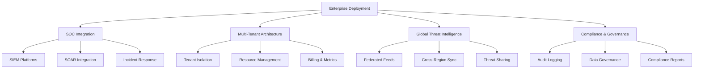

# Enterprise Examples

Real-world enterprise deployment scenarios and advanced use cases for TrojanHorse.js in large-scale organizational environments.

## Overview

This guide provides comprehensive examples for deploying TrojanHorse.js in enterprise environments, including SOC integration, multi-tenant architectures, and large-scale threat intelligence operations.



## Large-Scale SOC Deployment

### Complete SOC Integration Platform

```javascript
import { 
  TrojanHorse, 
  EnterpriseAuth, 
  SIEMConnector, 
  SOARIntegration,
  ThreatIntelligencePlatform 
} from 'trojanhorse-js/enterprise';

class EnterpriseSOCPlatform {
  constructor(config) {
    this.config = config;
    this.initialize();
  }
  
  async initialize() {
    // Initialize core TrojanHorse with enterprise configuration
    this.trojan = new TrojanHorse({
      sources: ['urlhaus', 'virustotal', 'alienvault', 'abuseipdb', 'crowdsec'],
      enterprise: true,
      
      // Performance configuration for high-volume environments
      performance: {
        workers: 16,                    // 16 worker processes
        batchSize: 500,                 // Large batch processing
        concurrentRequests: 50,         // High concurrency
        cacheEnabled: true,
        cacheTTL: 1800,                 // 30 minutes cache
        circuitBreaker: {
          enabled: true,
          threshold: 10,
          timeout: 60000
        }
      },
      
      // Enterprise security
      security: {
        encryption: true,
        auditLogging: true,
        complianceMode: 'SOC2',
        hsm: {
          enabled: true,
          provider: 'aws-cloudhsm'
        }
      }
    });
    
    // Setup enterprise authentication
    this.auth = new EnterpriseAuth({
      providers: {
        ldap: {
          enabled: true,
          host: 'ldap.company.com',
          baseDN: 'dc=company,dc=com'
        },
        saml: {
          enabled: true,
          entryPoint: 'https://sso.company.com/saml'
        },
        oauth2: {
          enabled: true,
          providers: ['azure', 'okta']
        }
      },
      
      mfa: {
        required: true,
        methods: ['totp', 'webauthn']
      },
      
      rbac: {
        roles: {
          soc_analyst: ['threats:read', 'intelligence:read'],
          security_engineer: ['threats:*', 'intelligence:*', 'vault:read'],
          soc_manager: ['*'],
          incident_responder: ['threats:read', 'incidents:*']
        }
      }
    });
    
    // Setup SIEM integrations
    await this.setupSIEMIntegrations();
    
    // Setup SOAR integration
    await this.setupSOARIntegration();
    
    // Setup threat intelligence platform
    await this.setupThreatIntelligencePlatform();
    
    // Setup automated workflows
    await this.setupAutomatedWorkflows();
  }
  
  async setupSIEMIntegrations() {
    // Splunk Enterprise Security
    this.splunk = new SIEMConnector({
      platform: 'splunk',
      host: 'splunk-es.company.com',
      token: process.env.SPLUNK_HEC_TOKEN,
      index: 'threat_intelligence',
      
      // Enterprise Splunk configuration
      config: {
        app: 'Enterprise_Security',
        notable_events: true,
        adaptive_response: true,
        threat_intelligence_framework: true
      },
      
      // Data models and correlation searches
      correlationRules: [
        {
          name: 'High_Confidence_Threat_Correlation',
          search: 'index=threat_intelligence confidence>=90 | correlate with network_traffic',
          schedule: '*/5 * * * *'
        }
      ]
    });
    
    // IBM QRadar SIEM
    this.qradar = new SIEMConnector({
      platform: 'qradar',
      host: 'qradar.company.com',
      token: process.env.QRADAR_TOKEN,
      
      // QRadar reference sets and custom properties
      referenceSets: {
        malicious_domains: 'TrojanHorse_Malicious_Domains',
        suspicious_ips: 'TrojanHorse_Suspicious_IPs',
        campaign_indicators: 'TrojanHorse_Campaign_IOCs'
      },
      
      customProperties: {
        threat_confidence: 'TrojanHorse_Confidence',
        threat_sources: 'TrojanHorse_Sources',
        correlation_score: 'TrojanHorse_Correlation'
      }
    });
    
    // Microsoft Sentinel
    this.sentinel = new SIEMConnector({
      platform: 'sentinel',
      tenantId: process.env.AZURE_TENANT_ID,
      subscriptionId: process.env.AZURE_SUBSCRIPTION_ID,
      resourceGroup: 'security-rg',
      workspaceName: 'enterprise-security-workspace',
      
      // Sentinel-specific configuration
      config: {
        threatIntelligence: {
          enabled: true,
          confidence_threshold: 70,
          valid_until_days: 30
        },
        
        analytics: {
          rules: ['TrojanHorse_High_Confidence_Threats'],
          workbooks: ['TrojanHorse_Threat_Analysis']
        }
      }
    });
    
    // Event handlers for SIEM integration
    this.trojan.on('threatDetected', async (threat) => {
      await this.handleThreatForSIEM(threat);
    });
  }
  
  async setupSOARIntegration() {
    this.soar = new SOARIntegration({
      platform: 'phantom', // or 'demisto', 'swimlane'
      endpoint: 'https://phantom.company.com',
      token: process.env.PHANTOM_TOKEN,
      
      // Playbook configuration
      playbooks: {
        high_confidence_threat: {
          id: 'playbook_001',
          trigger: 'confidence >= 90',
          actions: [
            'enrich_indicator',
            'check_internal_systems',
            'create_incident',
            'notify_stakeholders'
          ]
        },
        
        campaign_detection: {
          id: 'playbook_002',
          trigger: 'campaign_detected',
          actions: [
            'correlate_indicators',
            'timeline_analysis',
            'attribution_analysis',
            'executive_briefing'
          ]
        },
        
        false_positive_handling: {
          id: 'playbook_003',
          trigger: 'false_positive_reported',
          actions: [
            'validate_fp_claim',
            'update_whitelist',
            'retrain_models',
            'notify_analysts'
          ]
        }
      }
    });
    
    // Automated SOAR triggers
    this.trojan.on('threatDetected', async (threat) => {
      if (threat.confidence >= 90) {
        await this.soar.executePlaybook('high_confidence_threat', {
          threat: threat,
          priority: 'high',
          assignee: 'soc-team@company.com'
        });
      }
    });
    
    this.trojan.on('campaignDetected', async (campaign) => {
      await this.soar.executePlaybook('campaign_detection', {
        campaign: campaign,
        priority: 'critical',
        assignee: 'threat-intel-team@company.com'
      });
    });
  }
  
  async setupThreatIntelligencePlatform() {
    this.tip = new ThreatIntelligencePlatform({
      // Data sources
      sources: {
        commercial: [
          'recorded_future',
          'crowdstrike_falcon',
          'fireeye_intelligence'
        ],
        
        government: [
          'us_cert',
          'cisa_known_exploited',
          'fbi_flash'
        ],
        
        community: [
          'misp_communities',
          'otx_alienvault',
          'malware_bazaar'
        ],
        
        internal: [
          'soc_investigations',
          'incident_response',
          'honeypot_data'
        ]
      },
      
      // Enrichment and analysis
      enrichment: {
        enabled: true,
        
        modules: [
          'domain_analysis',
          'infrastructure_mapping',
          'malware_analysis',
          'attribution_engine',
          'campaign_tracker'
        ],
        
        external_apis: {
          'passive_dns': process.env.PASSIVE_DNS_API,
          'whois_service': process.env.WHOIS_API,
          'geolocation': process.env.GEOLOCATION_API
        }
      },
      
      // Machine learning and analytics
      analytics: {
        clustering: {
          enabled: true,
          algorithms: ['dbscan', 'kmeans'],
          features: ['infrastructure', 'timing', 'ttps']
        },
        
        attribution: {
          enabled: true,
          confidence_threshold: 70,
          ttp_analysis: true,
          infrastructure_fingerprinting: true
        },
        
        predictive: {
          enabled: true,
          models: ['lstm', 'random_forest'],
          prediction_horizon: '7d'
        }
      }
    });
    
    // TIP event handlers
    this.tip.on('campaignIdentified', async (campaign) => {
      await this.handleCampaignIdentification(campaign);
    });
    
    this.tip.on('attributionUpdate', async (attribution) => {
      await this.handleAttributionUpdate(attribution);
    });
  }
  
  async setupAutomatedWorkflows() {
    // Workflow: High-confidence threat response
    this.trojan.addWorkflow('high_confidence_response', {
      trigger: (event) => event.confidence >= 90,
      
      steps: [
        {
          name: 'immediate_enrichment',
          action: async (threat) => {
            return await this.tip.enrichIndicator(threat.indicator);
          }
        },
        
        {
          name: 'infrastructure_analysis',
          action: async (threat, context) => {
            return await this.tip.analyzeInfrastructure(threat.indicator);
          }
        },
        
        {
          name: 'internal_correlation',
          action: async (threat, context) => {
            return await this.correlateWithInternalSystems(threat);
          }
        },
        
        {
          name: 'automated_blocking',
          action: async (threat, context) => {
            if (context.internal_correlation.risk_score > 80) {
              await this.executeAutomatedBlocking(threat);
            }
          }
        },
        
        {
          name: 'incident_creation',
          action: async (threat, context) => {
            return await this.createSecurityIncident(threat, context);
          }
        },
        
        {
          name: 'stakeholder_notification',
          action: async (threat, context) => {
            await this.notifyStakeholders(threat, context);
          }
        }
      ]
    });
    
    // Workflow: Campaign analysis and response
    this.trojan.addWorkflow('campaign_analysis', {
      trigger: (event) => event.type === 'campaignDetected',
      
      steps: [
        {
          name: 'campaign_enrichment',
          action: async (campaign) => {
            return await this.tip.enrichCampaign(campaign);
          }
        },
        
        {
          name: 'attribution_analysis',
          action: async (campaign, context) => {
            return await this.tip.performAttribution(campaign);
          }
        },
        
        {
          name: 'impact_assessment',
          action: async (campaign, context) => {
            return await this.assessCampaignImpact(campaign, context);
          }
        },
        
        {
          name: 'executive_briefing',
          action: async (campaign, context) => {
            await this.generateExecutiveBriefing(campaign, context);
          }
        }
      ]
    });
  }
  
  async handleThreatForSIEM(threat) {
    const siemEvent = {
      timestamp: new Date().toISOString(),
      source: 'trojanhorse-js',
      event_type: 'threat_detected',
      
      indicator: threat.indicator,
      threat_type: threat.type,
      confidence: threat.confidence,
      sources: threat.sources,
      
      // Standardized fields for SIEM correlation
      severity: this.mapConfidenceToSeverity(threat.confidence),
      category: this.mapThreatTypeToCategory(threat.type),
      risk_score: threat.correlationScore,
      
      // Custom fields
      correlation_id: this.generateCorrelationId(),
      investigation_priority: this.calculateInvestigationPriority(threat),
      recommended_actions: this.generateRecommendedActions(threat)
    };
    
    // Send to all SIEM platforms
    await Promise.all([
      this.splunk.sendEvent(siemEvent),
      this.qradar.addToReferenceSet('threats', threat.indicator, siemEvent),
      this.sentinel.createThreatIndicator(siemEvent)
    ]);
    
    // Create notable events for high-confidence threats
    if (threat.confidence >= 85) {
      await this.splunk.createNotableEvent({
        title: `High Confidence Threat: ${threat.indicator}`,
        description: `TrojanHorse.js detected ${threat.indicator} with ${threat.confidence}% confidence`,
        urgency: 'high',
        owner: 'soc-team',
        status: 'new'
      });
    }
  }
  
  async correlateWithInternalSystems(threat) {
    const correlationResults = {
      dns_logs: await this.queryDNSLogs(threat.indicator),
      proxy_logs: await this.queryProxyLogs(threat.indicator),
      firewall_logs: await this.queryFirewallLogs(threat.indicator),
      endpoint_data: await this.queryEndpointSecurity(threat.indicator),
      network_flow: await this.queryNetworkFlow(threat.indicator)
    };
    
    // Calculate internal risk score
    const riskScore = this.calculateInternalRiskScore(correlationResults);
    
    return {
      ...correlationResults,
      risk_score: riskScore,
      affected_systems: this.identifyAffectedSystems(correlationResults),
      timeline: this.buildCorrelationTimeline(correlationResults)
    };
  }
  
  async executeAutomatedBlocking(threat) {
    const blockingActions = [];
    
    // DNS sinkhole
    if (threat.type === 'domain' || threat.type === 'url') {
      await this.dnsService.addToSinkhole(threat.indicator);
      blockingActions.push('dns_sinkhole');
    }
    
    // Firewall blocking
    if (threat.type === 'ip' || threat.type === 'domain') {
      await this.firewallService.addBlockRule(threat.indicator);
      blockingActions.push('firewall_block');
    }
    
    // Proxy blocking
    if (threat.type === 'url' || threat.type === 'domain') {
      await this.proxyService.addToBlocklist(threat.indicator);
      blockingActions.push('proxy_block');
    }
    
    // Email security
    if (threat.type === 'domain' || threat.type === 'url') {
      await this.emailSecurity.addToBlocklist(threat.indicator);
      blockingActions.push('email_block');
    }
    
    return {
      indicator: threat.indicator,
      actions_taken: blockingActions,
      timestamp: new Date().toISOString(),
      automated: true
    };
  }
  
  async createSecurityIncident(threat, context) {
    const incident = {
      title: `Security Threat: ${threat.indicator}`,
      description: `High-confidence threat detected by TrojanHorse.js`,
      
      severity: this.mapConfidenceToIncidentSeverity(threat.confidence),
      priority: this.calculateIncidentPriority(threat, context),
      category: 'security_threat',
      
      affected_systems: context.internal_correlation?.affected_systems || [],
      indicators: [threat.indicator],
      
      timeline: [
        {
          timestamp: threat.timestamp,
          action: 'threat_detected',
          details: `Threat detected with ${threat.confidence}% confidence`
        },
        ...context.timeline || []
      ],
      
      recommendations: this.generateIncidentRecommendations(threat, context),
      
      assignment: {
        team: this.determineResponsibleTeam(threat),
        escalation_path: this.getEscalationPath(threat.confidence),
        sla: this.calculateSLA(threat.confidence)
      }
    };
    
    // Create incident in ITSM system
    const incidentId = await this.itsmService.createIncident(incident);
    
    // Create incident in SOAR platform
    await this.soar.createCase({
      ...incident,
      external_id: incidentId,
      playbook: 'security_incident_response'
    });
    
    return { incidentId, incident };
  }
  
  async notifyStakeholders(threat, context) {
    const notifications = [];
    
    // SOC team notification
    await this.notificationService.send({
      channel: 'slack',
      recipients: ['#soc-alerts'],
      message: this.formatSOCNotification(threat, context),
      priority: 'high'
    });
    notifications.push('soc_team');
    
    // Executive notification for critical threats
    if (threat.confidence >= 95 || context.internal_correlation?.risk_score > 90) {
      await this.notificationService.send({
        channel: 'email',
        recipients: ['ciso@company.com', 'security-leadership@company.com'],
        subject: `CRITICAL: High-confidence security threat detected`,
        message: this.formatExecutiveNotification(threat, context),
        priority: 'critical'
      });
      notifications.push('executives');
    }
    
    // Business unit notification if systems affected
    if (context.internal_correlation?.affected_systems.length > 0) {
      const affectedBUs = this.identifyAffectedBusinessUnits(context.internal_correlation.affected_systems);
      
      for (const bu of affectedBUs) {
        await this.notificationService.send({
          channel: 'email',
          recipients: [bu.security_contact],
          subject: `Security Alert: Potential threat affecting ${bu.name}`,
          message: this.formatBusinessUnitNotification(threat, context, bu),
          priority: 'medium'
        });
      }
      notifications.push('business_units');
    }
    
    return notifications;
  }
  
  // Enterprise metrics and reporting
  async generateEnterpriseMetrics() {
    const metrics = {
      threats: {
        total_detected: await this.getMetric('threats.total'),
        high_confidence: await this.getMetric('threats.high_confidence'),
        by_type: await this.getMetric('threats.by_type'),
        by_source: await this.getMetric('threats.by_source'),
        detection_rate: await this.getMetric('threats.detection_rate')
      },
      
      performance: {
        average_response_time: await this.getMetric('performance.avg_response_time'),
        throughput: await this.getMetric('performance.throughput'),
        availability: await this.getMetric('performance.availability'),
        error_rate: await this.getMetric('performance.error_rate')
      },
      
      automation: {
        automated_blocks: await this.getMetric('automation.blocks'),
        soar_playbooks_executed: await this.getMetric('automation.soar_playbooks'),
        false_positive_rate: await this.getMetric('automation.false_positives')
      },
      
      compliance: {
        audit_events: await this.getMetric('compliance.audit_events'),
        data_retention_compliance: await this.getMetric('compliance.data_retention'),
        access_control_violations: await this.getMetric('compliance.access_violations')
      }
    };
    
    return metrics;
  }
}

// Initialize enterprise SOC platform
const socPlatform = new EnterpriseSOCPlatform({
  deployment: 'production',
  scale: 'enterprise',
  compliance: ['SOC2', 'ISO27001', 'NIST'],
  
  infrastructure: {
    kubernetes: true,
    cloud_provider: 'aws',
    regions: ['us-east-1', 'us-west-2', 'eu-west-1'],
    high_availability: true
  }
});

// Start the platform
await socPlatform.initialize();
console.log('Enterprise SOC platform initialized successfully');
```

## Multi-Tenant SaaS Deployment

### Multi-Tenant Architecture

```javascript
import { TrojanHorse, TenantManager, ResourceManager } from 'trojanhorse-js/enterprise';

class MultiTenantThreatIntelligence {
  constructor(config) {
    this.config = config;
    this.tenants = new Map();
    this.initialize();
  }
  
  async initialize() {
    // Initialize tenant manager
    this.tenantManager = new TenantManager({
      isolation: 'strict',          // 'strict', 'shared', 'hybrid'
      
      database: {
        strategy: 'database_per_tenant', // 'shared_database', 'database_per_tenant'
        encryption: 'tenant_specific_keys'
      },
      
      authentication: {
        sso_per_tenant: true,
        custom_domains: true,
        tenant_specific_branding: true
      },
      
      billing: {
        model: 'usage_based',       // 'subscription', 'usage_based', 'hybrid'
        metrics: ['api_calls', 'data_volume', 'user_count']
      }
    });
    
    // Initialize resource manager
    this.resourceManager = new ResourceManager({
      quotas: {
        api_calls_per_hour: {
          starter: 1000,
          professional: 10000,
          enterprise: 100000
        },
        
        data_retention_days: {
          starter: 30,
          professional: 90,
          enterprise: 365
        },
        
        concurrent_users: {
          starter: 5,
          professional: 50,
          enterprise: 500
        }
      },
      
      scaling: {
        auto_scale: true,
        resource_pools: ['shared', 'dedicated'],
        isolation_levels: ['container', 'vm', 'bare_metal']
      }
    });
    
    // Setup tenant lifecycle management
    this.setupTenantLifecycle();
  }
  
  async provisionTenant(tenantConfig) {
    const tenantId = this.generateTenantId();
    
    try {
      // Create tenant infrastructure
      const infrastructure = await this.provisionTenantInfrastructure(tenantId, tenantConfig);
      
      // Initialize tenant-specific TrojanHorse instance
      const trojanInstance = await this.createTenantTrojanHorse(tenantId, tenantConfig);
      
      // Setup tenant authentication
      const authConfig = await this.setupTenantAuthentication(tenantId, tenantConfig);
      
      // Configure tenant-specific feeds
      const feedConfig = await this.configureTenantFeeds(tenantId, tenantConfig);
      
      // Setup tenant monitoring and logging
      const monitoring = await this.setupTenantMonitoring(tenantId);
      
      // Create tenant record
      const tenant = {
        id: tenantId,
        name: tenantConfig.name,
        plan: tenantConfig.plan,
        status: 'active',
        created_at: new Date().toISOString(),
        
        config: tenantConfig,
        infrastructure: infrastructure,
        trojan: trojanInstance,
        auth: authConfig,
        feeds: feedConfig,
        monitoring: monitoring,
        
        quotas: this.resourceManager.getTenantQuotas(tenantConfig.plan),
        usage: this.initializeTenantUsage()
      };
      
      this.tenants.set(tenantId, tenant);
      
      // Start tenant services
      await this.startTenantServices(tenantId);
      
      console.log(`Tenant ${tenantId} provisioned successfully`);
      return tenant;
    } catch (error) {
      console.error(`Failed to provision tenant ${tenantId}:`, error);
      await this.cleanupFailedProvisioning(tenantId);
      throw error;
    }
  }
  
  async createTenantTrojanHorse(tenantId, config) {
    return new TrojanHorse({
      // Tenant-specific configuration
      tenant: {
        id: tenantId,
        isolation: true,
        namespace: `tenant-${tenantId}`
      },
      
      // Threat feed configuration based on plan
      sources: this.getTenantSources(config.plan),
      
      // Performance settings based on plan
      performance: {
        workers: this.getTenantWorkers(config.plan),
        batchSize: this.getTenantBatchSize(config.plan),
        cacheEnabled: config.plan !== 'starter',
        cacheTTL: this.getTenantCacheTTL(config.plan)
      },
      
      // Security configuration
      security: {
        encryption: true,
        tenantKeyIsolation: true,
        auditLogging: true,
        dataResidency: config.dataResidency || 'us'
      },
      
      // Quota enforcement
      quotas: {
        enabled: true,
        apiCallsPerHour: this.resourceManager.getQuota(config.plan, 'api_calls_per_hour'),
        maxConcurrentRequests: this.resourceManager.getQuota(config.plan, 'concurrent_requests')
      }
    });
  }
  
  async setupTenantAuthentication(tenantId, config) {
    const authConfig = {
      tenant_id: tenantId,
      domain: config.customDomain || `${tenantId}.trojanhorse-saas.com`,
      
      providers: {
        local: {
          enabled: true,
          passwordPolicy: config.passwordPolicy || 'standard'
        }
      },
      
      // Enterprise plans get SSO
      sso: config.plan === 'enterprise' ? {
        enabled: true,
        saml: {
          enabled: config.sso?.saml || false,
          entityId: `trojanhorse-${tenantId}`,
          acsUrl: `https://${config.customDomain}/auth/saml/acs`
        },
        oauth2: {
          enabled: config.sso?.oauth2 || false,
          providers: config.sso?.providers || []
        }
      } : { enabled: false },
      
      // RBAC configuration
      rbac: {
        enabled: true,
        customRoles: config.plan === 'enterprise',
        defaultRoles: this.getDefaultRoles(config.plan)
      },
      
      // Session management
      session: {
        timeout: config.sessionTimeout || 3600,
        multipleLogins: config.plan !== 'starter',
        ipRestriction: config.ipRestriction || false
      }
    };
    
    return authConfig;
  }
  
  async configureTenantFeeds(tenantId, config) {
    const feedConfig = {
      enabled_feeds: this.getTenantSources(config.plan),
      
      // Feed-specific configurations
      custom_feeds: config.plan === 'enterprise' ? {
        enabled: true,
        max_feeds: 10
      } : { enabled: false },
      
      // API rate limits per feed
      rate_limits: this.getFeedRateLimits(config.plan),
      
      // Data freshness requirements
      freshness: {
        real_time: config.plan === 'enterprise',
        max_age: this.getMaxDataAge(config.plan)
      }
    };
    
    return feedConfig;
  }
  
  async setupTenantMonitoring(tenantId) {
    const monitoring = {
      metrics: {
        enabled: true,
        retention: this.getMetricsRetention(tenantId),
        dashboards: await this.createTenantDashboards(tenantId)
      },
      
      alerting: {
        enabled: true,
        channels: ['email', 'webhook'],
        thresholds: this.getAlertingThresholds(tenantId)
      },
      
      logging: {
        enabled: true,
        level: 'info',
        retention: this.getLogRetention(tenantId),
        structured: true
      }
    };
    
    return monitoring;
  }
  
  // API endpoint for tenant threat intelligence
  async processTenantThreatRequest(tenantId, request) {
    const tenant = this.tenants.get(tenantId);
    if (!tenant) {
      throw new Error(`Tenant ${tenantId} not found`);
    }
    
    // Check quotas
    await this.enforceQuotas(tenantId, request);
    
    // Process request with tenant-specific instance
    const result = await tenant.trojan.scout(request.indicator, {
      sources: request.sources || tenant.feeds.enabled_feeds,
      ...request.options
    });
    
    // Record usage metrics
    await this.recordTenantUsage(tenantId, {
      api_calls: 1,
      data_volume: this.calculateDataVolume(result),
      timestamp: new Date().toISOString()
    });
    
    // Apply tenant-specific data filtering
    return this.filterTenantData(result, tenant);
  }
  
  async enforceQuotas(tenantId, request) {
    const tenant = this.tenants.get(tenantId);
    const usage = await this.getCurrentUsage(tenantId);
    
    // Check API call quota
    if (usage.api_calls_this_hour >= tenant.quotas.api_calls_per_hour) {
      throw new Error('API quota exceeded');
    }
    
    // Check concurrent request quota
    if (usage.concurrent_requests >= tenant.quotas.concurrent_requests) {
      throw new Error('Concurrent request limit exceeded');
    }
    
    // Check data volume quota (for enterprise plans)
    if (tenant.quotas.data_volume_per_month && 
        usage.data_volume_this_month >= tenant.quotas.data_volume_per_month) {
      throw new Error('Data volume quota exceeded');
    }
  }
  
  async recordTenantUsage(tenantId, usageData) {
    const tenant = this.tenants.get(tenantId);
    
    // Update in-memory usage tracking
    tenant.usage.api_calls_total++;
    tenant.usage.api_calls_this_hour++;
    tenant.usage.data_volume_total += usageData.data_volume;
    tenant.usage.last_activity = usageData.timestamp;
    
    // Persist to billing database
    await this.billingDB.recordUsage(tenantId, usageData);
    
    // Update real-time metrics
    await this.metricsCollector.record(tenantId, {
      'api.calls': 1,
      'data.volume': usageData.data_volume,
      'response.time': usageData.response_time || 0
    });
  }
  
  // Tenant scaling and resource management
  async scaleTenantResources(tenantId, scalingEvent) {
    const tenant = this.tenants.get(tenantId);
    
    switch (scalingEvent.type) {
      case 'high_usage':
        await this.scaleUp(tenantId, scalingEvent);
        break;
        
      case 'low_usage':
        await this.scaleDown(tenantId, scalingEvent);
        break;
        
      case 'plan_upgrade':
        await this.upgradeTenantPlan(tenantId, scalingEvent.newPlan);
        break;
        
      case 'plan_downgrade':
        await this.downgradeTenantPlan(tenantId, scalingEvent.newPlan);
        break;
    }
  }
  
  async scaleUp(tenantId, event) {
    const tenant = this.tenants.get(tenantId);
    
    // Increase resource allocation
    await this.resourceManager.allocateAdditionalResources(tenantId, {
      workers: Math.min(tenant.config.workers * 2, this.getMaxWorkers(tenant.plan)),
      memory: '2x',
      cache_size: '1.5x'
    });
    
    // Update tenant configuration
    tenant.infrastructure.scaled_up = true;
    tenant.infrastructure.scale_up_time = new Date().toISOString();
    
    console.log(`Scaled up resources for tenant ${tenantId}`);
  }
  
  // Billing and usage reporting
  async generateTenantBill(tenantId, billingPeriod) {
    const tenant = this.tenants.get(tenantId);
    const usage = await this.getUsageForPeriod(tenantId, billingPeriod);
    
    const bill = {
      tenant_id: tenantId,
      billing_period: billingPeriod,
      plan: tenant.plan,
      
      base_fee: this.getBaseFee(tenant.plan),
      
      usage_charges: {
        api_calls: {
          quantity: usage.api_calls,
          rate: this.getAPICallRate(tenant.plan),
          amount: usage.api_calls * this.getAPICallRate(tenant.plan)
        },
        
        data_volume: {
          quantity: usage.data_volume,
          rate: this.getDataVolumeRate(tenant.plan),
          amount: usage.data_volume * this.getDataVolumeRate(tenant.plan)
        },
        
        storage: {
          quantity: usage.storage_gb,
          rate: this.getStorageRate(tenant.plan),
          amount: usage.storage_gb * this.getStorageRate(tenant.plan)
        }
      },
      
      total_amount: 0, // Calculated below
      currency: 'USD',
      
      tax: {
        rate: this.getTaxRate(tenant.config.billing_address),
        amount: 0 // Calculated below
      }
    };
    
    // Calculate totals
    bill.total_amount = bill.base_fee + 
      Object.values(bill.usage_charges).reduce((sum, charge) => sum + charge.amount, 0);
    
    bill.tax.amount = bill.total_amount * bill.tax.rate;
    bill.total_amount += bill.tax.amount;
    
    return bill;
  }
  
  // Tenant analytics and reporting
  async generateTenantAnalytics(tenantId, period = '30d') {
    const tenant = this.tenants.get(tenantId);
    const usage = await this.getUsageForPeriod(tenantId, period);
    const threats = await this.getTenantThreats(tenantId, period);
    
    return {
      tenant_id: tenantId,
      period: period,
      
      usage: {
        api_calls: usage.api_calls,
        unique_indicators: usage.unique_indicators,
        data_volume_gb: usage.data_volume / (1024 * 1024 * 1024),
        average_response_time: usage.avg_response_time
      },
      
      threats: {
        total_detected: threats.length,
        high_confidence: threats.filter(t => t.confidence >= 90).length,
        by_type: this.groupBy(threats, 'type'),
        by_source: this.groupBy(threats, 'source'),
        trend: this.calculateThreatTrend(threats)
      },
      
      performance: {
        uptime: await this.calculateTenantUptime(tenantId, period),
        error_rate: usage.errors / usage.api_calls,
        cache_hit_rate: usage.cache_hits / usage.api_calls
      },
      
      security: {
        failed_authentications: await this.getFailedAuth(tenantId, period),
        suspicious_activities: await this.getSuspiciousActivities(tenantId, period)
      }
    };
  }
}

// Initialize multi-tenant service
const multiTenantService = new MultiTenantThreatIntelligence({
  deployment: 'multi_tenant_saas',
  regions: ['us-east-1', 'eu-west-1', 'ap-southeast-1'],
  compliance: ['SOC2', 'GDPR', 'CCPA']
});

// Example: Provision new tenant
const newTenant = await multiTenantService.provisionTenant({
  name: 'Acme Corporation',
  plan: 'enterprise',
  customDomain: 'threat-intel.acme.com',
  dataResidency: 'us',
  
  sso: {
    saml: true,
    entityId: 'acme-corporation',
    metadataUrl: 'https://sso.acme.com/metadata'
  },
  
  compliance: ['SOC2', 'ISO27001'],
  
  billing: {
    email: 'billing@acme.com',
    address: '123 Business St, City, State 12345'
  }
});

console.log('New tenant provisioned:', newTenant.id);
```

## Global Threat Intelligence Network

### Federated Threat Intelligence

```javascript
import { 
  FederatedThreatIntelligence, 
  ThreatSharingProtocol,
  GlobalThreatDatabase 
} from 'trojanhorse-js/enterprise';

class GlobalThreatIntelligenceNetwork {
  constructor(config) {
    this.config = config;
    this.initialize();
  }
  
  async initialize() {
    // Initialize federated threat intelligence
    this.federation = new FederatedThreatIntelligence({
      node_id: this.config.nodeId,
      region: this.config.region,
      
      // Peer nodes in the network
      peers: [
        { id: 'us-east', endpoint: 'https://us-east.threat-network.com' },
        { id: 'eu-west', endpoint: 'https://eu-west.threat-network.com' },
        { id: 'ap-southeast', endpoint: 'https://ap-southeast.threat-network.com' }
      ],
      
      // Data sharing configuration
      sharing: {
        enabled: true,
        anonymization: true,
        sensitivity_levels: ['public', 'tlp_white', 'tlp_green'],
        retention_policy: '1y',
        
        filters: {
          confidence_threshold: 70,
          exclude_false_positives: true,
          geographic_restrictions: this.config.geographicRestrictions
        }
      },
      
      // Synchronization settings
      sync: {
        realtime: true,
        batch_interval: '5m',
        conflict_resolution: 'latest_wins',
        checksum_validation: true
      }
    });
    
    // Initialize threat sharing protocol
    this.sharingProtocol = new ThreatSharingProtocol({
      standard: 'stix_2.1',
      
      formats: {
        input: ['stix', 'misp', 'ioc', 'csv'],
        output: ['stix', 'json', 'xml']
      },
      
      encryption: {
        enabled: true,
        algorithm: 'aes-256-gcm',
        key_exchange: 'ecdh',
        signature: 'ed25519'
      },
      
      authentication: {
        mutual_tls: true,
        api_keys: true,
        digital_signatures: true
      }
    });
    
    // Initialize global threat database
    this.globalDB = new GlobalThreatDatabase({
      distributed: true,
      consistency: 'eventual',
      
      partitioning: {
        strategy: 'geographic',
        replicas: 3,
        auto_failover: true
      },
      
      indexing: {
        indicators: true,
        temporal: true,
        geospatial: true,
        similarity: true
      }
    });
    
    // Setup event handlers
    this.setupEventHandlers();
  }
  
  setupEventHandlers() {
    // Handle incoming threat intelligence
    this.federation.on('threatReceived', async (threat) => {
      await this.processIncomingThreat(threat);
    });
    
    // Handle threat correlation across nodes
    this.federation.on('correlationRequest', async (request) => {
      await this.handleCorrelationRequest(request);
    });
    
    // Handle node synchronization
    this.federation.on('syncRequired', async (nodeId) => {
      await this.synchronizeWithNode(nodeId);
    });
  }
  
  async processIncomingThreat(threat) {
    try {
      // Validate threat data
      const validation = await this.sharingProtocol.validate(threat);
      if (!validation.valid) {
        console.warn('Invalid threat data received:', validation.errors);
        return;
      }
      
      // Check for duplicates
      const existing = await this.globalDB.findSimilar(threat.indicator);
      if (existing.length > 0) {
        await this.mergeThreatData(existing[0], threat);
      } else {
        await this.storeThreatData(threat);
      }
      
      // Trigger local correlation
      await this.triggerLocalCorrelation(threat);
      
      // Propagate to subscribers
      await this.propagateToSubscribers(threat);
    } catch (error) {
      console.error('Error processing incoming threat:', error);
    }
  }
  
  async shareLocalThreat(threat) {
    try {
      // Apply sharing policies
      const shareable = await this.applySharingPolicies(threat);
      if (!shareable.canShare) {
        console.log('Threat not eligible for sharing:', shareable.reason);
        return;
      }
      
      // Anonymize sensitive data
      const anonymized = await this.anonymizeThreat(threat);
      
      // Convert to standard format
      const stixThreat = await this.sharingProtocol.convertToSTIX(anonymized);
      
      // Sign and encrypt
      const secured = await this.sharingProtocol.securePayload(stixThreat);
      
      // Share with peer nodes
      const sharedWith = [];
      for (const peer of this.federation.peers) {
        try {
          await this.federation.shareThreat(peer.id, secured);
          sharedWith.push(peer.id);
        } catch (error) {
          console.error(`Failed to share with ${peer.id}:`, error);
        }
      }
      
      // Record sharing activity
      await this.recordSharingActivity(threat.indicator, sharedWith);
    } catch (error) {
      console.error('Error sharing local threat:', error);
    }
  }
  
  async performGlobalCorrelation(indicator) {
    // Query local database
    const localResults = await this.globalDB.query(indicator);
    
    // Query peer nodes
    const peerQueries = this.federation.peers.map(async (peer) => {
      try {
        const peerResults = await this.federation.queryPeer(peer.id, indicator);
        return { peer: peer.id, results: peerResults };
      } catch (error) {
        console.error(`Failed to query peer ${peer.id}:`, error);
        return { peer: peer.id, results: [], error: error.message };
      }
    });
    
    const peerResults = await Promise.all(peerQueries);
    
    // Combine and analyze results
    const combinedResults = {
      local: localResults,
      peers: peerResults.filter(r => !r.error),
      errors: peerResults.filter(r => r.error)
    };
    
    // Perform global correlation analysis
    const correlation = await this.analyzeGlobalCorrelation(combinedResults);
    
    return {
      indicator: indicator,
      local_matches: localResults.length,
      peer_matches: peerResults.reduce((sum, r) => sum + r.results.length, 0),
      total_matches: localResults.length + peerResults.reduce((sum, r) => sum + r.results.length, 0),
      confidence: correlation.confidence,
      consensus: correlation.consensus,
      attribution: correlation.attribution,
      campaign_links: correlation.campaignLinks,
      geographic_distribution: correlation.geographicDistribution
    };
  }
  
  async analyzeGlobalCorrelation(results) {
    const allResults = [
      ...results.local,
      ...results.peers.flatMap(p => p.results)
    ];
    
    // Calculate global confidence
    const confidenceScores = allResults.map(r => r.confidence);
    const avgConfidence = confidenceScores.reduce((sum, c) => sum + c, 0) / confidenceScores.length;
    const consensusLevel = this.calculateConsensusLevel(confidenceScores);
    
    // Analyze attribution
    const attributions = allResults.map(r => r.attribution).filter(Boolean);
    const attributionConsensus = this.findAttributionConsensus(attributions);
    
    // Identify campaign links
    const campaigns = allResults.map(r => r.campaigns).filter(Boolean).flat();
    const campaignLinks = this.identifyCampaignLinks(campaigns);
    
    // Geographic analysis
    const geoData = allResults.map(r => r.geography).filter(Boolean);
    const geographicDistribution = this.analyzeGeographicDistribution(geoData);
    
    return {
      confidence: avgConfidence,
      consensus: consensusLevel,
      attribution: attributionConsensus,
      campaignLinks: campaignLinks,
      geographicDistribution: geographicDistribution
    };
  }
  
  // Threat hunting across the global network
  async performGlobalThreatHunt(huntingQuery) {
    const huntingSession = {
      id: this.generateHuntingSessionId(),
      query: huntingQuery,
      startTime: new Date().toISOString(),
      nodes: [],
      results: []
    };
    
    // Distribute hunting query to all nodes
    const huntingPromises = this.federation.peers.map(async (peer) => {
      try {
        const peerResults = await this.federation.sendHuntingQuery(peer.id, huntingQuery);
        huntingSession.nodes.push({
          nodeId: peer.id,
          status: 'completed',
          results: peerResults.length,
          responseTime: peerResults.responseTime
        });
        return { peer: peer.id, results: peerResults };
      } catch (error) {
        huntingSession.nodes.push({
          nodeId: peer.id,
          status: 'failed',
          error: error.message
        });
        return { peer: peer.id, results: [], error: error.message };
      }
    });
    
    // Include local hunting
    const localResults = await this.performLocalThreatHunt(huntingQuery);
    huntingSession.nodes.push({
      nodeId: 'local',
      status: 'completed',
      results: localResults.length
    });
    
    const allResults = await Promise.all(huntingPromises);
    
    // Combine and deduplicate results
    const combinedResults = [
      ...localResults,
      ...allResults.flatMap(r => r.results)
    ];
    
    const deduplicatedResults = this.deduplicateHuntingResults(combinedResults);
    
    huntingSession.results = deduplicatedResults;
    huntingSession.endTime = new Date().toISOString();
    huntingSession.totalResults = deduplicatedResults.length;
    
    // Store hunting session for analysis
    await this.storeHuntingSession(huntingSession);
    
    return huntingSession;
  }
  
  // Network health and monitoring
  async monitorNetworkHealth() {
    const healthMetrics = {
      timestamp: new Date().toISOString(),
      local_node: {
        id: this.config.nodeId,
        status: 'healthy',
        uptime: process.uptime(),
        memory_usage: process.memoryUsage(),
        threat_count: await this.globalDB.getThreatCount(),
        last_sync: await this.getLastSyncTime()
      },
      
      peer_nodes: [],
      network_metrics: {
        total_nodes: this.federation.peers.length + 1,
        active_nodes: 0,
        sync_lag: 0,
        data_consistency: 0
      }
    };
    
    // Check peer node health
    for (const peer of this.federation.peers) {
      try {
        const peerHealth = await this.federation.checkPeerHealth(peer.id);
        healthMetrics.peer_nodes.push({
          id: peer.id,
          status: 'healthy',
          response_time: peerHealth.responseTime,
          threat_count: peerHealth.threatCount,
          last_sync: peerHealth.lastSync
        });
        healthMetrics.network_metrics.active_nodes++;
      } catch (error) {
        healthMetrics.peer_nodes.push({
          id: peer.id,
          status: 'unhealthy',
          error: error.message
        });
      }
    }
    
    // Calculate network metrics
    healthMetrics.network_metrics.sync_lag = this.calculateSyncLag(healthMetrics.peer_nodes);
    healthMetrics.network_metrics.data_consistency = await this.calculateDataConsistency();
    
    return healthMetrics;
  }
  
  // Analytics and reporting
  async generateNetworkAnalytics(period = '7d') {
    const analytics = {
      period: period,
      network_overview: {
        total_threats_shared: await this.getTotalThreatsShared(period),
        unique_indicators: await this.getUniqueIndicators(period),
        participating_nodes: this.federation.peers.length + 1,
        data_volume_gb: await this.getDataVolume(period)
      },
      
      sharing_statistics: {
        inbound_threats: await this.getInboundThreats(period),
        outbound_threats: await this.getOutboundThreats(period),
        correlation_requests: await this.getCorrelationRequests(period),
        hunting_sessions: await this.getHuntingSessions(period)
      },
      
      quality_metrics: {
        false_positive_rate: await this.calculateFalsePositiveRate(period),
        attribution_accuracy: await this.calculateAttributionAccuracy(period),
        correlation_success_rate: await this.calculateCorrelationSuccessRate(period)
      },
      
      geographic_distribution: await this.getGeographicDistribution(period),
      threat_categories: await this.getThreatCategories(period),
      top_threat_actors: await this.getTopThreatActors(period)
    };
    
    return analytics;
  }
}

// Initialize global threat intelligence network
const globalNetwork = new GlobalThreatIntelligenceNetwork({
  nodeId: 'enterprise-node-001',
  region: 'us-east-1',
  geographicRestrictions: ['china', 'russia'], // Example restrictions
  
  sharingLevel: 'full', // 'limited', 'full', 'custom'
  
  compliance: {
    data_sovereignty: true,
    export_controls: true,
    privacy_regulations: ['gdpr', 'ccpa']
  }
});

// Example: Share a high-confidence threat globally
await globalNetwork.shareLocalThreat({
  indicator: 'malicious-domain.com',
  type: 'domain',
  confidence: 95,
  sources: ['internal_honeypot', 'soc_analysis'],
  attribution: 'apt29',
  campaign: 'operation_xyz'
});

// Example: Perform global threat hunting
const huntingResults = await globalNetwork.performGlobalThreatHunt({
  type: 'infrastructure_hunt',
  criteria: {
    ssl_certificates: ['fingerprint_abc123'],
    hosting_providers: ['suspicious_hoster_inc'],
    registration_dates: ['2025-01-01', '2025-01-15']
  }
});

console.log('Global hunting results:', huntingResults);
```

---

**Next Steps**:
- Review [Custom Feed Examples](custom-feeds.md) for feed integration
- Check [Advanced Examples](advanced.md) for complex workflows
- Explore [Basic Examples](basic.md) for getting started