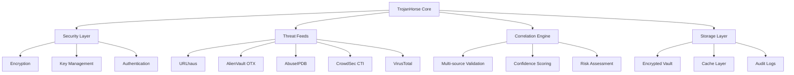
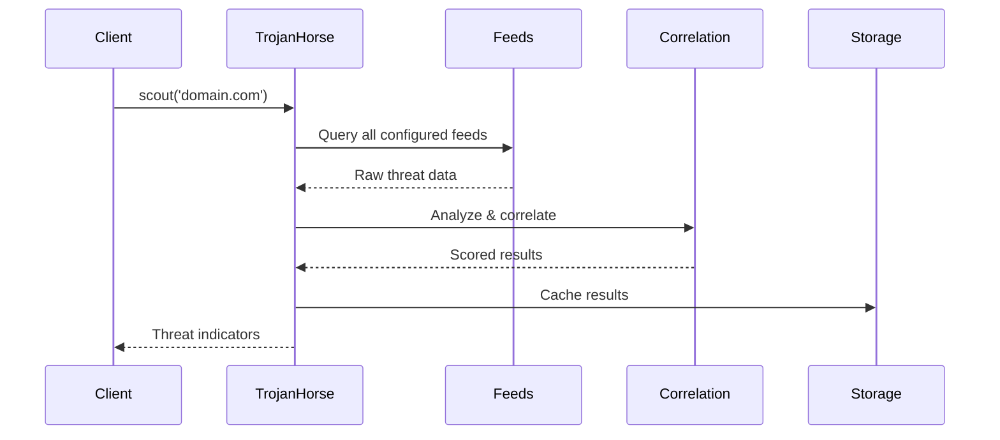
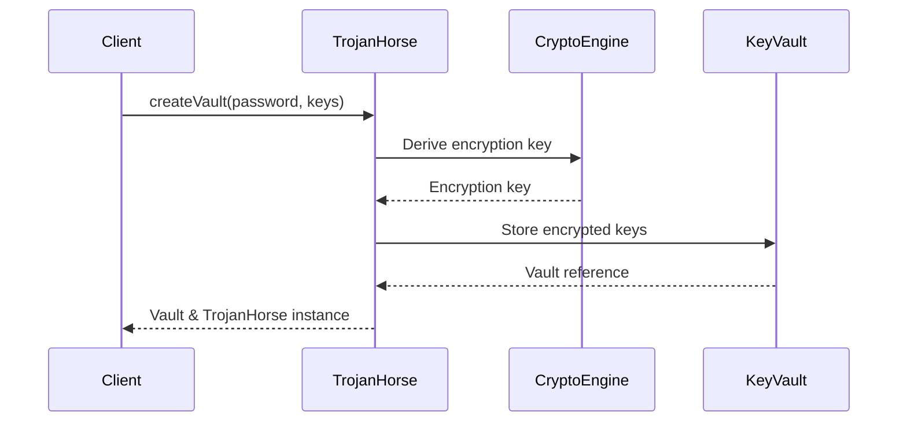

# Basic Concepts

Understanding the core concepts behind TrojanHorse.js will help you use it effectively for threat intelligence and security automation.

## Threat Intelligence

### What is Threat Intelligence?

Threat intelligence is evidence-based knowledge about existing and emerging security threats. TrojanHorse.js aggregates this intelligence from multiple sources to provide comprehensive threat detection.

### Types of Indicators

TrojanHorse.js works with several types of threat indicators:

| Type | Description | Examples |
|------|-------------|----------|
| **Domains** | Malicious domain names | `malware-site.com`, `phishing.net` |
| **URLs** | Specific malicious URLs | `http://bad-site.com/malware.exe` |
| **IP Addresses** | Malicious IP addresses | `192.0.2.1`, `10.0.0.1` |
| **File Hashes** | Malware file signatures | `MD5`, `SHA-1`, `SHA-256` hashes |
| **Email Addresses** | Malicious email addresses | Spam, phishing sources |

## Architecture Overview



## Core Components

### 1. TrojanHorse Core

The main orchestrator that:
- Manages threat feed integrations
- Coordinates security operations
- Handles configuration and lifecycle
- Provides unified API surface

```javascript
const trojan = new TrojanHorse({
  sources: ['urlhaus', 'alienvault'],
  strategy: 'defensive'
});
```

### 2. Security Layer

Handles all security-critical operations:

- **CryptoEngine**: AES-256-GCM encryption, key derivation
- **KeyVault**: Secure API key storage with auto-lock
- **Authentication**: Enterprise SSO, MFA, RBAC

```javascript
// Secure vault creation
const { vault } = await TrojanHorse.createVault('password', {
  alienVault: 'api-key-123'
});
```

### 3. Threat Feeds

External data sources providing threat intelligence:

#### URLhaus
- **Source**: Abuse.ch
- **Data**: Malicious URLs and domains
- **Authentication**: None required
- **Update Frequency**: Real-time

#### AlienVault OTX
- **Source**: AT&T Cybersecurity
- **Data**: Threat pulses, IOCs
- **Authentication**: API key required
- **Update Frequency**: Real-time

#### AbuseIPDB
- **Source**: Community-driven
- **Data**: IP reputation, abuse reports
- **Authentication**: API key required
- **Rate Limits**: 1000 requests/day (free)

### 4. Correlation Engine

Analyzes data across multiple feeds:

- **Cross-validation**: Verify threats across sources
- **Confidence scoring**: Rate threat likelihood
- **Risk assessment**: Categorize threat severity
- **Consensus building**: Aggregate multiple opinions

```javascript
const result = await trojan.scout('suspicious-domain.com');
console.log(`Confidence: ${result.correlationScore}`);
console.log(`Consensus level: ${result.consensusLevel}`);
```

## Detection Strategies

### Defensive Strategy
- Conservative threat detection
- Higher confidence thresholds
- Fewer false positives
- Suitable for production systems

```javascript
const trojan = new TrojanHorse({
  strategy: 'defensive',
  thresholds: {
    confidence: 0.8,
    consensus: 2
  }
});
```

### Aggressive Strategy
- Sensitive threat detection
- Lower confidence thresholds
- More comprehensive coverage
- Better for security research

```javascript
const trojan = new TrojanHorse({
  strategy: 'aggressive',
  thresholds: {
    confidence: 0.5,
    consensus: 1
  }
});
```

### Balanced Strategy
- Moderate threat detection
- Balanced false positive/negative rate
- Good for most use cases

```javascript
const trojan = new TrojanHorse({
  strategy: 'balanced'
});
```

## Data Flow

### 1. Scout Operation



### 2. Vault Operations



## Security Model

### Encryption at Rest
- **Algorithm**: AES-256-GCM
- **Key Derivation**: Argon2id (PBKDF2 fallback)
- **Storage**: Encrypted key vault
- **Auto-lock**: Configurable timeout

### Encryption in Transit
- **HTTPS**: All API communications
- **Certificate Validation**: Strict SSL/TLS
- **Request Signing**: HMAC validation where supported

### Access Control
- **API Keys**: Secure vault storage
- **Rate Limiting**: Per-feed limits
- **Audit Logging**: Security event tracking
- **Memory Protection**: Secure cleanup

## Event System

TrojanHorse.js provides real-time events for monitoring:

```javascript
const trojan = new TrojanHorse({
  events: {
    threatFound: (threat) => console.log('Threat:', threat),
    feedError: (error) => console.error('Feed error:', error),
    vaultLocked: () => console.log('Vault auto-locked'),
    rateLimited: (feed) => console.warn(`Rate limited: ${feed}`)
  }
});
```

### Available Events

| Event | Description | Payload |
|-------|-------------|---------|
| `threatFound` | Threat indicator discovered | `ThreatIndicator` |
| `feedError` | Feed query failed | `Error` object |
| `vaultLocked` | Vault auto-locked | None |
| `rateLimited` | API rate limit hit | Feed name |
| `correlationComplete` | Cross-feed analysis done | Results summary |

## Performance Considerations

### Caching Strategy
- **Memory Cache**: In-process result caching
- **TTL**: Configurable expiration
- **Size Limits**: Memory-conscious storage
- **Invalidation**: Smart cache refresh

### Rate Limiting
- **Per-feed Limits**: Respect API quotas
- **Backoff Strategy**: Exponential retry
- **Circuit Breakers**: Fault tolerance
- **Request Queuing**: Smooth rate distribution

### Batch Operations
- **Parallel Processing**: Concurrent feed queries
- **Result Streaming**: Memory-efficient processing
- **Progress Tracking**: Operation monitoring
- **Error Isolation**: Per-item error handling

## Browser Considerations

### CORS Limitations
Most threat intelligence APIs don't support CORS for security reasons.

**Solutions:**
1. **Backend Proxy**: Route through your server
2. **CORS Proxy Service**: Third-party proxy (development only)
3. **Demo Mode**: Simulated data for testing

```javascript
// Demo mode for development
const lookup = TrojanHorse.createLookup({ demoMode: true });

// Production proxy
const lookup = TrojanHorse.createLookup({
  proxyUrl: 'https://your-cors-proxy.com'
});
```

### Storage Limitations
- **Local Storage**: Limited capacity
- **IndexedDB**: Better for large datasets
- **Memory Only**: Most secure option

## Next Steps

Now that you understand the core concepts:

1. **[Configuration](../user-guide/configuration.md)** - Learn advanced settings
2. **[Threat Detection](../user-guide/threat-detection.md)** - Deep dive into detection
3. **[Vault Management](../user-guide/vault-management.md)** - Secure key handling
4. **[API Reference](../api/core.md)** - Complete API documentation

---

**Questions?** Join our [community discussions](https://github.com/sc4rfurry/TrojanHorse.js/discussions) or check the [troubleshooting guide](../deployment/production.md#troubleshooting).