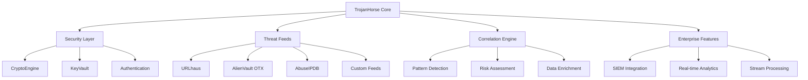

# TrojanHorse.js Documentation

<div class="hero">
  <h1>🏰 TrojanHorse.js</h1>
  <p><strong>The only Trojan you actually want in your system</strong></p>
  <p>Enterprise-grade threat intelligence library for JavaScript applications</p>
</div>

## What is TrojanHorse.js?

TrojanHorse.js is a comprehensive, production-ready JavaScript library designed for threat intelligence aggregation, analysis, and automation. Built with security-first principles, it provides enterprise-grade capabilities for cybersecurity professionals, security researchers, and organizations of all sizes.

### Key Features

!!! success "Production Ready"
    - **Real Cryptography**: AES-256-GCM encryption with Argon2id key derivation
    - **Enterprise Authentication**: OAuth2, SAML, LDAP, MFA, and RBAC support
    - **High Performance**: Stream processing with worker pools for large datasets
    - **Universal Deployment**: Node.js, Browser, Docker, Kubernetes ready

!!! info "Multi-Source Intelligence"
    - **URLhaus**: Malicious URL database by Abuse.ch
    - **AlienVault OTX**: Open threat exchange platform
    - **AbuseIPDB**: IP reputation and abuse reporting
    - **CrowdSec CTI**: Community threat intelligence
    - **VirusTotal**: File and URL analysis

!!! tip "Developer Experience"
    - **TypeScript First**: Full type safety and IntelliSense
    - **Multiple Formats**: ES modules, CommonJS, UMD, Browser builds
    - **Comprehensive CLI**: Interactive command-line interface
    - **REST API**: Production-ready API server with Swagger docs

## Quick Start

### Installation

=== "NPM"
    ```bash
    npm install trojanhorse-js
    ```

=== "Yarn"
    ```bash
    yarn add trojanhorse-js
    ```

=== "CDN"
    ```html
    <script src="https://unpkg.com/trojanhorse-js@latest/dist/trojanhorse.browser.min.js"></script>
    ```

### Basic Usage

```javascript
import { TrojanHorse } from 'trojanhorse-js';

// Initialize with basic configuration
const trojan = new TrojanHorse({
  sources: ['urlhaus', 'alienvault'],
  strategy: 'defensive'
});

// Scan for threats
const threats = await trojan.scout('suspicious-domain.com');
console.log(`Found ${threats.length} threats with confidence scores`);

// Create secure vault for API keys
const { vault } = await trojan.createVault('strong-password', {
  alienVault: 'your-api-key',
  abuseipdb: 'your-api-key'
});
```

## Architecture Overview



## Security Model

TrojanHorse.js implements defense-in-depth security:

- **Cryptographic Security**: Industry-standard encryption (AES-256-GCM, Argon2id)
- **Memory Protection**: Secure memory cleanup and erasure
- **Input Validation**: Comprehensive validation at all entry points
- **Audit Logging**: Security event tracking with PII masking
- **Access Control**: Role-based permissions and MFA support

## Use Cases

### Cybersecurity Operations
- **Threat Hunting**: Proactive threat detection and analysis
- **Incident Response**: Rapid IOC validation and enrichment
- **Security Monitoring**: Real-time threat intelligence integration
- **Compliance**: Audit trails and security reporting

### Development & Integration
- **API Integration**: RESTful API for threat intelligence queries
- **Custom Applications**: Embed threat detection in your applications
- **Automation**: Webhook-driven security automation
- **Data Analysis**: Large-scale threat data processing

### Enterprise Deployment
- **SIEM Integration**: Native connectors for Splunk, QRadar, Elastic
- **SSO Integration**: Enterprise authentication systems
- **Scalable Processing**: Handle GB+ threat feeds efficiently
- **High Availability**: Production-ready deployment patterns

## Getting Help

- **📖 Documentation**: Complete guides and API reference
- **🐛 Issues**: [GitHub Issues](https://github.com/sc4rfurry/TrojanHorse.js/issues) for bugs and features
- **💬 Community**: [GitHub Discussions](https://github.com/sc4rfurry/TrojanHorse.js/discussions) for Q&A
- **🚀 Enterprise**: [Contact us](mailto:enterprise@trojanhorse-js.com) for commercial support

## Next Steps

1. **[Installation Guide](getting-started/installation.md)** - Set up TrojanHorse.js in your environment
2. **[Quick Start Tutorial](getting-started/quickstart.md)** - Your first threat intelligence query
3. **[Configuration Guide](user-guide/configuration.md)** - Advanced configuration options
4. **[API Reference](api/core.md)** - Complete API documentation

---

<div class="centered">
  <p><strong>Ready to protect your digital fortress?</strong></p>
  <p><a href="getting-started/installation/" class="md-button md-button--primary">Get Started</a></p>
</div> 