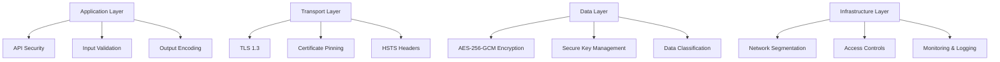

# Security Best Practices

Comprehensive security guidelines for deploying and using TrojanHorse.js in production environments.

## Core Security Principles

### Defense in Depth

TrojanHorse.js implements multiple layers of security controls:



## API Security

### Authentication and Authorization

#### JWT Token Security
```javascript
const auth = new EnterpriseAuth({
  jwt: {
    algorithm: 'RS256', // Use asymmetric algorithms
    issuer: 'trojanhorse.company.com',
    audience: 'trojanhorse-api',
    expiresIn: '15m', // Short-lived tokens
    refreshTokenTTL: '7d'
  },
  
  tokenValidation: {
    validateIssuer: true,
    validateAudience: true,
    validateExpiration: true,
    clockTolerance: 60 // seconds
  }
});
```

#### API Key Management
```javascript
const apiKeyManager = new APIKeyManager({
  encryption: {
    algorithm: 'aes-256-gcm',
    keyDerivation: 'argon2id',
    iterations: 100000
  },
  
  validation: {
    ipWhitelist: true,
    rateLimit: true,
    expirationCheck: true
  },
  
  rotation: {
    enabled: true,
    interval: '30d',
    gracePeriod: '7d'
  }
});
```

### Input Validation and Sanitization

#### Strict Input Validation
```javascript
import Joi from 'joi';

const threatScanSchema = Joi.object({
  indicator: Joi.string()
    .pattern(/^[a-zA-Z0-9.-]+$/) // Strict pattern for domains
    .max(253) // Max domain length
    .required(),
    
  type: Joi.string()
    .valid('domain', 'ip', 'url', 'hash')
    .required(),
    
  options: Joi.object({
    sources: Joi.array()
      .items(Joi.string().valid('urlhaus', 'alienvault', 'abuseipdb'))
      .max(10),
    timeout: Joi.number().min(1000).max(30000)
  })
});

// Validate all inputs
app.post('/api/threats/scan', async (req, res) => {
  const { error, value } = threatScanSchema.validate(req.body);
  if (error) {
    return res.status(400).json({ error: 'Invalid input' });
  }
  
  // Process with validated input
  const results = await trojan.scout(value.indicator, value.options);
  res.json(results);
});
```

#### SQL Injection Prevention
```javascript
// Use parameterized queries
const query = `
  SELECT * FROM threats 
  WHERE indicator = ? AND confidence > ? 
  ORDER BY detected_at DESC
`;

const results = await db.query(query, [indicator, confidenceThreshold]);
```

#### XSS Prevention
```javascript
import DOMPurify from 'dompurify';

// Sanitize all user-provided content
const sanitizeOutput = (data) => {
  if (typeof data === 'string') {
    return DOMPurify.sanitize(data);
  }
  
  if (Array.isArray(data)) {
    return data.map(sanitizeOutput);
  }
  
  if (typeof data === 'object' && data !== null) {
    const sanitized = {};
    for (const [key, value] of Object.entries(data)) {
      sanitized[key] = sanitizeOutput(value);
    }
    return sanitized;
  }
  
  return data;
};
```

## Cryptographic Security

### Encryption at Rest

#### Data Encryption
```javascript
const cryptoEngine = new CryptoEngine({
  encryption: {
    algorithm: 'aes-256-gcm',
    keySize: 256,
    ivSize: 96, // 12 bytes for GCM
    tagSize: 128 // 16 bytes authentication tag
  },
  
  keyDerivation: {
    algorithm: 'argon2id',
    memory: 65536, // 64 MB
    iterations: 3,
    parallelism: 4
  }
});

// Encrypt sensitive data before storage
const encryptedData = await cryptoEngine.encrypt(sensitiveData, {
  associatedData: 'threat-intelligence'
});
```

#### Key Management
```javascript
const keyVault = new KeyVault({
  provider: 'azure-keyvault', // or 'aws-kms', 'gcp-kms'
  
  config: {
    vaultUrl: 'https://trojanhorse-vault.vault.azure.net/',
    tenantId: process.env.AZURE_TENANT_ID,
    clientId: process.env.AZURE_CLIENT_ID
  },
  
  keyRotation: {
    enabled: true,
    interval: '90d', // Rotate every 90 days
    retainOldKeys: 2 // Keep 2 previous versions
  }
});

// Use hardware security modules when available
const masterKey = await keyVault.getMasterKey('trojanhorse-master-key', {
  hsm: true, // Use HSM-backed key
  algorithm: 'RSA-4096'
});
```

### Encryption in Transit

#### TLS Configuration
```javascript
const tlsOptions = {
  // Minimum TLS version
  secureProtocol: 'TLSv1_3_method',
  
  // Strong cipher suites only
  ciphers: [
    'TLS_AES_256_GCM_SHA384',
    'TLS_CHACHA20_POLY1305_SHA256',
    'TLS_AES_128_GCM_SHA256'
  ].join(':'),
  
  // Certificate verification
  rejectUnauthorized: true,
  checkServerIdentity: true,
  
  // Security headers
  secureOptions: constants.SSL_OP_NO_SSLv2 | constants.SSL_OP_NO_SSLv3
};
```

#### Certificate Pinning
```javascript
const certificatePinner = {
  pins: {
    'api.trojanhorse.com': [
      'sha256/primary-cert-fingerprint',
      'sha256/backup-cert-fingerprint'
    ]
  },
  
  validatePin: (hostname, cert) => {
    const fingerprint = crypto
      .createHash('sha256')
      .update(cert.raw)
      .digest('hex');
      
    const expectedPins = certificatePinner.pins[hostname];
    return expectedPins && expectedPins.includes(`sha256/${fingerprint}`);
  }
};
```

## Network Security

### Network Segmentation

#### Firewall Rules
```bash
# Inbound rules - only allow necessary traffic
iptables -A INPUT -p tcp --dport 443 -j ACCEPT  # HTTPS
iptables -A INPUT -p tcp --dport 22 -s MANAGEMENT_SUBNET -j ACCEPT  # SSH from management
iptables -A INPUT -p tcp --dport 9090 -s MONITORING_SUBNET -j ACCEPT  # Metrics

# Outbound rules - restrict external connections
iptables -A OUTPUT -p tcp --dport 443 -d THREAT_FEED_IPS -j ACCEPT  # Threat feeds
iptables -A OUTPUT -p tcp --dport 53 -j ACCEPT   # DNS
iptables -A OUTPUT -p udp --dport 53 -j ACCEPT   # DNS

# Default deny
iptables -P INPUT DROP
iptables -P FORWARD DROP
iptables -P OUTPUT DROP
```

#### VPN Configuration
```javascript
const vpnConfig = {
  type: 'wireguard',
  
  server: {
    privateKey: process.env.VPN_PRIVATE_KEY,
    address: '10.0.0.1/24',
    port: 51820
  },
  
  clients: {
    allowedIPs: ['10.0.0.0/24'],
    persistentKeepalive: 25
  }
};
```

### DDoS Protection

#### Rate Limiting
```javascript
const rateLimit = require('express-rate-limit');

const threatScanLimiter = rateLimit({
  windowMs: 15 * 60 * 1000, // 15 minutes
  max: 100, // Limit each IP to 100 requests per windowMs
  
  message: {
    error: 'Too many threat scan requests',
    retryAfter: '15 minutes'
  },
  
  // Different limits for different user types
  keyGenerator: (req) => {
    return req.user?.type === 'enterprise' ? 
      `enterprise:${req.user.id}` : 
      req.ip;
  },
  
  // Dynamic limits based on user type
  max: (req) => {
    switch (req.user?.type) {
      case 'enterprise': return 1000;
      case 'premium': return 500;
      default: return 100;
    }
  }
});
```

#### Circuit Breaker
```javascript
const circuitBreaker = new CircuitBreaker({
  threshold: 10, // Number of failures before opening
  timeout: 60000, // Time to wait before attempting reset
  resetTimeout: 30000, // Time to wait before closing again
  
  onOpen: () => {
    console.log('Circuit breaker opened - too many failures');
    // Alert operations team
  },
  
  onHalfOpen: () => {
    console.log('Circuit breaker half-open - testing service');
  },
  
  onClose: () => {
    console.log('Circuit breaker closed - service recovered');
  }
});
```

## Data Protection

### Data Classification

#### Sensitivity Levels
```javascript
const dataClassification = {
  PUBLIC: {
    encryption: false,
    retention: '1y',
    access: 'all'
  },
  
  INTERNAL: {
    encryption: true,
    retention: '2y',
    access: 'authenticated'
  },
  
  CONFIDENTIAL: {
    encryption: true,
    retention: '5y',
    access: 'authorized',
    auditLogging: true
  },
  
  RESTRICTED: {
    encryption: true,
    retention: '7y',
    access: 'need-to-know',
    auditLogging: true,
    dlp: true // Data Loss Prevention
  }
};
```

#### Data Masking
```javascript
const dataMasker = {
  maskEmail: (email) => {
    const [user, domain] = email.split('@');
    const maskedUser = user.charAt(0) + '*'.repeat(user.length - 2) + user.charAt(user.length - 1);
    return `${maskedUser}@${domain}`;
  },
  
  maskIP: (ip) => {
    const parts = ip.split('.');
    return `${parts[0]}.${parts[1]}.xxx.xxx`;
  },
  
  maskDomain: (domain) => {
    const parts = domain.split('.');
    if (parts.length >= 2) {
      return `${'*'.repeat(parts[0].length)}.${parts.slice(1).join('.')}`;
    }
    return domain;
  }
};
```

### Privacy Controls

#### GDPR Compliance
```javascript
const privacyControls = {
  // Right to be forgotten
  deleteUserData: async (userId) => {
    await Promise.all([
      db.threats.deleteMany({ userId }),
      db.sessions.deleteMany({ userId }),
      db.auditLogs.anonymize({ userId }),
      cache.deletePattern(`user:${userId}:*`)
    ]);
  },
  
  // Data portability
  exportUserData: async (userId) => {
    const userData = await db.users.findOne({ id: userId });
    const threats = await db.threats.find({ userId });
    const sessions = await db.sessions.find({ userId });
    
    return {
      user: userData,
      threats: threats,
      sessions: sessions,
      exportedAt: new Date().toISOString()
    };
  },
  
  // Consent management
  updateConsent: async (userId, consent) => {
    await db.users.updateOne(
      { id: userId },
      { 
        $set: { 
          consent: consent,
          consentUpdatedAt: new Date()
        }
      }
    );
  }
};
```

## Monitoring and Incident Response

### Security Event Monitoring

#### SIEM Integration
```javascript
const securityEventLogger = {
  logSecurityEvent: async (event) => {
    const securityEvent = {
      timestamp: new Date().toISOString(),
      type: event.type,
      severity: event.severity,
      source: 'trojanhorse',
      user: event.user,
      action: event.action,
      resource: event.resource,
      outcome: event.outcome,
      details: event.details,
      correlationId: generateCorrelationId()
    };
    
    // Send to multiple security systems
    await Promise.all([
      splunk.sendEvent(securityEvent),
      elasticsearch.index('security-events', securityEvent),
      syslog.send(securityEvent)
    ]);
  }
};

// Monitor critical events
app.use((req, res, next) => {
  res.on('finish', () => {
    if (res.statusCode >= 400) {
      securityEventLogger.logSecurityEvent({
        type: 'api_error',
        severity: res.statusCode >= 500 ? 'high' : 'medium',
        user: req.user?.id,
        action: `${req.method} ${req.path}`,
        outcome: 'failure',
        details: { statusCode: res.statusCode }
      });
    }
  });
  next();
});
```

#### Anomaly Detection
```javascript
const anomalyDetector = {
  detectAnomalies: async () => {
    const metrics = await getMetrics();
    
    // Statistical anomaly detection
    const anomalies = [];
    
    // Detect unusual API request patterns
    if (metrics.requestRate > (metrics.avgRequestRate * 3)) {
      anomalies.push({
        type: 'high_request_rate',
        value: metrics.requestRate,
        threshold: metrics.avgRequestRate * 3
      });
    }
    
    // Detect unusual authentication patterns
    if (metrics.failedAuthRate > 0.1) { // More than 10% failure rate
      anomalies.push({
        type: 'high_auth_failure_rate',
        value: metrics.failedAuthRate,
        threshold: 0.1
      });
    }
    
    // Detect unusual geographic access patterns
    const unusualLocations = await detectUnusualGeographicAccess();
    if (unusualLocations.length > 0) {
      anomalies.push({
        type: 'unusual_geographic_access',
        locations: unusualLocations
      });
    }
    
    return anomalies;
  }
};
```

### Incident Response

#### Automated Response
```javascript
const incidentResponse = {
  handleSecurityIncident: async (incident) => {
    // Immediate response based on severity
    switch (incident.severity) {
      case 'critical':
        await this.criticalIncidentResponse(incident);
        break;
      case 'high':
        await this.highSeverityResponse(incident);
        break;
      case 'medium':
        await this.mediumSeverityResponse(incident);
        break;
    }
  },
  
  criticalIncidentResponse: async (incident) => {
    // 1. Alert security team immediately
    await alertManager.sendCriticalAlert(incident);
    
    // 2. Trigger incident response playbook
    await runbook.execute('critical-security-incident');
    
    // 3. Consider automated containment
    if (incident.type === 'brute_force_attack') {
      await firewall.blockIP(incident.sourceIP);
    }
    
    // 4. Preserve evidence
    await forensics.captureEvidence(incident);
  },
  
  highSeverityResponse: async (incident) => {
    // 1. Alert security team
    await alertManager.sendHighPriorityAlert(incident);
    
    // 2. Log detailed information
    await auditLogger.logIncident(incident);
    
    // 3. Update threat intelligence
    if (incident.indicators) {
      await threatIntel.updateIndicators(incident.indicators);
    }
  }
};
```

## Compliance and Governance

### Regulatory Compliance

#### SOC 2 Controls
```javascript
const complianceControls = {
  // CC6.1 - Logical and Physical Access Controls
  accessControl: {
    multiFactorAuth: true,
    roleBasedAccess: true,
    accessReview: 'quarterly',
    privilegedAccessMonitoring: true
  },
  
  // CC6.2 - Authentication
  authentication: {
    passwordPolicy: {
      minLength: 12,
      complexity: true,
      history: 12,
      maxAge: 90
    },
    accountLockout: {
      threshold: 5,
      duration: 30,
      resetTime: 900
    }
  },
  
  // CC6.3 - Authorization
  authorization: {
    principleOfLeastPrivilege: true,
    regularAccessReviews: true,
    automaticDeprovisioning: true
  }
};
```

#### Audit Trail
```javascript
const auditTrail = {
  logAuditEvent: async (event) => {
    const auditRecord = {
      timestamp: new Date().toISOString(),
      eventType: event.type,
      userId: event.user?.id,
      sessionId: event.sessionId,
      sourceIP: event.sourceIP,
      userAgent: event.userAgent,
      action: event.action,
      resource: event.resource,
      outcome: event.outcome,
      details: event.details,
      hash: calculateHash(event) // Tamper detection
    };
    
    // Store in immutable log
    await auditLog.append(auditRecord);
    
    // Real-time monitoring for compliance violations
    await complianceMonitor.check(auditRecord);
  }
};
```

## Security Testing

### Penetration Testing

#### Automated Security Scanning
```javascript
const securityScanner = {
  runVulnerabilityAssessment: async () => {
    const results = await Promise.all([
      this.scanForSQLInjection(),
      this.scanForXSS(),
      this.scanForCSRF(),
      this.scanForSecurityHeaders(),
      this.scanForSSLConfiguration(),
      this.scanForDependencyVulnerabilities()
    ]);
    
    return this.consolidateResults(results);
  },
  
  scanForDependencyVulnerabilities: async () => {
    // Use npm audit or Snyk API
    const auditResult = await exec('npm audit --json');
    return JSON.parse(auditResult.stdout);
  }
};
```

#### Security Configuration Validation
```javascript
const configValidator = {
  validateSecurityConfig: () => {
    const issues = [];
    
    // Check TLS configuration
    if (!process.env.FORCE_HTTPS) {
      issues.push('HTTPS not enforced');
    }
    
    // Check authentication configuration
    if (!process.env.JWT_SECRET || process.env.JWT_SECRET.length < 32) {
      issues.push('Weak JWT secret');
    }
    
    // Check encryption configuration
    if (!process.env.ENCRYPTION_KEY) {
      issues.push('Encryption key not configured');
    }
    
    // Check logging configuration
    if (process.env.LOG_LEVEL === 'debug' && process.env.NODE_ENV === 'production') {
      issues.push('Debug logging enabled in production');
    }
    
    return {
      valid: issues.length === 0,
      issues: issues
    };
  }
};
```

---

**Next Steps**: Review [Security Overview](overview.md) for architectural security details or check [Vulnerability Reporting](reporting.md) for security disclosure procedures.