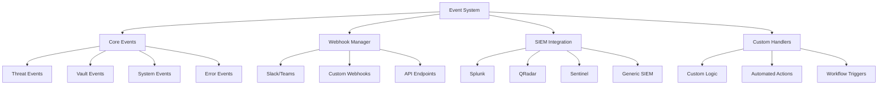

# Event System

Comprehensive guide to TrojanHorse.js event-driven architecture, real-time notifications, webhooks, and custom event handling.

## Overview

TrojanHorse.js provides a powerful event system that enables real-time notifications, automated responses, and seamless integration with external systems through webhooks, SIEM platforms, and custom handlers.



## Core Event Types

### Threat Detection Events

```javascript
import { TrojanHorse } from 'trojanhorse-js';

const trojan = new TrojanHorse();

// High-confidence threat detected
trojan.on('threatDetected', (event) => {
  console.log(`🚨 Threat detected: ${event.indicator}`);
  console.log(`Confidence: ${event.confidence}%`);
  console.log(`Sources: ${event.sources.join(', ')}`);
  console.log(`Risk Level: ${event.riskLevel}`);
});

// Campaign or coordinated attack detected
trojan.on('campaignDetected', (event) => {
  console.log(`🎯 Campaign detected: ${event.campaignId}`);
  console.log(`Indicators: ${event.indicators.length}`);
  console.log(`Attribution: ${event.attribution || 'Unknown'}`);
});

// New threat intelligence received
trojan.on('intelligenceUpdate', (event) => {
  console.log(`📊 Intelligence update: ${event.source}`);
  console.log(`New indicators: ${event.newIndicators}`);
  console.log(`Updated indicators: ${event.updatedIndicators}`);
});

// Correlation analysis completed
trojan.on('correlationComplete', (event) => {
  console.log(`🔗 Correlation analysis complete`);
  console.log(`Related threats: ${event.correlatedThreats.length}`);
  console.log(`Confidence score: ${event.correlationScore}`);
});
```

### Vault and Security Events

```javascript
// Vault access events
trojan.on('vaultAccessed', (event) => {
  console.log(`🔐 Vault accessed by: ${event.userId}`);
  console.log(`Keys accessed: ${event.keysAccessed.join(', ')}`);
  console.log(`IP Address: ${event.ipAddress}`);
});

// Key rotation events
trojan.on('keyRotationRequired', (event) => {
  console.log(`🔄 Key rotation required: ${event.service}`);
  console.log(`Current age: ${event.keyAge} days`);
  console.log(`Max age: ${event.maxAge} days`);
});

trojan.on('keyRotationComplete', (event) => {
  console.log(`✅ Key rotation completed: ${event.service}`);
  console.log(`Old key archived: ${event.oldKeyArchived}`);
  console.log(`New key validated: ${event.newKeyValidated}`);
});

// Security incidents
trojan.on('securityIncident', (event) => {
  console.log(`🚨 Security incident: ${event.type}`);
  console.log(`Severity: ${event.severity}`);
  console.log(`Details: ${event.details}`);
  
  // Immediate incident response
  if (event.severity === 'CRITICAL') {
    handleCriticalSecurityIncident(event);
  }
});
```

### System and Performance Events

```javascript
// System health events
trojan.on('healthCheck', (event) => {
  if (event.status === 'unhealthy') {
    console.log(`⚠️ System health issue: ${event.component}`);
    console.log(`Details: ${event.details}`);
  }
});

// Performance monitoring
trojan.on('performanceAlert', (event) => {
  console.log(`📈 Performance alert: ${event.metric}`);
  console.log(`Current value: ${event.currentValue}`);
  console.log(`Threshold: ${event.threshold}`);
});

// Rate limiting events
trojan.on('rateLimitExceeded', (event) => {
  console.log(`🚦 Rate limit exceeded: ${event.source}`);
  console.log(`Current rate: ${event.currentRate}`);
  console.log(`Limit: ${event.rateLimit}`);
});

// Circuit breaker events
trojan.on('circuitBreakerOpen', (event) => {
  console.log(`⚡ Circuit breaker opened: ${event.service}`);
  console.log(`Failure count: ${event.failureCount}`);
  console.log(`Error rate: ${event.errorRate}%`);
});
```

## Webhook Integration

### Basic Webhook Setup

```javascript
import { WebhookManager } from 'trojanhorse-js';

// Configure webhook endpoints
const webhookManager = new WebhookManager({
  endpoints: {
    slack: {
      url: process.env.SLACK_WEBHOOK_URL,
      channel: '#security-alerts',
      username: 'TrojanHorse.js',
      icon_emoji: ':shield:'
    },
    
    teams: {
      url: process.env.TEAMS_WEBHOOK_URL,
      card_theme: 'attention'
    },
    
    discord: {
      url: process.env.DISCORD_WEBHOOK_URL,
      username: 'TrojanHorse.js Bot',
      avatar_url: 'https://example.com/logo.png'
    },
    
    custom: {
      url: 'https://api.company.com/webhooks/security',
      headers: {
        'Authorization': `Bearer ${process.env.API_TOKEN}`,
        'Content-Type': 'application/json'
      },
      timeout: 5000
    }
  },
  
  // Global webhook settings
  retries: 3,
  retryDelay: 1000,
  timeout: 10000
});

// Attach webhook manager to TrojanHorse instance
trojan.setWebhookManager(webhookManager);
```

### Advanced Webhook Configuration

```javascript
// Configure conditional webhooks
const conditionalWebhooks = new WebhookManager({
  endpoints: {
    // Critical alerts to PagerDuty
    pagerduty: {
      url: 'https://events.pagerduty.com/v2/enqueue',
      condition: (event) => event.severity === 'CRITICAL',
      transform: (event) => ({
        routing_key: process.env.PAGERDUTY_ROUTING_KEY,
        event_action: 'trigger',
        payload: {
          summary: `Critical Threat: ${event.indicator}`,
          severity: 'critical',
          source: 'TrojanHorse.js',
          custom_details: event
        }
      })
    },
    
    // High/Medium alerts to Slack
    slack_alerts: {
      url: process.env.SLACK_WEBHOOK_URL,
      condition: (event) => ['HIGH', 'MEDIUM'].includes(event.severity),
      rateLimit: {
        maxRequests: 10,
        windowMs: 60000 // 1 minute
      },
      transform: (event) => ({
        channel: '#security-monitoring',
        text: `${getSeverityEmoji(event.severity)} Threat Alert`,
        attachments: [{
          color: getSeverityColor(event.severity),
          fields: [
            { title: 'Indicator', value: event.indicator, short: true },
            { title: 'Confidence', value: `${event.confidence}%`, short: true },
            { title: 'Sources', value: event.sources.join(', '), short: false }
          ],
          timestamp: event.timestamp
        }]
      })
    },
    
    // All events to SIEM
    siem_webhook: {
      url: 'https://siem.company.com/api/events',
      condition: () => true, // Send all events
      headers: {
        'X-API-Key': process.env.SIEM_API_KEY,
        'Content-Type': 'application/json'
      },
      transform: (event) => ({
        timestamp: event.timestamp,
        source: 'trojanhorse-js',
        event_type: event.type,
        severity: event.severity,
        data: event
      })
    }
  }
});
```

### Webhook Templates

```javascript
// Define reusable webhook templates
const webhookTemplates = {
  // Slack template for threats
  slackThreat: (event) => ({
    channel: '#threat-alerts',
    text: `🚨 ${event.severity} Threat Detected`,
    attachments: [{
      color: event.severity === 'CRITICAL' ? 'danger' : 
             event.severity === 'HIGH' ? 'warning' : 'good',
      fields: [
        { title: 'Indicator', value: `\`${event.indicator}\``, short: true },
        { title: 'Type', value: event.type, short: true },
        { title: 'Confidence', value: `${event.confidence}%`, short: true },
        { title: 'Sources', value: event.sources.join(', '), short: true },
        { title: 'First Seen', value: event.firstSeen, short: true },
        { title: 'Last Seen', value: event.lastSeen, short: true }
      ],
      actions: [{
        type: 'button',
        text: 'View Details',
        url: `https://portal.company.com/threats/${event.id}`
      }],
      timestamp: Math.floor(Date.now() / 1000)
    }]
  }),
  
  // Teams template for campaigns
  teamsCampaign: (event) => ({
    '@type': 'MessageCard',
    '@context': 'https://schema.org/extensions',
    summary: `Campaign Detected: ${event.campaignName}`,
    themeColor: event.severity === 'CRITICAL' ? 'FF0000' : 'FFA500',
    sections: [{
      activityTitle: '🎯 Threat Campaign Detected',
      activitySubtitle: event.campaignName,
      facts: [
        { name: 'Campaign ID', value: event.campaignId },
        { name: 'Indicators', value: `${event.indicators.length}` },
        { name: 'Confidence', value: `${event.confidence}%` },
        { name: 'Attribution', value: event.attribution || 'Unknown' },
        { name: 'First Seen', value: event.firstSeen },
        { name: 'Affected Systems', value: `${event.affectedSystems || 0}` }
      ],
      markdown: true
    }],
    potentialAction: [{
      '@type': 'OpenUri',
      name: 'View Campaign Analysis',
      targets: [{
        os: 'default',
        uri: `https://portal.company.com/campaigns/${event.campaignId}`
      }]
    }]
  }),
  
  // Generic JSON template
  genericJson: (event) => ({
    timestamp: new Date().toISOString(),
    source: 'trojanhorse-js',
    event: {
      type: event.type,
      severity: event.severity,
      data: event
    },
    metadata: {
      version: '2.0',
      format: 'trojanhorse-event',
      encoding: 'utf-8'
    }
  })
};

// Use templates in webhook configuration
webhookManager.addEndpoint('slack-threats', {
  url: process.env.SLACK_WEBHOOK_URL,
  template: webhookTemplates.slackThreat,
  condition: (event) => event.type === 'threatDetected'
});
```

## SIEM Integration

### Splunk Integration

```javascript
import { SplunkConnector } from 'trojanhorse-js/integrations';

// Configure Splunk HTTP Event Collector
const splunkConnector = new SplunkConnector({
  host: 'splunk.company.com',
  port: 8088,
  token: process.env.SPLUNK_HEC_TOKEN,
  index: 'threat_intelligence',
  sourcetype: 'trojanhorse:events',
  
  // SSL configuration
  ssl: {
    enabled: true,
    rejectUnauthorized: true,
    ca: fs.readFileSync('./splunk-ca.pem')
  },
  
  // Batch settings
  batch: {
    enabled: true,
    maxSize: 100,
    maxWait: 5000, // 5 seconds
    compression: true
  }
});

// Send events to Splunk
trojan.on('threatDetected', async (event) => {
  await splunkConnector.sendEvent({
    time: Date.now() / 1000,
    event: {
      threat_type: event.type,
      indicator: event.indicator,
      confidence: event.confidence,
      sources: event.sources,
      severity: event.severity,
      metadata: event.metadata
    }
  });
});

// Search Splunk for related events
const searchResults = await splunkConnector.search({
  query: `index=threat_intelligence indicator="${event.indicator}"`,
  timerange: { earliest: '-24h', latest: 'now' },
  output_mode: 'json'
});
```

### QRadar Integration

```javascript
import { QRadarConnector } from 'trojanhorse-js/integrations';

// Configure QRadar SIEM integration
const qradarConnector = new QRadarConnector({
  host: 'qradar.company.com',
  token: process.env.QRADAR_TOKEN,
  version: '15.0',
  
  // Reference set configuration
  referenceSets: {
    threats: 'TrojanHorse_Threats',
    campaigns: 'TrojanHorse_Campaigns',
    false_positives: 'TrojanHorse_FalsePositives'
  },
  
  // Custom property configuration
  customProperties: {
    threat_confidence: 'TrojanHorse_Confidence',
    threat_sources: 'TrojanHorse_Sources'
  }
});

// Add threats to QRadar reference sets
trojan.on('threatDetected', async (event) => {
  if (event.confidence >= 80) {
    await qradarConnector.addToReferenceSet('threats', event.indicator, {
      confidence: event.confidence,
      sources: event.sources.join(','),
      first_seen: event.timestamp,
      threat_type: event.type
    });
  }
});

// Create QRadar offense for high-confidence threats
trojan.on('threatDetected', async (event) => {
  if (event.confidence >= 95) {
    await qradarConnector.createOffense({
      description: `High-confidence threat detected: ${event.indicator}`,
      magnitude: calculateMagnitude(event.confidence),
      credibility: calculateCredibility(event.sources.length),
      relevance: calculateRelevance(event.type),
      severity: mapSeverity(event.severity)
    });
  }
});
```

### Microsoft Sentinel Integration

```javascript
import { SentinelConnector } from 'trojanhorse-js/integrations';

// Configure Microsoft Sentinel integration
const sentinelConnector = new SentinelConnector({
  tenantId: process.env.AZURE_TENANT_ID,
  subscriptionId: process.env.AZURE_SUBSCRIPTION_ID,
  resourceGroup: 'security-rg',
  workspaceName: 'security-workspace',
  
  authentication: {
    clientId: process.env.AZURE_CLIENT_ID,
    clientSecret: process.env.AZURE_CLIENT_SECRET
  },
  
  // Threat intelligence configuration
  threatIntel: {
    enabled: true,
    confidence_threshold: 70,
    valid_until_days: 30
  }
});

// Create threat indicators in Sentinel
trojan.on('threatDetected', async (event) => {
  if (event.confidence >= 70) {
    await sentinelConnector.createThreatIndicator({
      pattern: `[${getIndicatorType(event.type)}:value = '${event.indicator}']`,
      patternType: 'stix',
      source: 'TrojanHorse.js',
      displayName: `TrojanHorse Threat: ${event.indicator}`,
      description: `Threat detected with ${event.confidence}% confidence`,
      confidence: event.confidence,
      threatTypes: [mapThreatType(event.type)],
      validFrom: new Date().toISOString(),
      validUntil: new Date(Date.now() + 30 * 24 * 60 * 60 * 1000).toISOString(),
      externalReferences: event.sources.map(source => ({
        sourceName: source,
        description: `Threat intelligence from ${source}`
      }))
    });
  }
});

// Create incidents for campaigns
trojan.on('campaignDetected', async (event) => {
  await sentinelConnector.createIncident({
    title: `Threat Campaign: ${event.campaignName}`,
    description: `Multi-indicator threat campaign detected`,
    severity: mapIncidentSeverity(event.severity),
    status: 'New',
    classification: 'TruePositive',
    labels: [
      { labelName: 'TrojanHorse', labelType: 'System' },
      { labelName: 'Campaign', labelType: 'User' },
      { labelName: event.campaignId, labelType: 'User' }
    ],
    ownerAssignedTo: 'security-team@company.com'
  });
});
```

## Custom Event Handlers

### Building Custom Handlers

```javascript
// Create custom event handler class
class CustomThreatHandler {
  constructor(config) {
    this.config = config;
    this.actionHistory = new Map();
  }
  
  async handleThreatEvent(event) {
    // Check if we've seen this threat before
    const lastAction = this.actionHistory.get(event.indicator);
    if (lastAction && Date.now() - lastAction < 3600000) {
      console.log(`Skipping duplicate threat: ${event.indicator}`);
      return;
    }
    
    // Determine response based on confidence and type
    const response = this.determineResponse(event);
    
    // Execute response actions
    await this.executeResponse(event, response);
    
    // Record action
    this.actionHistory.set(event.indicator, Date.now());
  }
  
  determineResponse(event) {
    const responses = [];
    
    // High confidence threats
    if (event.confidence >= 90) {
      responses.push('block_immediate');
      responses.push('alert_soc');
      responses.push('create_incident');
    }
    
    // Medium confidence threats
    else if (event.confidence >= 70) {
      responses.push('add_to_watchlist');
      responses.push('alert_analyst');
      responses.push('enhance_monitoring');
    }
    
    // Low confidence threats
    else if (event.confidence >= 50) {
      responses.push('log_for_investigation');
      responses.push('update_intelligence');
    }
    
    // Critical infrastructure threats
    if (this.isCriticalInfrastructure(event.indicator)) {
      responses.push('emergency_protocols');
    }
    
    return responses;
  }
  
  async executeResponse(event, responses) {
    for (const response of responses) {
      try {
        await this.executeAction(response, event);
        console.log(`✅ Executed: ${response} for ${event.indicator}`);
      } catch (error) {
        console.error(`❌ Failed to execute: ${response}`, error);
      }
    }
  }
  
  async executeAction(action, event) {
    switch (action) {
      case 'block_immediate':
        await this.blockIndicator(event.indicator);
        break;
        
      case 'alert_soc':
        await this.alertSOC(event);
        break;
        
      case 'create_incident':
        await this.createIncident(event);
        break;
        
      case 'add_to_watchlist':
        await this.addToWatchlist(event.indicator);
        break;
        
      case 'emergency_protocols':
        await this.activateEmergencyProtocols(event);
        break;
        
      default:
        console.log(`Unknown action: ${action}`);
    }
  }
  
  isCriticalInfrastructure(indicator) {
    // Check if indicator affects critical infrastructure
    const criticalDomains = [
      'company.com',
      'internal.company.com',
      'critical-service.company.com'
    ];
    
    return criticalDomains.some(domain => 
      indicator.includes(domain) || indicator.endsWith(`.${domain}`)
    );
  }
}

// Register custom handler
const customHandler = new CustomThreatHandler({
  blockingEnabled: true,
  emergencyContacts: ['soc@company.com', '+1-555-EMERGENCY']
});

trojan.on('threatDetected', (event) => customHandler.handleThreatEvent(event));
```

### Workflow Automation

```javascript
// Create automated workflow system
class ThreatResponseWorkflow {
  constructor() {
    this.workflows = new Map();
    this.activeIncidents = new Map();
  }
  
  // Define workflow templates
  defineWorkflow(name, workflow) {
    this.workflows.set(name, workflow);
  }
  
  // Execute workflow based on event
  async executeWorkflow(workflowName, event) {
    const workflow = this.workflows.get(workflowName);
    if (!workflow) {
      throw new Error(`Workflow not found: ${workflowName}`);
    }
    
    const context = {
      event: event,
      startTime: Date.now(),
      steps: [],
      variables: {}
    };
    
    try {
      for (const step of workflow.steps) {
        const result = await this.executeStep(step, context);
        context.steps.push({
          name: step.name,
          result: result,
          timestamp: Date.now(),
          duration: Date.now() - context.startTime
        });
        
        // Check for early termination conditions
        if (step.terminateOnFailure && !result.success) {
          break;
        }
      }
      
      return context;
    } catch (error) {
      console.error(`Workflow execution failed: ${workflowName}`, error);
      throw error;
    }
  }
  
  async executeStep(step, context) {
    console.log(`Executing step: ${step.name}`);
    
    // Evaluate conditions
    if (step.condition && !this.evaluateCondition(step.condition, context)) {
      return { success: true, skipped: true, reason: 'Condition not met' };
    }
    
    // Execute action
    try {
      const result = await step.action(context);
      return { success: true, result: result };
    } catch (error) {
      return { success: false, error: error.message };
    }
  }
  
  evaluateCondition(condition, context) {
    // Simple condition evaluation
    // Production expression evaluator implementation
    return eval(condition.replace(/\$\{([^}]+)\}/g, (match, path) => {
      return this.getNestedValue(context, path);
    }));
  }
  
  getNestedValue(obj, path) {
    return path.split('.').reduce((current, key) => current?.[key], obj);
  }
}

// Define threat response workflows
const workflowEngine = new ThreatResponseWorkflow();

// High-confidence threat workflow
workflowEngine.defineWorkflow('high_confidence_threat', {
  name: 'High Confidence Threat Response',
  description: 'Automated response for high-confidence threats',
  steps: [
    {
      name: 'validate_threat',
      action: async (context) => {
        // Validate threat with additional sources
        const validation = await validateThreatWithAdditionalSources(context.event.indicator);
        context.variables.validated = validation.isValid;
        return validation;
      },
      condition: 'true'
    },
    {
      name: 'block_indicator',
      action: async (context) => {
        await blockIndicatorInFirewall(context.event.indicator);
        return { blocked: true };
      },
      condition: '${variables.validated} === true',
      terminateOnFailure: true
    },
    {
      name: 'create_incident',
      action: async (context) => {
        const incident = await createSecurityIncident({
          title: `High Confidence Threat: ${context.event.indicator}`,
          description: `Threat detected with ${context.event.confidence}% confidence`,
          severity: 'High',
          assignee: 'security-team@company.com'
        });
        context.variables.incidentId = incident.id;
        return incident;
      },
      condition: 'true'
    },
    {
      name: 'notify_stakeholders',
      action: async (context) => {
        await sendNotification({
          recipients: ['soc@company.com', 'ciso@company.com'],
          subject: `URGENT: High Confidence Threat Detected`,
          body: `Threat ${context.event.indicator} has been detected and blocked. Incident ${context.variables.incidentId} created.`
        });
        return { notified: true };
      },
      condition: '${variables.incidentId} !== undefined'
    }
  ]
});

// Execute workflow on high-confidence threats
trojan.on('threatDetected', async (event) => {
  if (event.confidence >= 90) {
    try {
      const result = await workflowEngine.executeWorkflow('high_confidence_threat', event);
      console.log('Workflow completed:', result);
    } catch (error) {
      console.error('Workflow failed:', error);
    }
  }
});
```

## Event Filtering and Routing

### Advanced Event Filtering

```javascript
// Create sophisticated event filter
class EventFilter {
  constructor() {
    this.rules = [];
    this.statistics = {
      processed: 0,
      filtered: 0,
      routed: 0
    };
  }
  
  addRule(rule) {
    this.rules.push({
      id: rule.id || Date.now().toString(),
      name: rule.name,
      condition: rule.condition,
      action: rule.action,
      priority: rule.priority || 0,
      enabled: rule.enabled !== false
    });
    
    // Sort by priority (higher first)
    this.rules.sort((a, b) => b.priority - a.priority);
  }
  
  async process(event) {
    this.statistics.processed++;
    
    for (const rule of this.rules) {
      if (!rule.enabled) continue;
      
      try {
        if (await this.evaluateCondition(rule.condition, event)) {
          const result = await rule.action(event);
          
          if (result === 'STOP') {
            this.statistics.filtered++;
            return false; // Stop processing
          } else if (result === 'CONTINUE') {
            continue; // Continue to next rule
          } else {
            this.statistics.routed++;
            return true; // Route event
          }
        }
      } catch (error) {
        console.error(`Rule ${rule.name} failed:`, error);
      }
    }
    
    return true; // Default: route event
  }
  
  async evaluateCondition(condition, event) {
    if (typeof condition === 'function') {
      return await condition(event);
    }
    
    if (typeof condition === 'string') {
      // Simple expression evaluation
      return this.evaluateExpression(condition, event);
    }
    
    return true;
  }
  
  evaluateExpression(expression, event) {
    // Replace placeholders with actual values
    const processed = expression.replace(/event\.(\w+)/g, (match, property) => {
      const value = event[property];
      return typeof value === 'string' ? `"${value}"` : value;
    });
    
    try {
      return eval(processed);
    } catch (error) {
      console.error('Expression evaluation error:', error);
      return false;
    }
  }
  
  getStatistics() {
    return {
      ...this.statistics,
      filterRate: this.statistics.filtered / this.statistics.processed,
      routeRate: this.statistics.routed / this.statistics.processed
    };
  }
}

// Create and configure event filter
const eventFilter = new EventFilter();

// Filter out low-confidence threats during business hours
eventFilter.addRule({
  name: 'filter_low_confidence_business_hours',
  condition: (event) => {
    const hour = new Date().getHours();
    const isBusinessHours = hour >= 9 && hour <= 17;
    return event.confidence < 60 && isBusinessHours;
  },
  action: () => 'STOP',
  priority: 100
});

// Rate limit duplicate events
const recentEvents = new Map();
eventFilter.addRule({
  name: 'rate_limit_duplicates',
  condition: (event) => {
    const key = `${event.type}_${event.indicator}`;
    const lastSeen = recentEvents.get(key);
    const now = Date.now();
    
    if (lastSeen && now - lastSeen < 300000) { // 5 minutes
      return true; // Duplicate within 5 minutes
    }
    
    recentEvents.set(key, now);
    return false;
  },
  action: () => 'STOP',
  priority: 90
});

// Route critical events to emergency channel
eventFilter.addRule({
  name: 'emergency_routing',
  condition: 'event.severity === "CRITICAL"',
  action: (event) => {
    // Send to emergency channel
    sendEmergencyAlert(event);
    return 'CONTINUE'; // Continue processing
  },
  priority: 80
});

// Apply filter to all events
trojan.on('*', async (event) => {
  const shouldRoute = await eventFilter.process(event);
  if (!shouldRoute) {
    return; // Event was filtered out
  }
  
  // Route event to appropriate handlers
  routeEventToHandlers(event);
});
```

## Real-time Event Dashboard

### Event Metrics and Monitoring

```javascript
// Real-time event monitoring dashboard
class EventDashboard {
  constructor() {
    this.metrics = {
      total_events: 0,
      events_by_type: new Map(),
      events_by_severity: new Map(),
      events_per_minute: [],
      avg_confidence: 0,
      sources_activity: new Map()
    };
    
    this.startMetricsCollection();
  }
  
  recordEvent(event) {
    this.metrics.total_events++;
    
    // Count by type
    const typeCount = this.metrics.events_by_type.get(event.type) || 0;
    this.metrics.events_by_type.set(event.type, typeCount + 1);
    
    // Count by severity
    const severityCount = this.metrics.events_by_severity.get(event.severity) || 0;
    this.metrics.events_by_severity.set(event.severity, severityCount + 1);
    
    // Update average confidence
    if (event.confidence) {
      this.updateAverageConfidence(event.confidence);
    }
    
    // Track source activity
    if (event.sources) {
      event.sources.forEach(source => {
        const sourceCount = this.metrics.sources_activity.get(source) || 0;
        this.metrics.sources_activity.set(source, sourceCount + 1);
      });
    }
  }
  
  updateAverageConfidence(newConfidence) {
    const currentAvg = this.metrics.avg_confidence;
    const totalEvents = this.metrics.total_events;
    
    this.metrics.avg_confidence = (currentAvg * (totalEvents - 1) + newConfidence) / totalEvents;
  }
  
  startMetricsCollection() {
    // Collect events per minute
    setInterval(() => {
      const now = Date.now();
      this.metrics.events_per_minute.push({
        timestamp: now,
        count: this.getEventsInLastMinute()
      });
      
      // Keep only last hour of data
      const oneHourAgo = now - 3600000;
      this.metrics.events_per_minute = this.metrics.events_per_minute.filter(
        entry => entry.timestamp > oneHourAgo
      );
    }, 60000); // Every minute
  }
  
  getEventsInLastMinute() {
    // Production event tracking with time-window analysis
    // Implementation depends on your event storage
    return 0;
  }
  
  generateReport() {
    return {
      timestamp: new Date().toISOString(),
      total_events: this.metrics.total_events,
      events_by_type: Object.fromEntries(this.metrics.events_by_type),
      events_by_severity: Object.fromEntries(this.metrics.events_by_severity),
      avg_confidence: Math.round(this.metrics.avg_confidence * 100) / 100,
      events_per_minute: this.metrics.events_per_minute.slice(-60), // Last hour
      most_active_sources: this.getTopSources(5),
      health_score: this.calculateHealthScore()
    };
  }
  
  getTopSources(limit) {
    return Array.from(this.metrics.sources_activity.entries())
      .sort((a, b) => b[1] - a[1])
      .slice(0, limit)
      .map(([source, count]) => ({ source, count }));
  }
  
  calculateHealthScore() {
    // Simple health score based on various factors
    let score = 100;
    
    // Penalize high error rates
    const errorEvents = this.metrics.events_by_type.get('error') || 0;
    const errorRate = errorEvents / this.metrics.total_events;
    score -= errorRate * 50;
    
    // Penalize too many critical events
    const criticalEvents = this.metrics.events_by_severity.get('CRITICAL') || 0;
    const criticalRate = criticalEvents / this.metrics.total_events;
    score -= criticalRate * 30;
    
    return Math.max(0, Math.min(100, score));
  }
}

// Initialize dashboard
const dashboard = new EventDashboard();

// Record all events
trojan.on('*', (event) => {
  dashboard.recordEvent(event);
});

// Expose dashboard API
app.get('/api/dashboard/metrics', (req, res) => {
  res.json(dashboard.generateReport());
});

// WebSocket for real-time updates
const wss = new WebSocketServer({ port: 8080 });

wss.on('connection', (ws) => {
  // Send initial dashboard data
  ws.send(JSON.stringify(dashboard.generateReport()));
  
  // Send updates every 10 seconds
  const interval = setInterval(() => {
    ws.send(JSON.stringify(dashboard.generateReport()));
  }, 10000);
  
  ws.on('close', () => {
    clearInterval(interval);
  });
});
```

---

**Next Steps**:
- Configure [Threat Detection](threat-detection.md) for automated monitoring
- Set up [Vault Management](vault-management.md) for secure credential storage
- Review [Configuration Guide](configuration.md) for system settings