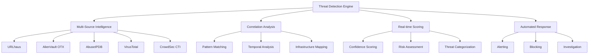

# Threat Detection

Comprehensive guide to threat detection capabilities in TrojanHorse.js, including real-time scanning, correlation analysis, and automated response workflows.

## Overview

TrojanHorse.js provides advanced threat detection capabilities through multi-source intelligence correlation, machine learning-enhanced scoring, and real-time pattern analysis.



## Threat Detection Methods

### 1. Real-time Scanning

#### Basic Threat Scanning
```javascript
import { TrojanHorse } from 'trojanhorse-js';

const trojan = new TrojanHorse({
  sources: ['urlhaus', 'alienvault', 'abuseipdb', 'virustotal'],
  realTime: {
    enabled: true,
    scanInterval: 5000, // 5 seconds
    batchSize: 100
  }
});

// Single indicator scan
const results = await trojan.scout('malicious-domain.com');
console.log('Threat Level:', results.threatLevel);
console.log('Confidence:', results.confidence);
console.log('Sources:', results.sources);

// Batch scanning
const indicators = [
  'suspicious-ip.com',
  '192.168.1.100',
  'http://evil-site.net/malware.exe'
];

const batchResults = await trojan.scoutBatch(indicators);
for (const result of batchResults) {
  if (result.threatLevel === 'HIGH') {
    console.log(`🚨 High threat detected: ${result.indicator}`);
  }
}
```

#### Advanced Scanning Options
```javascript
// Configure advanced scanning parameters
const advancedResults = await trojan.scout('target-indicator.com', {
  // Source-specific configuration
  sources: {
    urlhaus: { enabled: true, timeout: 3000 },
    alienvault: { enabled: true, sections: ['general', 'malware'] },
    virustotal: { enabled: true, engines: ['sophos', 'kaspersky'] }
  },
  
  // Correlation settings
  correlation: {
    enabled: true,
    timeWindow: '24h',
    minimumSources: 2
  },
  
  // Response configuration
  response: {
    autoBlock: false,
    generateAlert: true,
    investigationMode: true
  }
});
```

### 2. Pattern-Based Detection

#### Infrastructure Pattern Detection
```javascript
// Detect patterns in malicious infrastructure
const infrastructurePatterns = await trojan.detectInfrastructurePatterns({
  indicators: ['domain1.com', 'domain2.com', 'ip-address'],
  
  patterns: {
    sharedInfrastructure: true,
    sslCertificates: true,
    registrationDetails: true,
    dnsPatterns: true
  },
  
  correlation: {
    timeWindow: '30d',
    minimumConfidence: 75
  }
});

if (infrastructurePatterns.length > 0) {
  console.log('Infrastructure campaign detected:', infrastructurePatterns);
}
```

#### Behavioral Pattern Analysis
```javascript
// Analyze behavioral patterns
const behavioralAnalysis = await trojan.analyzeBehavioralPatterns({
  indicators: recentIndicators,
  
  analysis: {
    temporalPatterns: true,
    geographicClustering: true,
    tacticsAndTechniques: true,
    victimProfiling: true
  },
  
  machinelearning: {
    enabled: true,
    models: ['clustering', 'anomaly_detection'],
    confidence_threshold: 80
  }
});
```

### 3. Machine Learning Detection

#### Anomaly Detection
```javascript
// Enable ML-powered anomaly detection
const mlDetection = await trojan.enableMLDetection({
  models: {
    anomalyDetection: {
      enabled: true,
      sensitivity: 0.8,
      trainingData: 'recent_30_days'
    },
    
    classificationModel: {
      enabled: true,
      categories: ['malware', 'phishing', 'c2', 'botnet'],
      confidence_threshold: 0.75
    },
    
    clustering: {
      enabled: true,
      algorithm: 'dbscan',
      minSamples: 3
    }
  },
  
  realtime: {
    enabled: true,
    processingDelay: 100 // milliseconds
  }
});

// Real-time ML-enhanced threat detection
trojan.on('mlThreatDetected', (threat) => {
  console.log(`ML detected threat: ${threat.indicator}`);
  console.log(`Category: ${threat.mlCategory}`);
  console.log(`Confidence: ${threat.mlConfidence}`);
  console.log(`Anomaly Score: ${threat.anomalyScore}`);
});
```

#### Predictive Analysis
```javascript
// Predictive threat modeling
const predictiveAnalysis = await trojan.predictiveAnalysis({
  baseIndicators: currentThreats,
  
  prediction: {
    futureThreatWindow: '7d',
    evolutionPatterns: true,
    campaignProgression: true,
    infrastructureMigration: true
  },
  
  confidence: {
    minimumScore: 70,
    requireMultipleSources: true
  }
});

if (predictiveAnalysis.predictions.length > 0) {
  console.log('Predicted future threats:', predictiveAnalysis.predictions);
}
```

## Real-time Monitoring

### Event-Driven Detection
```javascript
// Set up real-time threat monitoring
trojan.enableRealTimeMonitoring({
  sources: ['live_feeds', 'user_submissions', 'honeypots'],
  
  processing: {
    batchSize: 500,
    processingInterval: 2000, // 2 seconds
    priorityQueue: true
  },
  
  alerting: {
    immediate: ['HIGH', 'CRITICAL'],
    batched: ['MEDIUM', 'LOW'],
    batchInterval: 300000 // 5 minutes
  }
});

// Event handlers for different threat levels
trojan.on('criticalThreat', async (threat) => {
  // Immediate response for critical threats
  await handleCriticalThreat(threat);
  await notifySecurityTeam(threat);
  await initiateIncidentResponse(threat);
});

trojan.on('highThreat', async (threat) => {
  // High priority threat handling
  await logThreatDetails(threat);
  await updateThreatIntelligence(threat);
  await sendAlert(threat);
});

trojan.on('mediumThreat', async (threat) => {
  // Medium priority threat handling
  await logThreat(threat);
  await updateStatistics(threat);
});
```

### Continuous Monitoring
```javascript
// Continuous background monitoring
const continuousMonitor = trojan.startContinuousMonitoring({
  watchlist: {
    domains: ['suspicious-domain.com', 'known-bad.net'],
    ips: ['192.168.1.100', '10.0.0.50'],
    urls: ['http://malware-site.com/payload.exe']
  },
  
  monitoring: {
    interval: 60000, // 1 minute
    deepScan: true,
    historyTracking: true
  },
  
  escalation: {
    newThreatDetection: 'immediate',
    statusChange: 'batched',
    confidenceIncrease: 'threshold_based'
  }
});
```

## Threat Correlation

### Multi-Source Correlation
```javascript
// Advanced threat correlation
const correlation = await trojan.correlateThreats({
  primaryIndicator: 'malicious-domain.com',
  
  correlation: {
    infrastructure: {
      sharedIPs: true,
      sslCertificates: true,
      registrationData: true
    },
    
    temporal: {
      timeWindow: '30d',
      activityPatterns: true,
      campaignTimeline: true
    },
    
    contextual: {
      victimGeography: true,
      industryTargeting: true,
      attackVectors: true
    }
  },
  
  output: {
    correlationGraph: true,
    timelineSeries: true,
    confidenceScoring: true
  }
});

console.log('Correlated threats:', correlation.relatedThreats);
console.log('Campaign analysis:', correlation.campaignAnalysis);
```

### Attribution Analysis
```javascript
// Threat attribution and actor profiling
const attribution = await trojan.analyzeAttribution({
  indicators: correlatedThreats,
  
  attribution: {
    ttp_analysis: true,
    infrastructure_fingerprinting: true,
    malware_families: true,
    geographical_analysis: true
  },
  
  sources: {
    threat_reports: true,
    actor_profiles: true,
    campaign_databases: true
  }
});

if (attribution.likelyActors.length > 0) {
  console.log('Attributed threat actors:', attribution.likelyActors);
  console.log('Confidence level:', attribution.confidence);
}
```

## Response Automation

### Automated Response Workflows
```javascript
// Configure automated response actions
trojan.configureAutomatedResponse({
  rules: [
    {
      condition: 'threat.confidence >= 95 && threat.level === "CRITICAL"',
      actions: [
        'block_indicator',
        'notify_soc',
        'create_incident',
        'isolate_systems'
      ],
      execution: 'immediate'
    },
    {
      condition: 'threat.confidence >= 80 && threat.level === "HIGH"',
      actions: [
        'add_to_watchlist',
        'notify_analysts',
        'enhance_monitoring'
      ],
      execution: 'within_5_minutes'
    },
    {
      condition: 'threat.confidence >= 60 && threat.level === "MEDIUM"',
      actions: [
        'log_for_investigation',
        'update_threat_intelligence'
      ],
      execution: 'batched'
    }
  ],
  
  safeguards: {
    requireManualApproval: ['isolate_systems', 'block_network_range'],
    maxActionsPerHour: 100,
    cooldownPeriod: 300 // 5 minutes
  }
});
```

### Integration with Security Tools
```javascript
// Integrate with existing security infrastructure
const securityIntegration = trojan.integrateSecurityTools({
  siem: {
    platform: 'splunk',
    endpoint: 'https://splunk.company.com:8089',
    index: 'threat_intelligence'
  },
  
  soar: {
    platform: 'phantom',
    endpoint: 'https://phantom.company.com',
    playbooks: ['threat_investigation', 'incident_response']
  },
  
  firewall: {
    platform: 'palo_alto',
    endpoint: 'https://firewall.company.com/api',
    actions: ['block_ip', 'block_domain', 'create_rule']
  },
  
  endpoint_protection: {
    platform: 'crowdstrike',
    endpoint: 'https://api.crowdstrike.com',
    actions: ['isolate_host', 'scan_host', 'update_indicators']
  }
});
```

## Performance Optimization

### Caching and Performance
```javascript
// Optimize threat detection performance
trojan.optimizePerformance({
  caching: {
    enabled: true,
    ttl: 3600, // 1 hour
    maxSize: '500MB',
    strategy: 'lru'
  },
  
  processing: {
    parallelRequests: 10,
    requestTimeout: 5000,
    retryAttempts: 3,
    circuitBreaker: true
  },
  
  database: {
    connectionPool: 20,
    queryTimeout: 10000,
    indexOptimization: true
  }
});
```

### Monitoring and Metrics
```javascript
// Monitor detection performance
trojan.enablePerformanceMonitoring({
  metrics: [
    'detection_latency',
    'throughput_per_second',
    'accuracy_rate',
    'false_positive_rate',
    'source_reliability'
  ],
  
  alerting: {
    latency_threshold: 5000, // 5 seconds
    accuracy_threshold: 95, // 95%
    false_positive_threshold: 5 // 5%
  },
  
  reporting: {
    interval: 'hourly',
    dashboard: true,
    export: ['prometheus', 'grafana']
  }
});
```

## Advanced Features

### Custom Detection Rules
```javascript
// Create custom detection rules
trojan.addCustomDetectionRules([
  {
    name: 'Suspicious Domain Pattern',
    pattern: /[a-z]{8,20}\.(tk|ml|ga|cf)$/,
    category: 'suspicious_domain',
    confidence: 70,
    action: 'investigate'
  },
  {
    name: 'Known C2 Infrastructure',
    conditions: {
      port_pattern: [80, 443, 8080, 8443],
      ssl_cert_invalid: true,
      geographic_anomaly: true
    },
    confidence: 90,
    action: 'block'
  }
]);
```

### Threat Hunting
```javascript
// Proactive threat hunting
const huntingResults = await trojan.proactiveThreatHunt({
  hypotheses: [
    'APT group using new infrastructure',
    'Cryptocurrency mining campaign',
    'Credential harvesting operation'
  ],
  
  hunting_parameters: {
    timeWindow: '30d',
    confidence_threshold: 60,
    correlation_depth: 3
  },
  
  data_sources: {
    threat_feeds: true,
    historical_data: true,
    external_intelligence: true
  }
});

console.log('Hunting results:', huntingResults);
```

---

**Next Steps**: 
- Explore [Vault Management](vault-management.md) for secure credential storage
- Check [Event System](events.md) for real-time notifications
- Review [Configuration Guide](configuration.md) for advanced settings